Blog 101 - Salon Hair Treatments Explained: Which One Is Right for Your Hair?

Introduction
Healthy, beautiful hair is something everyone wants, but achieving it often requires more than just regular shampoo and conditioner. Daily exposure to pollution, heat styling, chemical treatments, and changing weather can leave your hair dry, damaged, frizzy, or lifeless. Choosing the right salon hair treatment can make a significant difference in restoring your hair's health and appearance. With so many professional hair treatments available, it can be confusing to decide which one is best for your hair type and concerns. Understanding the purpose of each treatment will help you make an informed decision and achieve long-lasting results.

What Is a Salon Hair Treatment?
A salon hair treatment is a professional service designed to improve the health, texture, strength, and appearance of your hair. Unlike regular home care products, salon treatments use advanced formulas and professional techniques to address specific hair concerns. Popular salon hair treatments include:
● Hair Spa
● Keratin Treatment
● Smoothening Treatment
● Deep Conditioning
● Scalp Treatment
● Hair Botox
● Protein Treatment
Each treatment serves a different purpose and is suitable for specific hair conditions. Causes of Hair Damage Before selecting a treatment, it's important to understand what is causing your hair problems.

Common causes include:
● Frequent heat styling
● Hair coloring and bleaching
● Exposure to pollution and sunlight
● Poor nutrition
● Hard water
● Lack of proper hair care
● Excessive use of chemical products
● Stress and hormonal changes
Identifying the root cause helps in choosing the most effective treatment.

Signs Your Hair Needs Professional Treatment
Your hair may benefit from a salon treatment if you notice:
● Dry and rough texture
● Split ends
● Excessive frizz
● Hair breakage
● Lack of shine
● Tangled hair
● Weak hair strands
● Unmanageable curls or waves
These signs often indicate that your hair requires professional care beyond regular home maintenance.

Why Choosing the Right Treatment Matters
Every hair type has unique needs. Selecting the wrong treatment may not provide the desired results and could even make certain issues worse. For example:
● Keratin treatment works well for frizzy and unruly hair.
● Hair spa is ideal for dry and dehydrated hair.
● Protein treatments help strengthen weak, damaged strands.
● Scalp treatments are beneficial for dandruff and scalp irritation.
● Hair Botox improves smoothness and repairs damaged hair without harsh chemicals.
A professional hair consultation ensures that the treatment matches your hair condition rather than simply following trends. Professional Hair Treatment Options Hair Spa Hair spa deeply nourishes the scalp and hair using moisturizing products and relaxing massage techniques. It improves blood circulation and restores softness and shine. Keratin Treatment Keratin treatment reduces frizz and makes hair smoother and easier to manage. It is a popular choice for people with thick, curly, or damaged hair. Deep Conditioning Deep conditioning restores moisture to dry hair and improves elasticity, making hair softer and healthier. Protein Treatment Protein treatments repair weakened hair strands by strengthening the hair structure and reducing breakage. Hair Botox Hair Botox helps repair damaged hair, smooth rough texture, and improve overall appearance without permanently altering the hair's natural structure.

Who Should Consider Professional Hair Treatments?
Salon hair treatments are suitable for:
● People with damaged or chemically treated hair
● Individuals experiencing excessive frizz
● Those with dry or dull hair
● People preparing for weddings or special events
● Anyone wanting healthier, shinier, and more manageable hair
A professional stylist can recommend the most suitable option after evaluating your hair type and lifestyle.

Results and Benefits
Choosing the right salon hair treatment offers several advantages:
● Healthier-looking hair
● Reduced frizz
● Improved softness
● Stronger hair strands
● Better moisture retention
● Enhanced shine
● Easier styling and maintenance
● Long-lasting improvement with proper care
Regular professional care also helps prevent future damage.

Tips for Maintaining Your Results
To make your salon treatment last longer:
● Use salon-recommended shampoo and conditioner.
● Avoid excessive heat styling.
● Protect your hair from direct sunlight.
● Schedule regular trims.
● Eat a balanced diet rich in protein and vitamins.
● Avoid washing your hair too frequently.
● Follow your stylist's aftercare instructions.
Consistent maintenance ensures your hair remains healthy between salon visits.

Conclusion
Choosing the right salon hair treatment is the key to achieving healthy, beautiful, and manageable hair. Whether your concern is dryness, frizz, breakage, or dullness, there is a professional solution designed for your specific needs. Instead of guessing which treatment is right, consult an experienced hairstylist who can assess your hair and recommend the best option. With the right treatment and proper aftercare, you can enjoy stronger, shinier, and healthier hair that looks and feels its best every day

Blog 102 - How Professional Hair Analysis Helps You Get Better Salon Results

Introduction
Many people visit a salon hoping to solve hair problems like dryness, frizz, hair fall, or damage. However, choosing a treatment without understanding your hair's actual condition often leads to disappointing results. What works for one person may not work for another because every hair type is unique. This is where professional hair analysis becomes valuable. Before recommending any treatment or hairstyle, experienced hairstylists examine your hair and scalp to identify underlying issues. A proper hair analysis ensures that you receive personalized care that delivers better, longer-lasting results.

What Is Professional Hair Analysis?
Professional hair analysis is a detailed assessment of your hair and scalp performed by a trained salon expert. During the consultation, the stylist evaluates various factors to understand your hair's health and recommend the most suitable services and products. A hair analysis typically includes checking:
● Hair texture and thickness
● Hair density
● Moisture levels
● Scalp condition
● Hair elasticity
● Signs of damage
● Split ends and breakage
● Previous chemical treatments
This process helps create a customized hair care plan instead of relying on guesswork. Reasons Hair Analysis Is Important There are several reasons why professional hair analysis is an essential part of quality salon care.

Common reasons include:
● Every hair type responds differently to treatments.
● Hidden scalp issues may affect hair health.
● Incorrect product selection can cause further damage.
● Hair goals vary from person to person.
● Lifestyle and environmental factors impact hair condition.
A proper assessment allows your stylist to choose the safest and most effective approach.

Signs You May Need a Hair Analysis
Professional hair analysis is recommended if you experience:
● Frequent hair fall
● Dry or rough hair
● Excessive frizz
● Dull appearance
● Split ends
● Oily or flaky scalp
● Hair breakage
● Difficulty managing your hair
Even if your hair appears healthy, regular analysis can help prevent future problems.

Why Professional Hair Analysis Matters
Professional hair analysis helps identify the real cause of your hair concerns instead of simply treating the visible symptoms. For example:
● Hair fall may result from scalp issues rather than weak hair.
● Frizz could be caused by dehydration instead of naturally curly hair.
● Dryness may indicate protein loss or chemical damage.
● Oily hair might require scalp balancing rather than extra washing.
Understanding these factors helps ensure every salon treatment is tailored to your individual needs. How Professional Hair Analysis Improves Salon

Results
A professional consultation helps your stylist recommend treatments that truly benefit your hair. Some examples include: Personalized Hair Treatments The stylist selects services such as hair spa, keratin, deep conditioning, scalp therapy, or protein treatment based on your hair condition.

Better Product Recommendations
Professional-grade shampoos, conditioners, serums, and masks are recommended according to your hair type. Healthier Coloring Results Hair analysis determines whether your hair is strong enough for coloring or bleaching, reducing the risk of excessive damage. Customized Home Care Routine You'll receive advice on washing frequency, styling techniques, and maintenance products to extend salon results.

Who Should Consider Professional Hair Analysis?
Hair analysis is beneficial for:
● People experiencing hair damage
● Individuals with frequent hair fall
● Anyone planning chemical treatments
● People with scalp concerns
● Those changing their hairstyle
● Individuals seeking healthier, shinier hair
Even regular salon visitors can benefit from periodic hair assessments.

Results and Benefits
Professional hair analysis offers several advantages:
● Personalized treatment plans
● Improved treatment effectiveness
● Healthier scalp
● Stronger hair
● Reduced breakage
● Better moisture balance
● Longer-lasting salon results
● Greater confidence in your hair care decisions
It also helps avoid unnecessary treatments that may not suit your hair.

Tips for Getting the Best Results
To maximize the benefits of your hair analysis:
● Share your complete hair history with your stylist.
● Mention previous coloring or chemical treatments.
● Discuss your daily hair care routine.
● Be honest about your hair goals.
● Follow the recommended home care routine.
● Schedule regular follow-up consultations.
● Protect your hair from excessive heat and pollution.
Consistency is key to maintaining healthy hair over time.

Conclusion
Professional hair analysis is the foundation of successful salon treatments. By understanding your hair's unique condition, a skilled stylist can recommend the right services, products, and care routine to achieve the best possible results. Instead of relying on trial and error, investing in a professional hair analysis helps you make informed decisions, improve hair health, and enjoy beautiful, manageable hair for the long term.

Blog 103 - What Your Hairstyle Says About Your Personality

Introduction
Your hairstyle is more than just a fashion choice—it is a reflection of your personality, lifestyle, and confidence. Whether you prefer long flowing hair, a sleek bob, bold curls, or a trendy fade, your hairstyle often communicates something about who you are before you even speak. While no hairstyle can completely define a person's character, the way you style your hair can reveal your preferences, habits, and attitude. Understanding this connection can also help you choose a hairstyle that complements both your appearance and your personality.

What Does Your Hairstyle Say About Your Personality?
A hairstyle is a personal expression of your identity. It reflects your comfort level, creativity, confidence, and daily routine. Professional hairstylists often consider personality, face shape, lifestyle, and maintenance preferences before recommending a haircut or style. Your hairstyle should not only look good but also fit your everyday life and personal style. Reasons People Choose Certain Hairstyles Several factors influence hairstyle choices, including:
● Personal style and fashion preferences
● Face shape
● Hair texture
● Career or profession
● Lifestyle
● Hair maintenance routine
● Current fashion trends
● Confidence and self-expression
Choosing the right hairstyle is about balancing appearance with practicality.

Signs It's Time for a New Hairstyle
You may benefit from changing your hairstyle if you notice:
● You're bored with your current look.
● Your hairstyle no longer suits your lifestyle.
● Styling your hair takes too much time.
● Your haircut has lost its shape.
● You want a fresh, more confident appearance.
● Your hair has become difficult to manage.
● Your face shape or hair texture has changed over time.
A fresh hairstyle can instantly improve your overall appearance and confidence.

Why Your Hairstyle Matters
Your hairstyle influences first impressions and can affect how you feel about yourself. A haircut that matches your personality often feels more natural and boosts self-confidence. Here are some common personality traits associated with different hairstyles: Long Hair People with long hairstyles often enjoy versatility and creativity. They usually appreciate classic beauty and like experimenting with different looks. Short Hair Short hairstyles often reflect confidence, practicality, and a busy lifestyle. They are popular among individuals who prefer low-maintenance grooming. Layered Hairstyles Layered cuts suggest flexibility and a modern sense of style. They add movement and suit people who enjoy keeping their look fresh. Curly Hair People who embrace their natural curls are often seen as confident, energetic, and expressive. Curly hairstyles celebrate individuality. Sleek Straight Hair Straight hairstyles create a polished and sophisticated appearance. They often suit professionals who prefer a neat and elegant look. Bold Hair Colors Bright or unique hair colors usually reflect creativity, confidence, and a willingness to stand out from the crowd.

Who Should Consider a Hairstyle Consultation?
A professional hairstyle consultation is ideal for:
● Anyone planning a makeover
● People starting a new job
● Brides and grooms preparing for their wedding
● Individuals struggling to manage their hair
● Anyone wanting a hairstyle that suits their personality
● People looking to refresh their appearance
Professional hairstylists consider your face shape, hair texture, and lifestyle before suggesting the best style.

Results and Benefits
Choosing the right hairstyle offers many advantages:
● Improved confidence
● Better facial balance
● Easier daily styling
● Healthier-looking hair
● A more polished appearance
● A hairstyle that reflects your personality
● Better overall first impressions
A suitable haircut enhances your natural features while making daily hair care more manageable.

Tips for Choosing the Right Hairstyle
Follow these best practices before your next salon visit:
● Choose a style that matches your lifestyle.
● Consider your face shape and hair texture.
● Be realistic about daily maintenance.
● Consult a professional hairstylist.
● Bring reference photos for inspiration.
● Schedule regular trims to maintain the shape.
● Prioritize healthy hair over following every trend.
The best hairstyle is one that makes you feel comfortable and confident every day.

Conclusion
Your hairstyle is a powerful form of self-expression that reflects your personality, lifestyle, and confidence. While trends come and go, the right haircut should suit your unique features and everyday routine. A professional salon consultation can help you choose a hairstyle that enhances your appearance while making hair care easier. With the right style and regular maintenance, you can enjoy a fresh, confident look that truly represents who you are.

Blog 104 - Easy Ways to Protect Your Hair from Everyday Pollution

Introduction
Every day, your hair is exposed to pollution, dust, smoke, harmful UV rays, and environmental toxins. While many people focus on skincare, they often overlook how pollution affects their hair and scalp. Over time, these external factors can make your hair dry, dull, weak, and difficult to manage. Fortunately, protecting your hair from everyday pollution doesn't have to be complicated. With the right hair care routine and a few simple habits, you can keep your hair healthy, shiny, and strong despite environmental challenges.

What Is Hair Pollution Damage?
Hair pollution damage occurs when tiny dust particles, smoke, chemicals, and pollutants settle on your hair and scalp. These contaminants strip away your hair's natural moisture, weaken the hair cuticle, and can even clog scalp pores. Unlike temporary dirt that washes away easily, long-term pollution exposure gradually damages the hair, making professional hair care and proper maintenance increasingly important.

Common Causes of Hair Damage from Pollution
Several environmental factors contribute to hair problems, including:
● Air pollution
● Dust and dirt
● Vehicle exhaust fumes
● UV rays from the sun
● Humidity and changing weather
● Hard water
● Cigarette smoke
● Chemical exposure
When combined with heat styling or chemical treatments, pollution can worsen existing hair damage.

Signs Your Hair Is Affected by Pollution
You may notice these common signs if pollution is affecting your hair:
● Dry and rough texture
● Increased hair fall
● Dull appearance
● Frizzy hair
● Itchy scalp
● Greasy roots
● Split ends
● Hair that tangles easily
Ignoring these symptoms can lead to long-term hair weakness and scalp issues.

Why Protecting Your Hair Matters
Healthy hair starts with a healthy scalp. Pollution not only affects the outer appearance of your hair but also weakens the roots over time. Continuous exposure can reduce shine, increase breakage, and make your hair more difficult to style. Protecting your hair from pollution helps maintain its natural moisture, strength, and smoothness while reducing the need for corrective treatments later. Easy Ways to Protect Your Hair Cover Your Hair Outdoors Wear a scarf, cap, or hat when spending extended time outdoors. This creates a barrier against dust, sunlight, and pollutants. Wash Your Hair Regularly Clean your hair according to your hair type to remove dirt, oil, and pollution buildup without over-washing. Use a Gentle Shampoo Choose a mild shampoo that cleanses the scalp while preserving your hair's natural moisture. Apply Conditioner After Every Wash Conditioner helps seal the hair cuticle, making it smoother and less vulnerable to environmental damage. Avoid Excessive Heat Styling Frequent use of straighteners, curling irons, and blow dryers can weaken hair already stressed by pollution. Schedule Regular Hair Spa Treatments Professional hair spa treatments deeply cleanse, nourish, and hydrate both the scalp and hair, helping reverse pollution-related damage. Maintain a Healthy Diet Nutrients such as protein, iron, biotin, and vitamins support stronger hair growth from within.

Who Should Take Extra Hair Care Precautions?
Pollution protection is especially important for:
● People living in busy cities
● Daily commuters
● Outdoor workers
● Individuals with chemically treated hair
● People with dry or frizzy hair
● Anyone experiencing frequent hair fall
Even healthy hair benefits from preventive care against environmental damage.

Results and Benefits
Following a pollution-protection routine can provide several benefits:
● Healthier scalp
● Softer hair
● Reduced frizz
● Less hair breakage
● Improved shine
● Better moisture retention
● Easier hair management
● Stronger, healthier-looking hair
Consistent care helps your hair remain resilient throughout the year.

Tips for Preventing Pollution Damage
Keep your hair healthy with these simple practices:
● Avoid touching your hair with dirty hands.
● Trim split ends regularly.
● Use a leave-in serum for extra protection.
● Drink enough water to stay hydrated.
● Avoid sleeping with dirty hair.
● Use lukewarm instead of hot water for washing.
● Visit a professional salon for regular hair assessments and treatments.
Small daily habits can make a significant difference in maintaining healthy hair.

Conclusion
Everyday pollution can gradually damage your hair, but the right care routine can protect it from long-term harm. Simple steps like covering your hair outdoors, using quality hair care products, scheduling regular salon treatments, and maintaining a healthy lifestyle can help preserve your hair's strength and shine. By taking preventive measures today, you can enjoy healthier, smoother, and more manageable hair for years to come.

Blog 105 - How to Choose Hair Services Based on Your Hair Goals

Introduction
When you visit a salon, it's easy to feel overwhelmed by the variety of hair services available. From hair spas and deep conditioning to keratin treatments and hair coloring, every service promises healthier and more beautiful hair. However, the best treatment depends on your specific hair goals rather than what's currently trending. Choosing the right salon service starts with understanding what you want to achieve. Whether your goal is smoother hair, stronger strands, vibrant color, or better scalp health, selecting the right professional treatment can help you enjoy long-lasting and satisfying results.

What Does It Mean to Choose Hair Services Based on
Your Goals? Every person's hair is different, and so are their expectations. Choosing hair services based on your goals means selecting treatments that address your unique hair concerns instead of opting for popular services that may not suit your needs. Professional hairstylists evaluate your hair type, scalp condition, lifestyle, and desired results before recommending the most suitable treatments.

Common Hair Goals
People visit salons for many different reasons, including:
● Reducing frizz
● Repairing damaged hair
● Adding shine
● Improving hair strength
● Controlling hair fall
● Treating a dry scalp
● Getting a new haircut
● Changing hair color
● Preparing for a special occasion
Knowing your primary goal helps your stylist create a personalized hair care plan.

Signs You May Need a Professional Hair Consultation
You should consider a consultation if:
● You're unsure which treatment is right for you.
● Your hair feels dry or damaged.
● You experience frequent hair breakage.
● Previous treatments didn't deliver the expected results.
● You want to try a new hairstyle or hair color.
● Your scalp feels itchy or excessively oily.
A professional consultation helps avoid unnecessary treatments and ensures better outcomes.

Why Choosing the Right Hair Service Matters
Every salon treatment is designed for a specific purpose. Selecting the wrong one may not solve your problem and can sometimes lead to additional damage or wasted time and money. For example:
● A moisturizing treatment won't strengthen severely damaged hair that needs protein.
● Hair coloring without preparing damaged hair can increase breakage.
● Smoothing treatments may not address scalp-related concerns.
Choosing the right service improves both the health and appearance of your hair. Hair Services for Different Goals Goal: Smooth and Frizz-Free Hair If your hair is difficult to manage or becomes frizzy in humid weather, treatments like keratin or smoothening can help create softer, sleeker hair. Goal: Repair Damaged Hair Deep conditioning, protein treatments, and hair Botox can restore moisture, improve elasticity, and strengthen weakened hair strands. Goal: Healthy Scalp Scalp treatments and professional hair spa sessions help remove buildup, improve scalp health, and promote healthier hair growth. Goal: Stronger Hair Protein-rich treatments help reinforce the hair structure, reducing breakage and improving overall strength. Goal: Fresh New Look A professional haircut or hair color can completely transform your appearance while enhancing your facial features and personal style.

Who Should Consider Personalized Hair Services?
Customized salon services are ideal for:
● People with damaged or chemically treated hair
● Individuals experiencing hair fall
● Those with frizzy or dry hair
● Anyone planning a hair makeover
● Brides and grooms preparing for special occasions
● People who want healthier, easier-to-manage hair
Professional guidance ensures you receive treatments that match your hair goals.

Results and Benefits
Choosing the right hair services offers several advantages:
● Healthier hair
● Better moisture balance
● Reduced frizz
● Stronger hair strands
● Improved shine
● Easier styling
● Longer-lasting salon results
● Greater confidence
Personalized care often delivers better results than one-size-fits-all treatments.

Tips for Choosing the Right Hair Service
Follow these best practices before booking your appointment:
● Clearly discuss your hair goals with your stylist.
● Be honest about previous chemical treatments.
● Ask for a professional hair analysis.
● Consider your daily hair care routine.
● Choose treatments based on hair health, not trends.
● Follow recommended aftercare instructions.
● Schedule regular maintenance appointments.
Working closely with an experienced hairstylist helps you achieve the best possible outcome.

Conclusion
Choosing the right salon hair services starts with understanding your personal hair goals. Whether you want smoother hair, stronger strands, a healthier scalp, or a complete makeover, professional guidance ensures you receive treatments that truly benefit your hair. By combining expert recommendations with proper home care, you can enjoy healthier, more beautiful hair that looks great and feels even better every day.

Blog 106 - How to Choose a Salon in Vadodara That Matches Your Hair Care Needs

Introduction
Finding the right salon is about more than convenience or attractive interiors. The quality of your salon experience directly impacts the health of your hair, the results of your treatments, and your overall confidence. With so many salons in Vadodara offering a wide range of services, choosing the one that truly meets your hair care needs can feel overwhelming. Whether you're planning a haircut, hair color, keratin treatment, hair spa, or a complete makeover, selecting the right beauty salon in Vadodara ensures you receive personalized care, professional advice, and long-lasting results. Knowing what to look for before booking your appointment can help you make the right decision.

What Makes a Good Hair Salon?
A professional salon is more than a place to get your hair styled. It provides expert consultations, uses quality products, follows proper hygiene standards, and offers treatments that are customized to your hair type and goals. A reliable salon focuses on maintaining the long-term health of your hair rather than simply following trends. Factors to Consider When Choosing a Salon Before selecting a hair salon in Vadodara, consider the following factors:
● Experience of the hairstylists
● Quality of hair care products
● Cleanliness and hygiene
● Customer reviews and ratings
● Range of salon services
● Personalized consultations
● Transparent pricing
● Comfortable salon environment
These factors help ensure a positive experience and better hair care results.

Signs You've Found the Right Salon
A professional salon will usually:
● Listen carefully to your hair concerns.
● Recommend treatments based on your hair condition.
● Explain procedures before starting.
● Use high-quality professional products.
● Maintain proper hygiene standards.
● Offer aftercare advice.
● Focus on healthy hair rather than unnecessary services.
These are signs that the salon prioritizes customer satisfaction and hair health.

Why Choosing the Right Salon Matters
Your hair is unique, and every treatment should be tailored to your specific needs. Choosing an experienced salon reduces the risk of poor haircuts, unsuitable treatments, unnecessary chemical damage, and disappointing results. Professional hairstylists evaluate your hair type, scalp condition, lifestyle, and personal preferences before recommending services. This personalized approach helps achieve healthier hair while saving time and money in the long run.

How to Choose the Best Salon in Vadodara
Check the Salon's Experience Choose a salon with trained professionals who regularly update their skills and stay informed about modern hair care techniques and trends. Read Customer Reviews Online reviews provide valuable insights into customer satisfaction, service quality, professionalism, and overall salon experience. Book a Hair Consultation A professional consultation allows the stylist to assess your hair and recommend suitable treatments instead of offering generic solutions. Evaluate Hygiene Standards Clean workstations, sanitized tools, and proper hygiene practices are essential for a safe and comfortable salon experience. Look at Service Options A good beauty salon should offer a complete range of services, including:
● Haircuts
● Hair coloring
● Hair spa treatments
● Keratin treatments
● Deep conditioning
● Scalp treatments
● Hair styling
● Bridal hair services
Having multiple services under one roof makes future appointments more convenient. Ask About Home Care The best salons don't just provide treatments—they also educate clients about maintaining healthy hair at home with the right products and routine.

Who Should Take Extra Care When Choosing a Salon?
Selecting the right salon is especially important for:
● People coloring their hair
● Individuals with damaged or chemically treated hair
● Brides preparing for their wedding
● Anyone planning a major hairstyle change
● People experiencing hair fall or scalp concerns
● Clients seeking long-term hair care solutions
Professional guidance helps ensure safe and satisfying results.

Results and Benefits
Choosing the right salon offers several long-term benefits:
● Healthier hair
● Personalized treatments
● Better haircut and styling results
● Reduced risk of hair damage
● Professional hair care advice
● Improved scalp health
● Long-lasting salon results
● Greater confidence after every visit
Building a relationship with a trusted hairstylist also ensures consistency in your hair care journey.

Tips for Finding the Right Salon
To make the best choice:
● Visit the salon before booking a major service.
● Ask questions during the consultation.
● Share your complete hair history honestly.
● Compare service quality instead of choosing only by price.
● Look for experienced and certified hairstylists.
● Follow the salon's recommended aftercare routine.
● Schedule regular maintenance appointments for healthier hair.
Taking time to choose the right salon can make a significant difference in your overall hair health.

Conclusion
Choosing the right salon in Vadodara is one of the most important decisions you can make for your hair. A professional salon provides expert consultations, personalized treatments, and high-quality care that helps maintain healthy, beautiful hair. Instead of selecting a salon based solely on location or price, focus on experience, hygiene, customer service, and professional expertise. With the right salon and the right hairstylist, you can enjoy healthier hair, better results, and greater confidence with every visit.

Blog 107 - The Hidden Reasons Your Hair Loses Shine and How to Restore It

Introduction
Healthy, shiny hair is often associated with good hair care and overall wellness. However, if your hair has started looking dull, rough, or lifeless despite using quality products, there may be underlying reasons that are easy to overlook. Hair naturally reflects light when its outer layer is smooth and healthy, but everyday habits and environmental factors can reduce that natural shine. The good news is that dull hair is usually reversible. By understanding what causes your hair to lose its shine and following the right hair care routine, you can restore softness, smoothness, and a healthy glow. What Causes Hair to Lose Its Shine? Hair loses its shine when the outer protective layer, known as the cuticle, becomes rough or damaged. Instead of reflecting light evenly, damaged hair scatters light, making it appear dry, dull, and unhealthy. Professional hairstylists often evaluate both your hair and scalp to determine what's affecting your hair's natural brightness before recommending suitable treatments.

Common Reasons for Dull Hair
Several everyday factors can cause your hair to lose its shine, including:
● Excessive heat styling
● Frequent hair coloring or bleaching
● Pollution and dust
● Lack of moisture
● Hard water
● Poor nutrition
● Overwashing
● Product buildup on the scalp and hair
Even healthy hair can gradually lose its shine if these factors are not managed properly.

Signs Your Hair Needs Attention
You may notice the following signs if your hair is losing its natural shine:
● Dry and rough texture
● Frizzy hair
● Split ends
● Hair breakage
● Lack of softness
● Difficulty styling
● Tangled hair
● Dull appearance even after washing
These signs indicate that your hair needs nourishment and proper care.

Why Hair Loses Its Natural Glow
Your hair is constantly exposed to sunlight, pollution, humidity, heat tools, and styling products. Over time, these factors weaken the hair cuticle and reduce its ability to retain moisture. Poor scalp health can also affect hair quality. When the scalp is unhealthy, it becomes difficult for hair to grow strong and vibrant. Maintaining both scalp and hair health is essential for long-lasting shine.

How to Restore Shine to Your Hair
Use a Moisturizing Shampoo and Conditioner Choose products that match your hair type and help maintain moisture without weighing your hair down.

Deep Condition Regularly
Weekly deep conditioning treatments restore hydration, smooth the hair cuticle, and improve softness. Reduce Heat Styling Limit the use of straighteners, curling irons, and blow dryers. Always use a heat protectant before styling. Get Regular Hair Spa Treatments Professional hair spa treatments deeply nourish your hair and scalp while restoring moisture and natural shine. Trim Split Ends Regular trims remove damaged ends, making your hair look healthier and preventing further breakage. Eat a Nutrient-Rich Diet Healthy hair starts from within. Include foods rich in protein, iron, biotin, omega-3 fatty acids, and vitamins to support stronger, shinier hair.

Stay Hydrated
Drinking enough water helps maintain your scalp's moisture balance and supports healthier-looking hair.

Who Should Consider Professional Hair Care?
Professional hair treatments are especially beneficial for:
● People with dry or damaged hair
● Individuals with chemically treated hair
● Frequent heat styling users
● People exposed to pollution daily
● Anyone experiencing dull or lifeless hair
A professional consultation helps identify the most suitable treatments for your hair type.

Results and Benefits
Restoring your hair's natural shine offers several advantages:
● Softer, smoother hair
● Improved moisture balance
● Reduced frizz
● Better hair strength
● Healthier scalp
● Easier styling
● Increased confidence
● Long-lasting healthy appearance
Consistent care leads to noticeable improvements over time.

Tips for Keeping Hair Shiny
To maintain naturally shiny hair:
● Wash your hair with lukewarm water.
● Avoid excessive shampooing.
● Use a leave-in serum for added protection.
● Protect your hair from harsh sunlight.
● Avoid harsh chemical treatments whenever possible.
● Schedule regular salon visits.
● Follow a consistent home hair care routine.
Healthy habits are the key to maintaining beautiful, glossy hair.

Conclusion
Dull, lifeless hair is often the result of everyday habits, environmental exposure, and lack of proper care rather than permanent damage. By identifying the hidden causes and following a healthy hair care routine, you can restore your hair's natural shine and strength. Combining professional salon treatments with consistent home care will help you enjoy soft, healthy, and radiant hair that looks beautiful every day.

Blog 108 - Healthy Hair vs Beautiful Hair: Why You Need Both

Introduction
When people think about great hair, they often focus on how it looks. Smooth, shiny, and stylish hair is certainly attractive, but true beauty starts with healthy hair. While beautiful hair may catch attention, healthy hair ensures that your style lasts longer and remains strong over time. Many hair problems begin when appearance is prioritized over hair health. Excessive heat styling, chemical treatments, and poor maintenance can make hair look good temporarily while causing long-term damage. Understanding the difference between healthy hair and beautiful hair helps you build a routine that delivers both.

What Is Healthy Hair and Beautiful Hair?
Healthy hair is strong, well-nourished, and protected from damage. It has a balanced moisture level, minimal breakage, and a healthy scalp that supports natural hair growth. Beautiful hair refers to hair that looks polished, shiny, and well-styled. While appearance is important, beautiful hair is easier to achieve and maintain when your hair is healthy from the inside out. The ideal goal is to combine healthy hair with beautiful styling for long-lasting results.

Common Reasons Hair Loses Its Health
Several everyday habits can affect both the health and appearance of your hair, including:
● Frequent heat styling
● Hair coloring and bleaching
● Pollution
● Poor nutrition
● Overwashing
● Product buildup
● Lack of hydration
● Skipping regular trims
Over time, these factors weaken the hair and reduce its natural shine.

Signs Your Hair Needs More Care
Your hair may require professional attention if you notice:
● Dryness
● Split ends
● Hair breakage
● Excessive frizz
● Lack of shine
● Rough texture
● Hair fall
● Difficulty styling
These signs indicate that your hair needs nourishment before focusing only on styling.

Why You Need Both Healthy and Beautiful Hair
Beautiful hairstyles can improve your appearance instantly, but unhealthy hair often struggles to maintain those styles. Healthy hair responds better to styling, coloring, and treatments while remaining strong and manageable. Professional hairstylists focus on improving hair health first because healthy hair naturally looks shinier, smoother, and more vibrant. Investing in both health and beauty gives you longer-lasting results and reduces future hair damage.

How to Achieve Healthy and Beautiful Hair
Follow a Consistent Hair Care Routine Use a shampoo and conditioner suitable for your hair type and maintain a regular washing schedule. Nourish Your Hair Deep conditioning treatments and hair masks help restore moisture, improve softness, and reduce breakage.

Protect Your Hair from Heat
Always apply a heat protectant before using styling tools such as straighteners, curling irons, or blow dryers. Maintain a Healthy Scalp A healthy scalp creates the ideal environment for strong hair growth. Regular scalp care helps remove buildup and keeps hair follicles healthy.

Eat a Balanced Diet
Include foods rich in protein, vitamins, iron, zinc, and healthy fats to support stronger hair from within.

Visit a Professional Salon
Regular salon visits for trims, hair spa treatments, and consultations help maintain both the health and appearance of your hair.

Who Should Focus on Hair Health?
Healthy hair care is important for:
● People with chemically treated hair
● Individuals with dry or damaged hair
● Frequent heat styling users
● People experiencing hair fall
● Anyone wanting long-lasting, beautiful hair
Every hair type benefits from a balanced care routine.

Results and Benefits
Prioritizing both hair health and beauty provides several advantages:
● Stronger hair
● Natural shine
● Reduced breakage
● Softer texture
● Better hairstyle longevity
● Improved scalp health
● Easier styling
● Greater confidence
Healthy hair naturally enhances your overall appearance.

Tips for Maintaining Healthy and Beautiful Hair
For long-lasting results:
● Avoid excessive heat styling.
● Trim your hair regularly.
● Stay hydrated.
● Use salon-recommended hair care products.
● Protect your hair from pollution and sunlight.
● Avoid harsh chemical treatments whenever possible.
● Schedule regular professional hair consultations.
Small daily habits make a significant difference over time.

Conclusion
Healthy hair and beautiful hair go hand in hand. While styling can improve your appearance temporarily, true beauty begins with strong, well-maintained hair. By following a consistent hair care routine, eating a balanced diet, protecting your hair from damage, and visiting a professional salon regularly, you can enjoy hair that not only looks beautiful but also stays healthy, strong, and manageable for years to come.

Blog 109 - How Weather Changes Affect Your Hair Throughout the Year

Introduction
Have you ever noticed that your hair becomes frizzy during the monsoon, dry in winter, or oily in the summer? If so, you're not alone. Weather conditions have a direct impact on your hair and scalp, and using the same hair care routine throughout the year may not give you the best results. Each season brings different challenges that affect your hair's moisture, strength, and overall health. Understanding how weather influences your hair can help you make small adjustments to your routine, keeping your hair healthy, shiny, and manageable all year long. How Does Weather Affect Your Hair? Your hair reacts to changes in temperature, humidity, sunlight, and moisture levels in the environment. These factors can alter the condition of your scalp and the outer layer of your hair, making it behave differently from one season to another. By adapting your hair care routine to the weather, you can reduce damage and maintain healthier hair throughout the year.

Common Weather-Related Causes of Hair Problems
Several environmental factors can affect your hair, including:
● High humidity
● Intense sunlight
● Cold winter air
● Dry indoor environments
● Rainwater exposure
● Dust and pollution
● Excessive sweating
● Sudden temperature changes
These conditions may weaken your hair if proper care isn't taken.

Signs Your Hair Is Affected by Seasonal Changes
You may notice these common symptoms:
● Frizzy hair
● Dry and brittle strands
● Oily scalp
● Increased hair fall
● Split ends
● Dull appearance
● Itchy scalp
● Hair that feels difficult to manage
These signs often change with the seasons and require different care approaches.

Why Seasonal Hair Care Matters
Your hair needs different levels of moisture and protection depending on the weather. Ignoring seasonal changes can make existing hair problems worse, while adjusting your routine helps maintain your hair's natural balance. Healthy hair isn't about using more products—it's about using the right products and treatments at the right time of year. Hair Care Tips for Every Season Summer Hot weather increases sweat and oil production, making the scalp greasy. Best practices include:
● Wash your hair regularly with a gentle shampoo.
● Protect your hair from direct sunlight.
● Stay hydrated.
● Avoid excessive heat styling.
● Use lightweight conditioners.
Monsoon Humidity can cause excessive frizz and scalp buildup. To protect your hair:
● Dry your hair thoroughly after getting wet.
● Avoid tying wet hair.
● Keep your scalp clean.
● Use anti-frizz hair products.
● Schedule regular scalp cleansing treatments.
Winter Cold weather removes moisture from both your scalp and hair. During winter:
● Use moisturizing shampoos and conditioners.
● Apply deep conditioning treatments weekly.
● Avoid washing with very hot water.
● Use nourishing hair oils if recommended by your stylist.
● Reduce the use of heat styling tools.

Who Should Take Extra Care?
Seasonal hair care is especially important for:
● People with dry or curly hair
● Individuals with color-treated hair
● Frequent heat styling users
● People with sensitive scalps
● Anyone experiencing seasonal hair fall
Professional salon consultations can help you adjust your routine based on your hair type.

Results and Benefits
Following a seasonal hair care routine offers many benefits:
● Better moisture balance
● Reduced frizz
● Stronger hair
● Healthier scalp
● Improved shine
● Less breakage
● Easier styling
● Year-round healthy-looking hair
Small adjustments can produce noticeable improvements over time.

Tips for Protecting Your Hair Throughout the Year
Maintain healthy hair in every season by following these simple practices:
● Choose products suited to the current weather.
● Stay hydrated every day.
● Eat a balanced diet rich in protein and vitamins.
● Protect your hair from harsh sunlight.
● Avoid excessive heat styling.
● Trim your hair regularly.
● Visit a professional salon for seasonal hair treatments and consultations.
Consistency is the key to healthy hair regardless of the weather.

Conclusion
Weather changes are unavoidable, but hair damage doesn't have to be. By understanding how different seasons affect your hair and making simple adjustments to your hair care routine, you can protect your hair from dryness, frizz, oiliness, and breakage. Combining seasonal home care with regular professional salon treatments will help you enjoy healthy, beautiful hair throughout the year, no matter what the weather brings.

Blog 110 - The Complete Guide to Professional Hair & Beauty Consultations at a Salon

Introduction
Visiting a salon is about more than getting a haircut or a beauty treatment—it's about receiving professional guidance tailored to your unique needs. Whether you're planning a new hairstyle, hair color, skincare treatment, or complete makeover, a professional consultation is the first step toward achieving the best possible results. Many people skip consultations because they believe they already know what they want. However, every person's hair, skin, and beauty goals are different. A professional hair and beauty consultation helps experts understand your concerns, recommend suitable services, and create a personalized plan that delivers long-lasting results.

What Is a Professional Hair & Beauty Consultation?
A professional hair and beauty consultation is a one-on-one discussion with an experienced stylist or beauty expert before any treatment begins. During this session, your hair, scalp, skin, lifestyle, and beauty goals are carefully evaluated to recommend the most appropriate services. A consultation may include:
● Hair analysis
● Scalp assessment
● Skin evaluation
● Discussion about previous treatments
● Lifestyle and daily routine review
● Beauty goals
● Product recommendations
● Home care advice
This personalized approach ensures every treatment is safe, effective, and suitable for your needs.

Why Are Consultations Important?
Professional consultations help avoid common beauty mistakes and improve treatment results. Some common reasons include:
● Every hair and skin type is different.
● Not all treatments suit everyone.
● Previous chemical services may affect new treatments.
● Lifestyle influences maintenance requirements.
● Professional advice helps prevent unnecessary damage.
A consultation ensures that treatments are based on your individual needs rather than assumptions.

Signs You Should Book a Consultation
A consultation is highly recommended if you:
● Want a complete makeover
● Plan to color your hair
● Have damaged or dry hair
● Experience hair fall or scalp concerns
● Are preparing for a wedding or special event
● Want professional skincare advice
● Feel unsure about which treatment to choose
Even regular salon clients benefit from periodic consultations as their hair and skin change over time.

Why Professional Consultations Matter
Choosing treatments without expert advice can lead to disappointing results, unnecessary expenses, or damage to your hair and skin. Professional consultations help identify the root cause of concerns instead of simply treating visible symptoms. For example:
● Dry hair may require deep conditioning instead of smoothing.
● Hair fall may be linked to scalp health.
● Sensitive skin may require customized facial treatments.
● A haircut should complement your face shape and lifestyle.
Personalized recommendations lead to better outcomes and greater satisfaction. What Happens During a Salon Consultation? Hair Assessment Your stylist examines your hair texture, thickness, moisture level, elasticity, and overall condition before recommending services. Scalp Evaluation The scalp is checked for dryness, oiliness, dandruff, irritation, or product buildup that may affect hair health. Beauty Consultation For skincare services, your skin type, concerns, and treatment history are evaluated to recommend suitable facial or beauty treatments. Lifestyle Discussion Your stylist asks about your daily routine, styling habits, and maintenance preferences to recommend practical solutions. Personalized Treatment Plan Based on the consultation, you may receive recommendations such as:
● Hair spa
● Deep conditioning
● Keratin treatment
● Hair coloring
● Scalp therapy
● Haircut and styling
● Facial treatments
● Skin care services
You'll also receive guidance on maintaining your results at home.

Who Should Consider a Hair & Beauty Consultation?
Professional consultations are ideal for:
● First-time salon clients
● Brides and grooms
● People planning major hair transformations
● Individuals with damaged hair
● Clients experiencing scalp or skin concerns
● Anyone seeking personalized beauty advice
Expert guidance helps you make confident decisions about your appearance.

Results and Benefits
A professional consultation offers several long-term advantages:
● Personalized treatment recommendations
● Healthier hair and skin
● Better salon results
● Reduced risk of damage
● Improved confidence
● More effective home care routine
● Long-lasting beauty results
● Better value from salon services
The right consultation creates the foundation for successful treatments.

Tips for a Successful Consultation
To get the most from your appointment:
● Be honest about previous treatments.
● Share your beauty goals clearly.
● Discuss your daily routine.
● Bring inspiration photos if needed.
● Ask questions about maintenance.
● Follow your stylist's recommendations.
● Schedule regular follow-up consultations.
Open communication helps your stylist create a beauty plan that's tailored specifically to you.

Conclusion
A professional hair and beauty consultation is one of the most valuable services a salon can offer. It ensures that every haircut, hair treatment, color service, or beauty procedure is customized to your unique needs and goals. Instead of relying on trends or guesswork, trust experienced professionals to guide your beauty journey. With the right consultation and personalized care, you'll enjoy healthier hair, glowing skin, and results that make you look and feel your absolute best.

Blog 111 - Why Every Great Hairstyle Starts with Healthy Hair

Introduction
A stylish haircut or trendy hairstyle can instantly transform your appearance, but even the best haircut cannot hide unhealthy hair. Dryness, split ends, breakage, and dullness can make any hairstyle look less attractive. That's why professional hairstylists always emphasize one important principle—healthy hair is the foundation of every great hairstyle. Whether you prefer long layers, a classic bob, textured curls, or sleek straight hair, maintaining healthy hair ensures your style looks fresh, vibrant, and easy to manage. Investing in hair health before focusing on styling leads to better results and long-lasting beauty.

What Does Healthy Hair Mean?
Healthy hair is hair that is strong, well-moisturized, smooth, and free from excessive damage. It has a healthy cuticle that reflects light, making it appear naturally shiny and soft. Healthy hair also starts with a healthy scalp. When your scalp is properly nourished and clean, it creates the ideal environment for stronger and healthier hair growth.

Common Reasons Hair Loses Its Health
● Frequent heat styling
● Hair coloring and bleaching
● Pollution and dust
● Lack of proper conditioning
● Poor nutrition
● Excessive sun exposure
● Overwashing
● Skipping regular trims
These factors gradually reduce your hair's strength, making it more difficult to achieve beautiful hairstyles.

Signs Your Hair Needs More Care
Your hair may require professional attention if you notice: ● Split ends ● Dry or rough texture ● Excessive frizz ● Hair breakage ● Dull appearance ● Hair fall ● Tangling ● Difficulty styling Addressing these concerns early helps restore your hair before the damage becomes severe.

Why Healthy Hair Matters Before Styling
A hairstyle looks its best when the hair itself is healthy. Strong, moisturized hair responds better to cutting, coloring, and styling while maintaining its shape for longer. Unhealthy hair, on the other hand, often struggles to hold styles, appears lifeless, and is more prone to damage during salon services. Prioritizing hair health not only improves your hairstyle but also reduces future maintenance.

How to Build Healthy Hair Before Your Next Hairstyle
Follow a Consistent Hair Care Routine Choose a shampoo and conditioner that suit your hair type and maintain a regular cleansing routine.

Deep Condition Regularly
Weekly deep conditioning treatments restore moisture, reduce frizz, and improve softness.

Protect Your Hair from Heat
Always use a heat protectant before blow-drying, straightening, or curling your hair. Schedule Regular Hair Trims Trimming your hair every few weeks removes split ends and keeps your hairstyle looking fresh.

Nourish Your Hair from Within
A balanced diet rich in protein, vitamins, iron, zinc, and healthy fats supports stronger hair growth.

Visit a Professional Salon
Professional treatments like hair spas, scalp therapies, and deep conditioning help repair damage and maintain healthy hair between appointments.

Who Should

Focus on Hair Health
?
● People with colored or chemically treated hair
● Individuals who frequently use heat styling tools
● People experiencing dryness or frizz
● Anyone planning a major hairstyle change
● Brides and grooms preparing for special occasions
● Anyone who wants stronger, shinier hair
Healthy hair benefits every hairstyle, regardless of hair type or length.

Results and Benefits
● Stronger hair
● Reduced breakage
● Improved shine
● Softer texture
● Easier styling
● Better hairstyle longevity
● Healthier scalp
● Greater confidence
Healthy hair naturally enhances every haircut and style.

Tips for Maintaining Healthy Hair
To keep your hair in excellent condition: ● Wash your hair according to your hair type.
● Avoid excessive heat styling.
● Use quality hair care products.
● Protect your hair from pollution and sunlight.
● Stay hydrated.
● Eat a nutritious diet.
● Visit your hairstylist regularly for professional care and advice.
Consistency is the key to maintaining healthy, beautiful hair.

Conclusion
Every great hairstyle begins with healthy hair. While trendy cuts and professional styling can enhance your appearance, strong and well-maintained hair creates the perfect foundation for lasting beauty. By following a proper hair care routine, protecting your hair from damage, and scheduling regular salon visits, you can enjoy hairstyles that not only look amazing but also reflect the true health and vitality of your hair.

Blog 112 - Simple Daily Habits That Keep Your Hair Healthy Between Salon Visits

Introduction
A salon visit can leave your hair looking soft, shiny, and refreshed, but maintaining those results depends largely on your daily routine. While professional treatments provide deep nourishment, your everyday hair care habits determine how long your hair stays healthy between appointments. The good news is that you don't need an elaborate routine or expensive products to maintain beautiful hair. Small, consistent habits can prevent damage, reduce breakage, and keep your hair looking healthy until your next salon visit.

What Does Daily Hair Care Mean?
Daily hair care involves simple practices that protect your hair from everyday damage while maintaining its strength, moisture, and shine. It focuses on consistency rather than complicated routines. A balanced routine includes proper cleansing, conditioning, hydration, protection, and gentle handling of your hair every day.

Common Reasons Hair Becomes Unhealthy Between
● Excessive heat styling
● Pollution and dust
● Overwashing
● Using unsuitable hair products
● Tight hairstyles
● Poor nutrition
● Lack of hydration
● Skipping conditioner
Over time, these factors can reduce the effectiveness of professional salon treatments.

Signs Your Hair Care Routine Needs Improvement
● Dry or rough hair
● Split ends
● Excessive frizz
● Hair breakage
● Lack of shine
● Tangled hair
● Oily scalp
● Difficulty styling your hair
These signs often indicate that your hair needs better daily care.

Why Daily Hair Habits Matter
Healthy hair is built through consistency. Even the best salon treatments cannot protect your hair if daily habits continue to cause damage. Simple preventive care helps preserve moisture, strengthen the hair shaft, and maintain your hairstyle for longer. It also reduces the need for frequent corrective treatments. Daily Habits for Healthy Hair Wash Your Hair Properly Clean your hair according to your hair type using a gentle shampoo. Avoid washing too frequently, as it may remove natural oils.

Never Skip Conditioner
Conditioner keeps your hair hydrated, smooth, and manageable. Apply it mainly to the mid-lengths and ends after every wash. Limit Heat Styling Reduce the use of straighteners, curling irons, and blow dryers. Whenever you use heat tools, apply a heat protectant first. Brush Gently Use a wide-tooth comb or a soft brush to detangle your hair carefully. Start from the ends and work upward to minimize breakage. Protect Your Hair Outdoors Wear a scarf, hat, or use protective hair products when spending time in strong sunlight or polluted environments.

Stay Hydrated
Drinking enough water helps maintain moisture levels in both your scalp and hair.

Eat a Balanced Diet
Include foods rich in protein, iron, zinc, biotin, and vitamins to support healthy hair growth from within.

Who Should Follow These Habits?
● People with dry or damaged hair
● Individuals with colored hair
● Frequent heat styling users
● People experiencing hair fall
● Anyone wanting healthier, shinier hair
Regardless of your hair type, consistency is the key to long-term results.

Results and Benefits
● Stronger hair
● Reduced breakage
● Better moisture balance
● Healthier scalp
● Improved shine
● Less frizz
● Easier styling
● Longer-lasting salon results
Small improvements each day can produce noticeable changes over time.

Tips for Maintaining Hair Between Salon Visits
To keep your hair healthy until your next appointment: ● Deep condition your hair once a week.
● Avoid sleeping with wet hair.
● Trim split ends regularly.
● Use salon-recommended hair care products.
● Minimize chemical treatments.
● Keep your hair clean without overwashing.
● Schedule routine salon maintenance as advised by your hairstylist.
Combining professional care with good daily habits delivers the best long-term results.

Conclusion
Healthy hair doesn't depend only on what happens during a salon appointment—it depends on the care you give it every day. By following simple daily habits like gentle cleansing, regular conditioning, protecting your hair from heat and pollution, and maintaining a healthy lifestyle, you can keep your hair looking strong, shiny, and beautiful between salon visits. Consistency is the secret to long-lasting hair health and confidence.

Blog 113 - Signs It's Time to Change Your Hairstyle for a Fresh New Look

Introduction
Your hairstyle plays an important role in your overall appearance and confidence. While a favorite haircut may work well for years, there comes a time when it no longer reflects your personality, lifestyle, or current trends. Holding onto the same hairstyle for too long can make your look feel outdated and less flattering. Changing your hairstyle doesn't always mean making a dramatic transformation. Sometimes, a simple haircut, fresh layers, bangs, or a new styling technique can completely refresh your appearance. Knowing when it's time for a change helps you maintain a modern, confident, and polished look.

What Does Changing Your Hairstyle Mean?
Changing your hairstyle means updating your haircut, length, texture, or styling to better suit your face shape, hair condition, and lifestyle. It doesn't necessarily require cutting off all your hair—it can be as simple as adding layers, changing your parting, or trying a new finish. A professional hairstylist can recommend styles that enhance your natural features while keeping your hair healthy and manageable.

Common Reasons People Change Their Hairstyle
● Lifestyle changes
● Career or professional growth
● Special occasions
● Hair damage
● Changing fashion trends
● Loss of hairstyle shape
● Desire for a confidence boost
● Seasonal changes
A new hairstyle often reflects a new chapter in life.

Signs It's Time for a New Hairstyle
Here are some clear signs that your current hairstyle may need an update:

Your Hair Feels Difficult to Manage
If styling your hair every morning has become frustrating or time-consuming, a new haircut may make your routine much easier.

Your Hair Has Lost Its Shape
As hair grows, even the best haircut loses its structure. If your style no longer looks neat, it's time for a trim or a fresh cut.

You Notice More Split Ends
Damaged ends make your hair appear unhealthy and can ruin the overall appearance of your hairstyle. You Haven't Changed Your Style in Years Keeping the same hairstyle for many years isn't necessarily a bad thing, but updating your look occasionally can enhance your features and boost your confidence.

Your Lifestyle Has Changed
A busy schedule may require a lower-maintenance hairstyle, while a new job or special event may inspire a more polished look.

Your Hair Texture Has Changed
Age, weather, hormonal changes, or chemical treatments can affect your hair's texture. Your hairstyle should adapt to these changes.

Why Changing Your Hairstyle Matters
A hairstyle should complement your face shape, hair texture, and daily routine. The right haircut highlights your best features while making your hair easier to maintain. A fresh hairstyle can also improve confidence, make you look younger, and help you express your personality more effectively.

How to Choose the Right New Hairstyle

Consider Your Face Shape
Different face shapes suit different hairstyles. A professional stylist can recommend cuts that balance your facial features. Think About Maintenance Choose a hairstyle that fits the amount of time you're willing to spend styling your hair each day.

Focus on Hair Health
Repair damaged hair before making major changes like coloring or chemical treatments.

Get a Professional Consultation
A hairstylist will assess your hair type, texture, density, and lifestyle before suggesting the most suitable hairstyle.

Bring Inspiration Photos
Showing reference images helps your stylist understand the look you're aiming to achieve.

Who Should Consider a Hairstyle Change?
● Feel bored with your current look
● Want a confidence boost
● Have damaged or overgrown hair
● Are preparing for a wedding or special event
● Have experienced changes in hair texture
● Want a style that's easier to maintain
Professional advice helps you choose a style that complements both your personality and your hair.

Results and Benefits
● A more youthful appearance
● Improved confidence
● Easier daily styling
● Healthier-looking hair
● Better face framing
● A modern, polished look
● Reduced split ends
● Greater satisfaction with your appearance
Even small changes can make a significant difference.

Tips for Maintaining Your New Hairstyle
To keep your haircut looking its best: ● Schedule regular trims every 6–8 weeks.
● Use hair products suitable for your hair type.
● Protect your hair from excessive heat.
● Deep condition regularly.
● Follow your stylist's maintenance advice.
● Eat a balanced diet for healthy hair growth.
● Visit your salon for routine consultations.
Regular maintenance helps your hairstyle stay fresh and attractive.

Conclusion
Changing your hairstyle is one of the easiest ways to refresh your appearance and boost your confidence. If your current haircut feels outdated, difficult to manage, or no longer suits your lifestyle, it may be time for a new look. With the guidance of a professional hairstylist, you can choose a hairstyle that enhances your features, complements your personality, and keeps your hair healthy and beautiful for months to come.

Blog 114 - The Importance of Hair Consultation Before Any Major Hair Transformation

Introduction
Thinking about getting a dramatic haircut, changing your hair color, or trying a keratin treatment? A major hair transformation can completely refresh your appearance, but achieving the best results requires more than simply choosing a style from social media. Every person's hair is unique, and what looks great on someone else may not be the right choice for you. This is why a professional hair consultation is one of the most important steps before any major salon service. A consultation helps your hairstylist understand your hair's condition, your expectations, and the treatments that will deliver the safest and most satisfying results.

What Is a Hair Consultation?
A hair consultation is a detailed discussion between you and your hairstylist before beginning any major hair service. During this process, the stylist carefully examines your hair and scalp while learning about your lifestyle, previous treatments, and hair goals. A professional consultation often includes:
● Hair texture assessment
● Scalp analysis
● Hair health evaluation
● Discussion about previous chemical treatments
● Face shape analysis
● Lifestyle and maintenance preferences
● Hair care recommendations
● This personalized approach helps create a treatment plan that suits your individual needs. Reasons a Hair Consultation Is Essential Before making a major change, your stylist needs to understand several important factors, including:
● Current hair health
● Hair thickness and density
● Previous coloring or chemical treatments
● Daily styling habits
● Desired results
● Maintenance expectations
● Budget and treatment timeline
Ignoring these factors can lead to disappointing or even damaging results.

Signs You Should Schedule a Consultation First
● Color or bleach your hair
● Try a keratin or smoothing treatment
● Switch from long hair to a short haircut
● Repair severely damaged hair
● Correct a previous hair treatment
● Prepare for a wedding or special event
● Completely change your hairstyle
Even small changes benefit from expert advice.

Why Hair Consultation Matters
Major hair transformations involve more than appearance—they also affect your hair's health. A consultation helps identify potential risks before treatment begins. For example: ● Severely damaged hair may need repair before coloring.
● Thin hair may require a different haircut than thick hair.
● Certain hair colors may require multiple appointments.
● Some treatments are not suitable for chemically damaged hair.
Professional guidance helps protect your hair while ensuring realistic expectations. What Happens During a Professional Hair Consultation?

Hair and Scalp Analysis
Your stylist evaluates the overall condition of your hair and scalp to identify dryness, damage, sensitivity, or other concerns.

Understanding Your Goals
You'll discuss the look you want to achieve, your preferred style, and how much maintenance you're comfortable with. Treatment Recommendations Based on the consultation, your stylist may recommend services such as: ● Hair coloring ● Haircut and styling ● Hair spa ● Deep conditioning ● Protein treatment ● Keratin treatment ● Scalp therapy Each recommendation is tailored to your hair's specific needs.

Home Care Advice
You'll also receive guidance on shampoos, conditioners, styling products, and daily routines to maintain your new look after your salon visit.

Who Should Get a Hair Consultation?
● First-time salon clients
● People planning major hair transformations
● Individuals with damaged hair
● Clients with hair fall or scalp concerns
● Brides and grooms
● Anyone unsure about which treatment is best
Personalized advice helps ensure safe and successful results.

Results and Benefits
● Personalized treatment plan
● Healthier hair
● Better hairstyle selection
● Reduced risk of hair damage
● More predictable results
● Easier maintenance
● Improved confidence
● Greater satisfaction with your salon experience
Taking time for a consultation often leads to better overall outcomes.

Tips Before Your Hair Consultation
To get the most from your appointment: ● Be honest about previous hair treatments.
● Bring inspiration photos.
● Share your daily hair care routine.
● Discuss your styling preferences.
● Ask about treatment maintenance.
● Follow your stylist's recommendations.
● Don't be afraid to ask questions.
Open communication allows your stylist to create the best possible plan for your hair.

Conclusion
A professional hair consultation is the foundation of every successful hair transformation. Whether you're planning a bold new haircut, hair color, or restorative treatment, expert guidance ensures your choices are based on your hair's health, lifestyle, and personal goals. By investing a little time in a consultation before your appointment, you can enjoy beautiful, long-lasting results while keeping your hair healthy, strong, and full of life.

Blog 115 - The Benefits of Investing in Professional Hair Care Instead of DIY

Introduction
DIY hair care has become increasingly popular thanks to social media tutorials, home remedies, and countless online beauty hacks. While some natural treatments can support your regular hair care routine, they often cannot replace the expertise, technology, and personalized care offered by a professional salon. In some cases, experimenting with DIY treatments can even lead to dryness, breakage, uneven hair color, or scalp irritation. Investing in professional hair care is not just about achieving beautiful hair—it's about protecting your hair's long-term health. Professional hairstylists understand different hair types, identify underlying problems, and recommend treatments that are tailored specifically to your needs, helping you achieve better and longer-lasting results.

What Is Professional Hair Care?
Professional hair care involves salon services performed by trained hairstylists using high-quality products and proven techniques. Unlike DIY methods, professional treatments are customized after carefully assessing your hair's condition, texture, scalp health, and beauty goals. Professional hair care services may include: ● Hair consultations ● Haircuts and styling ● Hair spa treatments ● Deep conditioning ● Keratin treatments ● Hair coloring ● Scalp treatments ● Protein and repair therapies These services are designed to improve both the appearance and health of your hair.

Common Reasons People Choose DIY Hair Care
● More affordable
● Easy to prepare
● Natural and chemical-free
● Convenient
● Popular on social media
● Recommended by friends or family
While some DIY methods can provide temporary benefits, they often fail to address specific hair concerns and may not be suitable for every hair type.

Signs Your Hair Needs Professional Attention
● Persistent dryness
● Excessive frizz
● Hair breakage
● Split ends
● Hair fall
● Dull appearance
● Scalp irritation
● Uneven hair texture
If these problems continue despite home treatments, it's time to consult a professional hairstylist.

Why Professional Hair Care Matters
Hair care is not one-size-fits-all. What works for someone else may not work for you. Professional hairstylists evaluate your individual hair condition before recommending treatments, reducing the risk of damage caused by unsuitable products or DIY experiments. Professional treatments also penetrate deeper into the hair shaft than most home remedies, delivering more effective and long-lasting results. Professional Hair Care vs DIY Hair Care

Personalized Solutions
Professional salons create customized treatment plans based on your hair type, scalp condition, and personal goals, while DIY methods often rely on general advice that may not suit everyone.

Expert Knowledge
Experienced hairstylists understand hair structure, product ingredients, and treatment techniques, helping prevent unnecessary damage.

High-Quality Products
Professional salons use premium products formulated with advanced ingredients that are often more effective than over-the-counter alternatives.

Safe Hair Transformations
Services like hair coloring, keratin treatments, and chemical straightening require professional expertise to avoid uneven results or severe damage.

Long-Term Hair Health
Rather than offering temporary fixes, professional hair care focuses on maintaining healthy hair over time through proper treatments and maintenance.

Who Should Invest in Professional Hair Care?
Professional salon care is ideal for: ● People with dry or damaged hair ● Individuals with colored or chemically treated hair ● Frequent heat styling users ● People experiencing hair fall ● Anyone planning a major hairstyle change ● Individuals seeking healthier, shinier hair Even people with healthy hair benefit from regular professional maintenance.

Results and Benefits
● Stronger hair
● Healthier scalp
● Reduced breakage
● Better moisture balance
● Improved shine
● Longer-lasting salon results
● Personalized hair care advice
● Greater confidence
Professional care helps prevent small problems from becoming major concerns.

Tips for Maintaining Healthy Hair
To maximize the benefits of professional hair care: ● Follow your stylist's aftercare recommendations.
● Use salon-recommended shampoos and conditioners.
● Avoid excessive heat styling.
● Eat a balanced diet rich in vitamins and protein.
● Stay hydrated.
● Schedule regular trims.
● Visit your salon for routine hair assessments and treatments.
Consistency between salon visits helps maintain long-term hair health.

Conclusion
While DIY hair care can be useful for basic maintenance, it cannot replace the expertise and personalized approach of professional salon care. Investing in professional hair treatments ensures that your hair receives the right care based on its unique needs, helping prevent damage while improving its strength, shine, and overall health. By combining expert salon services with a consistent home care routine, you can enjoy beautiful, healthy hair that lasts far beyond your next appointment.

Blog 116 - How a Beauty Parlour in Vadodara Helps You Maintain Your Signature Style

Introduction
Everyone has a signature style that reflects their personality and boosts their confidence. Whether it's perfectly styled hair, healthy skin, well-groomed eyebrows, or polished nails, maintaining that look requires consistent care and professional expertise. While home care is important, regular visits to a trusted beauty parlour help ensure your style always looks fresh and well-maintained. If you're looking for a reliable beauty parlour in Vadodara, choosing experienced professionals can make all the difference. From personalized beauty services to expert recommendations, the right salon helps you maintain your signature style while keeping your hair and skin healthy.

What Is a Signature Style?
A signature style is your unique look that represents your personality and lifestyle. It includes your hairstyle, hair color, skincare routine, makeup preferences, and overall grooming habits. Maintaining this style doesn't mean following every fashion trend. Instead, it's about consistently looking your best with professional care that suits your individual features.

Common Challenges in Maintaining Your Look
● Busy schedules
● Hair damage
● Skin concerns
● Changing weather
● Lack of professional guidance
● Using unsuitable products
● Irregular salon visits
● DIY beauty treatments
These factors can gradually affect the quality of your hair and skin.

Signs It's Time to Visit a Beauty Parlour
● Hair losing its shape
● Dry or damaged hair
● Fading hair color
● Dull skin
● Uneven eyebrows
● Split ends
● Frizzy hair
● Difficulty maintaining your usual look
Regular maintenance prevents these small issues from becoming bigger concerns.

Why Professional Beauty Care Matters
A professional beauty parlour offers much more than grooming services. Beauty experts understand your hair type, skin condition, and personal preferences to recommend treatments that deliver long-lasting results. Rather than simply improving your appearance for a day, regular salon care helps maintain healthy hair and glowing skin throughout the year. Personalized advice also helps you avoid products or treatments that may not suit your needs. Style Professional

Haircuts and Styling
Regular trims and expert styling keep your haircut looking fresh while maintaining its shape and volume.

Hair Treatments
Services like hair spa, deep conditioning, keratin treatments, and scalp therapies improve hair health, reduce frizz, and restore shine.

Hair Color Maintenance
Professional touch-ups help maintain vibrant hair color while minimizing damage and ensuring even results. Skincare Services Facials and skin treatments remove impurities, improve hydration, and help maintain healthy, radiant skin.

Eyebrow and Grooming Services
Well-shaped eyebrows and regular grooming enhance your facial features and complete your overall look.

Personalized Beauty Advice
Professional beauty experts recommend products and home care routines based on your hair type, skin type, and lifestyle.

Who Should Visit a Beauty Parlour Regularly?
● Working professionals
● Brides-to-be
● College students
● People with busy lifestyles
● Individuals with colored or treated hair
● Anyone wanting to maintain a polished appearance
Professional care helps everyone look and feel their best.

Results and Benefits
● Healthier hair
● Glowing skin
● Well-maintained hairstyle
● Reduced hair damage
● Professional grooming
● Improved confidence
● Easier daily maintenance
● Consistently polished appearance
Small maintenance appointments often prevent the need for major corrective treatments.

Tips for Maintaining Your Signature Style
To keep your look fresh between salon visits: ● Follow your hairstylist's home care recommendations.
● Use products suited to your hair and skin type.
● Protect your hair from excessive heat and pollution.
● Stay hydrated and eat a balanced diet.
● Schedule regular trims and beauty treatments.
● Avoid experimenting with harsh DIY treatments.
● Visit the same trusted beauty professionals for consistent results.
A combination of professional care and healthy daily habits delivers the best long-term results.

Conclusion
Maintaining your signature style takes more than occasional grooming—it requires regular professional care and a consistent beauty routine. A trusted beauty parlour in Vadodara can help you keep your hair healthy, your skin radiant, and your overall appearance polished throughout the year. With personalized treatments, expert advice, and regular maintenance, you can confidently showcase your unique style every day while enjoying long-lasting beauty and healthy hair.

Blog 117 - Why Quality Hair Products Make a Bigger Difference Than You Think

Introduction
Many people spend time and money on regular salon visits but continue using low-quality hair products at home. While professional treatments can improve your hair's condition, the products you use every day play an equally important role in maintaining those results. Choosing the wrong shampoo, conditioner, or styling product can undo the benefits of even the best salon treatment. Quality hair products are designed with carefully selected ingredients that nourish, protect, and strengthen your hair. Instead of simply cleaning or styling your hair, they help maintain long-term hair health while addressing specific concerns like dryness, frizz, damage, or color protection.

What Are Quality Hair Products?
Quality hair products are professionally formulated products made with ingredients that support healthy hair and scalp. They are designed for different hair types and concerns, offering targeted solutions rather than one-size-fits-all results. Examples include:
● Professional shampoos
● Moisturizing conditioners
● Hair serums
● Leave-in conditioners
● Hair masks
● Heat protectants
● Scalp treatments
These products work together to improve your hair's overall health while protecting it from everyday damage.

Why Do Hair Products Matter?
Your hair is exposed to pollution, sunlight, heat styling, humidity, and dust almost every day. Without proper care, these factors weaken the hair cuticle, leading to dryness and breakage. Quality products help: ● Maintain moisture ● Protect against heat damage ● Strengthen hair fibers ● Reduce frizz ● Improve shine ● Keep the scalp healthy Using suitable products consistently helps preserve your hair's natural beauty.

Signs You're Using the Wrong Hair Products
● Dry or rough hair
● Excessive hair fall
● Frizz after washing
● Product buildup
● Oily scalp but dry hair
● Itchy scalp
● Dull appearance
● Hair that feels heavy or sticky
These signs often indicate that your current products don't match your hair's needs.

Why Quality Products Matter More Than You Think
Many inexpensive products contain harsh ingredients that may temporarily make your hair feel clean but gradually strip away its natural moisture. Professional-quality products are developed to maintain the natural balance of your hair while addressing specific concerns. They work more effectively because they contain carefully balanced ingredients and are often recommended according to your hair type. Using quality products consistently can also reduce the need for corrective treatments later.

Better Cleansing
Professional shampoos remove dirt and excess oil without damaging your scalp's natural protective barrier.

Improved Moisture Balance
Quality conditioners and hair masks replenish moisture, leaving hair softer and more manageable.

Protection from Heat
Heat protectants form a protective layer that minimizes damage caused by straighteners, curling irons, and blow dryers.

Stronger Hair
Repair-focused products strengthen weakened hair strands, reducing breakage and split ends.

Longer-Lasting Salon Results
Whether you've had hair coloring, keratin treatment, or a hair spa, using recommended products helps maintain your salon results for longer.

Who Should Invest in Quality Hair Products?
Professional hair care products are especially beneficial for: ● People with colored hair ● Individuals with dry or damaged hair ● Frequent heat styling users ● People with curly or frizzy hair ● Anyone experiencing hair fall ● Those wanting healthier, shinier hair Choosing products based on your hair type provides better long-term results.

Results and Benefits
● Softer hair
● Better shine
● Reduced frizz
● Stronger hair strands
● Improved scalp health
● Less breakage
● Easier styling
● Longer-lasting salon treatments
Small improvements in your daily routine often produce noticeable results within a few weeks.

Tips for Choosing the Right Hair Products
For healthier hair: ● Choose products based on your hair type.
● Avoid switching shampoos too frequently.
● Use conditioner after every wash.
● Apply heat protectant before styling.
● Deep condition your hair once a week.
● Follow your hairstylist's recommendations.
● Buy products from trusted professional brands.
The right products work best when combined with a consistent hair care routine.

Conclusion
Quality hair products are more than just beauty essentials—they're an investment in the long-term health of your hair. While salon treatments provide professional care, the products you use at home determine how well those results last. By choosing products suited to your hair type and following a consistent routine, you can enjoy stronger, shinier, and healthier hair every day while reducing future damage and maintenance.

Blog 118 - Common Hair Problems That Professional Salon Experts Can Solve

Introduction
Everyone experiences hair problems at some point. Whether it's hair fall, frizz, dandruff, dryness, or split ends, these issues can affect both your appearance and confidence. While home remedies and over-the-counter products may offer temporary relief, they often fail to address the root cause of the problem. Professional salon experts are trained to identify different hair and scalp conditions and recommend treatments that suit your specific needs. With the right diagnosis, products, and techniques, many common hair concerns can be managed effectively, helping you achieve healthier, stronger, and more beautiful hair.

What Are Common Hair Problems?
Hair problems are conditions that affect the health, texture, strength, or appearance of your hair and scalp. These issues can develop because of environmental factors, lifestyle habits, improper hair care, or chemical treatments. Professional salons don't just treat the symptoms—they focus on understanding the cause before recommending a solution.

Common Causes of Hair Problems
● Pollution and dust
● Excessive heat styling
● Frequent hair coloring or bleaching
● Poor nutrition
● Stress
● Hard water
● Hormonal changes
● Using unsuitable hair products
Understanding the cause is the first step toward effective treatment.

Signs Your Hair Needs Professional Care
● Excessive hair fall
● Persistent dandruff
● Dry and rough hair
● Split ends
● Frizzy hair
● Hair breakage
● Oily scalp
● Lack of shine
Ignoring these signs may lead to more severe damage over time.

Why Professional Treatment Matters
Every person's hair is unique. What works for one individual may not work for another. Professional hairstylists examine your hair type, scalp condition, and lifestyle before recommending personalized treatments. Instead of experimenting with different products, professional guidance helps you choose solutions that are both safe and effective.

Common Hair Problems Salon Experts Can Solve

Hair Fall
While some hair shedding is normal, excessive hair fall may indicate scalp or hair health issues. Salon experts assess the condition of your scalp and recommend strengthening treatments along with proper home care.

Dry and Damaged Hair
Deep conditioning, hair spa treatments, and repair therapies help restore moisture, softness, and elasticity to dry or chemically treated hair.

Frizzy Hair
Professional smoothing treatments, moisturizing therapies, and customized product recommendations help control frizz and improve manageability.

Dandruff and Scalp Issues
A healthy scalp is essential for healthy hair. Professional scalp treatments remove buildup, balance oil production, and improve scalp health.

Split Ends
Although split ends cannot be repaired, regular trims remove damaged sections and prevent the problem from spreading further.

Hair Color Damage
Professional salons offer repair treatments that strengthen color-treated hair while helping preserve color vibrancy and shine.

Who Should

Visit a Professional Salon
? Professional salon care is recommended for: ● People with recurring hair problems ● Individuals with chemically treated hair ● Frequent heat styling users ● People experiencing scalp concerns ● Anyone planning a major hair transformation ● Individuals wanting healthier hair Even healthy hair benefits from regular professional maintenance.

Results and Benefits
Professional salon treatments provide several long-term benefits: ● Healthier hair ● Stronger hair strands ● Reduced breakage ● Improved scalp condition ● Better moisture balance ● Easier styling ● Enhanced shine ● Long-lasting results Regular professional care helps prevent future hair problems before they become serious.

Tips for Maintaining Healthy Hair
To support professional treatments at home: ● Use shampoos and conditioners suited to your hair type.
● Avoid excessive heat styling.
● Protect your hair from pollution and sunlight.
● Eat a balanced diet rich in vitamins and protein.
● Stay hydrated.
● Schedule regular trims.
● Visit your salon for routine hair consultations.
Healthy daily habits help maintain the results of professional treatments.

Conclusion
Many common hair problems can be successfully managed with the help of experienced salon professionals. Rather than relying on trial and error, investing in expert advice and customized treatments allows you to address the root cause of your concerns. With regular salon care, quality hair products, and a consistent home routine, you can enjoy healthier, stronger, and more beautiful hair all year round.

Blog 119 - How Lifestyle Choices Impact Your Hair Health More Than You Realize

Introduction
When people experience hair problems, they often blame the weather, hair products, or genetics. While these factors do play a role, your daily lifestyle has a much bigger impact on your hair health than many people realize. Poor eating habits, lack of sleep, stress, dehydration, and unhealthy routines can gradually weaken your hair, making it dry, brittle, and prone to breakage. Healthy hair isn't achieved only through salon treatments or expensive products. It starts with taking care of your overall well-being. By making a few positive lifestyle changes, you can improve the strength, shine, and health of your hair from the inside out. Your hair depends on proper nutrition, hydration, blood circulation, and hormonal balance to grow healthy and strong. When your body doesn't receive the nutrients and care it needs, your hair is often one of the first places where the effects become visible. Healthy lifestyle habits support stronger hair growth, while unhealthy habits can slow growth and contribute to common hair concerns.

Common Lifestyle Factors That Affect Hair
● Poor nutrition
● Lack of sleep
● Stress
● Dehydration
● Smoking
● Excessive alcohol consumption
● Lack of physical activity
● Poor hair care habits
Making improvements in these areas can significantly benefit your hair.

Signs Your Lifestyle May Be Affecting Your Hair
Your daily habits may be impacting your hair if you notice: ● Increased hair fall ● Dry and brittle hair ● Slow hair growth ● Dull appearance ● Hair breakage ● Excessive shedding ● Weak hair strands ● Dry scalp These signs often indicate that your hair needs support both internally and externally.

Why Lifestyle Matters More Than You Think
Hair is made primarily of protein and requires a steady supply of nutrients to stay healthy. Poor nutrition or ongoing stress can interrupt the natural hair growth cycle, leading to weaker hair and increased shedding. Similarly, dehydration can reduce your hair's moisture levels, while lack of sleep may affect your body's ability to repair and regenerate healthy cells. A balanced lifestyle supports healthy hair growth and improves the effectiveness of professional salon treatments. Lifestyle Habits That Improve Hair Health

Eat a Balanced Diet
Include foods rich in:
● Protein
● Iron
● Zinc
● Biotin
● Omega-3 fatty acids
● Vitamins A, C, D, and E
These nutrients support stronger hair from the roots.

Stay Hydrated
Drinking enough water helps maintain moisture in your scalp and hair, reducing dryness and improving elasticity. Get Enough Sleep Aim for 7–8 hours of quality sleep each night. Proper rest allows your body to repair tissues and support healthy hair growth.

Manage Stress
Chronic stress can contribute to increased hair fall. Activities such as exercise, meditation, or spending time on hobbies can help reduce stress levels.

Exercise Regularly
Physical activity improves blood circulation, allowing nutrients and oxygen to reach your hair follicles more effectively.

Avoid Harmful Habits
Limiting smoking and excessive alcohol consumption can improve overall health, including the condition of your hair and scalp.

Follow a Proper Hair Care Routine
Use products suitable for your hair type, avoid excessive heat styling, and schedule regular salon treatments to keep your hair healthy.

Who Should Pay Extra Attention?
● People experiencing hair fall
● Individuals with dry or damaged hair
● Busy professionals under stress
● Students with irregular sleep schedules
● People recovering from illness
● Anyone wanting stronger, healthier hair
Everyone benefits from improving their daily routine.

Results and Benefits
● Stronger hair
● Better hair growth
● Reduced breakage
● Improved shine
● Healthier scalp
● Better moisture balance
● Increased confidence
● Long-term hair health
The benefits extend beyond your hair and improve your overall well-being.

Tips for Supporting Healthy Hair Every Day
For long-lasting results: ● Eat nutritious meals consistently.
● Drink plenty of water.
● Sleep well every night.
● Exercise regularly.
● Minimize stress whenever possible.
● Visit your salon for regular hair consultations.
● Follow a personalized hair care routine recommended by your stylist.
Healthy habits practiced every day produce the best long-term results.

Conclusion
Your lifestyle has a powerful influence on the health of your hair. While professional salon treatments and quality hair products are important, they work best when combined with proper nutrition, hydration, adequate sleep, stress management, and healthy daily habits. By taking care of your body as well as your hair, you create the perfect foundation for stronger, shinier, and healthier hair that looks and feels its best every day.

Blog 120 - What to Expect During Your Visit to a Professional Beauty Parlour in Vadodara

Introduction
Visiting a professional beauty parlour is more than just a beauty appointment—it's an opportunity to relax, refresh, and receive personalized care from experienced professionals. Whether you're visiting for a haircut, hair spa, facial, hair color, or complete makeover, knowing what to expect can help you feel more comfortable and confident. If it's your first visit to a beauty parlour in Vadodara, you may have questions about the consultation process, treatments, and aftercare. Understanding each step of the experience allows you to make informed decisions and get the best possible results from your appointment. What Happens During a Professional Beauty Parlour Visit? A professional beauty parlour focuses on understanding your individual beauty goals before recommending any service. Instead of offering the same treatment to everyone, experienced beauty professionals customize services based on your hair type, skin condition, and personal preferences. From consultation to aftercare advice, every step is designed to improve your overall experience and deliver long-lasting results. Preparing for Your Appointment Before your visit, it's helpful to: ● Know your beauty goals.
● Bring inspiration photos if you're considering a new hairstyle.
● Inform your stylist about previous hair treatments.
● Mention any skin sensitivities or allergies.
● Arrive on time for your appointment.
Good communication helps beauty professionals recommend the most suitable services.

What to Expect During Your Visit
A professional beauty parlour appointment usually includes several important steps.

Warm Welcome and Consultation
Your appointment begins with a consultation. The hairstylist or beauty expert will discuss your concerns, expectations, and desired results before recommending any treatment. During the consultation, they may ask about:
● Your hair care routine
● Previous hair coloring or chemical treatments
● Skin concerns
● Lifestyle
● Styling preferences
● This helps create a personalized treatment plan. Hair and Scalp Assessment If you're receiving hair services, your stylist will examine your:
● Hair texture
● Hair thickness
● Hair health
● Scalp condition
● Moisture level

Signs of damage
● This assessment ensures the recommended treatments are suitable for your hair. Personalized Service Depending on your appointment, you may receive services such as:
● Haircut and styling
● Hair spa
● Deep conditioning
● Hair coloring
● Keratin treatment
● Scalp treatment
● Facial
● Threading and grooming
Professional salons use quality products and modern techniques to achieve safe and effective results.
● Expected results
● Maintenance requirements
● Suitable home care products
● Future treatment recommendations
This guidance helps you maintain your results long after your salon visit.

Why Professional Beauty Parlour Services Matter
Professional beauty parlours offer much more than cosmetic improvements. Experienced professionals understand how different hair and skin types respond to treatments and recommend services accordingly. Instead of relying on trial and error, personalized consultations reduce the risk of unsuitable treatments while improving long-term hair and skin health.

Who Should Visit a Professional Beauty Parlour?
Professional beauty services are ideal for: ● First-time salon clients ● Brides and grooms ● Working professionals ● Students ● People planning hair transformations ● Individuals with damaged hair or skin concerns ● Anyone wanting regular beauty maintenance Every client receives personalized recommendations based on their unique needs.

Results and Benefits
● Healthier hair
● Improved scalp condition
● Glowing skin
● Better hairstyle maintenance
● Reduced hair damage
● Professional grooming
● Personalized beauty advice
● Increased confidence
Consistent professional care helps maintain your appearance throughout the year.

Tips for Getting the Best Salon Experience
To make the most of your appointment: ● Be honest about your hair and skin history.
● Ask questions if you're unsure about a treatment.
● Follow the recommended aftercare routine.
● Use salon-recommended products.
● Schedule maintenance appointments.
● Communicate your expectations clearly.
● Trust your beauty professional's expertise.
A collaborative approach leads to better and longer-lasting results.

Conclusion
A visit to a professional beauty parlour in Vadodara is about much more than improving your appearance—it's about receiving expert care tailored to your individual needs. From personalized consultations and professional treatments to practical aftercare advice, every step is designed to help you look and feel your best. By choosing a trusted beauty parlour and maintaining regular appointments, you can enjoy healthy hair, glowing skin, and lasting confidence every day.

Blog 121 - How to Maintain Smooth, Manageable Hair in Every Season

Introduction
Keeping your hair smooth and manageable throughout the year can be challenging. Changes in weather, humidity, pollution, and temperature affect your hair differently in every season. You may notice frizz during the monsoon, dryness in winter, or an oily scalp during summer. These seasonal changes can make even healthy hair difficult to manage if you don't adjust your hair care routine. The good news is that maintaining soft, smooth, and healthy hair doesn't require a complicated routine. By understanding how each season affects your hair and following the right hair care practices, you can keep your hair looking beautiful and manageable all year long.

What Does Smooth and Manageable Hair Mean?
Smooth and manageable hair is healthy hair that feels soft, stays hydrated, resists excessive frizz, and is easy to style. It doesn't necessarily mean perfectly straight hair—it means your hair remains healthy, strong, and easy to maintain regardless of its natural texture. Achieving this requires proper care, suitable products, and regular professional maintenance.

Common Reasons Hair Becomes Difficult to Manage
Several environmental and lifestyle factors affect your hair throughout the year, including:
● High humidity
● Dry winter air
● Excessive sun exposure
● Pollution and dust
● Heat styling
● Hard water
● Poor nutrition
● Using unsuitable hair products
These factors can reduce moisture, increase frizz, and weaken your hair over time.

Signs Your Hair Needs Extra Care
Your hair may need more attention if you experience: ● Excessive frizz ● Dryness ● Split ends ● Hair breakage ● Dull appearance ● Tangling ● Oily scalp ● Difficulty styling Recognizing these signs early helps prevent long-term damage.

Why Seasonal Hair Care Matters
Each season places different demands on your hair. During summer, heat and sweat increase oil production. Monsoon humidity causes frizz, while winter removes natural moisture, leaving hair dry and brittle. Using the same products and routine throughout the year may not provide the best results. Adapting your hair care routine according to seasonal changes helps maintain healthy, manageable hair regardless of the weather.

Tips to Maintain Smooth Hair in Every Season

Use the Right Shampoo and Conditioner
Choose products that match your hair type and seasonal needs. Moisturizing formulas work well during colder months, while lightweight products are ideal for humid weather.

Deep Condition Regularly
Weekly deep conditioning helps restore moisture, improve softness, and reduce frizz caused by changing weather conditions.

Protect Your Hair from Heat
Limit the use of blow dryers, straighteners, and curling irons. Always apply a heat protectant before styling. Don't Skip Regular Hair Trims Trimming your hair every 6–8 weeks removes split ends and keeps your hairstyle neat and manageable.

Stay Hydrated
Drinking enough water supports healthy hair by maintaining moisture levels from within.

Eat a Balanced Diet
Include foods rich in protein, iron, zinc, omega-3 fatty acids, and vitamins to strengthen your hair naturally.

Visit Your Salon Regularly
Professional treatments like hair spa, deep conditioning, and scalp care help maintain smooth hair and repair seasonal damage.

Who Should Follow a Seasonal Hair Care Routine?
● People with frizzy hair
● Individuals with dry or damaged hair
● Those with chemically treated hair
● Frequent heat styling users
● People living in areas with changing weather
● Anyone wanting smoother, healthier hair
Every hair type benefits from adjusting care routines throughout the year.

Results and Benefits
● Softer hair
● Better moisture balance
● Reduced frizz
● Improved shine
● Stronger hair
● Healthier scalp
● Easier styling
● Long-lasting salon results
Consistent care helps your hair remain healthy regardless of the season.

Tips for

Long-Term Hair Health
To maintain beautiful hair throughout the year: ● Avoid overwashing your hair.
● Use lukewarm water instead of very hot water.
● Protect your hair from direct sunlight.
● Avoid sleeping with wet hair.
● Use salon-recommended hair care products.
● Schedule regular professional consultations.
● Follow a consistent home care routine.
Healthy daily habits make a significant difference over time.

Conclusion
Smooth, manageable hair is achievable in every season with the right care and consistency. By adjusting your routine according to changing weather conditions, using quality hair care products, maintaining a healthy lifestyle, and visiting a professional salon regularly, you can protect your hair from seasonal damage and enjoy soft, healthy, and beautiful hair throughout the year.

Blog 122 - Everything You Should Avoid After Getting a Professional Hair Service

Introduction
Getting a professional hair service—whether it's a haircut, hair color, keratin treatment, smoothening, or hair spa—is an investment in your appearance and hair health. However, the results don't depend only on the salon visit. What you do after your appointment plays a major role in how long your hair stays healthy, smooth, and beautiful. Many people unknowingly make mistakes after leaving the salon that can reduce the effectiveness of their treatment. By following the right aftercare routine and avoiding a few common habits, you can protect your hair and enjoy long-lasting results.

What Is Hair Service Aftercare?
Hair service aftercare refers to the steps you take to maintain your hair after receiving a professional treatment. These practices help preserve the health of your hair, prevent damage, and extend the life of your salon service. Your hairstylist may recommend different aftercare routines depending on the type of treatment you've received, making it important to follow their advice carefully.

Common Mistakes People Make After a Hair Service
● Washing their hair too soon
● Using unsuitable shampoos
● Excessive heat styling
● Skipping conditioner
● Swimming in chlorinated water immediately
● Ignoring aftercare instructions
● Using harsh chemical products
● Tying hair too tightly
Avoiding these habits helps maintain healthier hair for longer.

Signs Your Hair Needs Better Aftercare
If you notice any of the following shortly after your salon visit, your aftercare routine may need improvement:
● Hair becoming dry
● Increased frizz
● Hair color fading quickly
● Rough texture
● Split ends
● Loss of shine
● Hair breakage
● Difficulty styling
Proper maintenance helps prevent these issues.

Why Aftercare Matters
Professional salon treatments improve your hair's condition, but the hair remains exposed to heat, pollution, sunlight, and daily wear after your appointment. Without proper care, these factors can gradually reduce the effectiveness of the treatment. Following a recommended aftercare routine protects your investment and keeps your hair looking salon-fresh for a longer time. Things You Should Avoid After a Professional Hair Service

Avoid Washing Your Hair Immediately
Certain treatments, such as keratin or smoothening, require waiting before washing your hair. Always follow your stylist's recommended waiting period.

Don't Use Harsh Shampoos
Avoid shampoos containing harsh cleansing agents that may strip moisture or fade hair color. Use products recommended for your specific treatment. Limit Heat Styling Although your hair may look perfect after your appointment, frequent use of straighteners and curling irons can cause unnecessary damage. Always use a heat protectant if styling is necessary.

Avoid Tight Hairstyles
Tight ponytails, buns, or braids can place stress on freshly treated hair and may affect the longevity of certain treatments.

Stay Away from Chlorinated Water
Swimming pools contain chlorine, which can dry out hair and affect hair color or smoothing treatments. Protect your hair before swimming whenever possible.

Don't Skip Conditioner
Conditioner helps maintain moisture and softness, especially after professional treatments.

Avoid DIY Chemical Treatments
Do not experiment with home coloring or chemical treatments immediately after a professional service without consulting your stylist.

Who Should Follow These Aftercare Tips?
● People with colored hair
● Individuals with keratin or smoothening treatments
● Chemically treated hair
● Frequent heat styling users
● Anyone who has recently received a professional salon service
Good aftercare benefits every hair type.

Results and Benefits
● Longer-lasting salon results
● Healthier hair
● Better moisture retention
● Reduced frizz
● Improved shine
● Less breakage
● Easier styling
● Better value from your salon treatments
Small daily habits help preserve professional results for weeks.

Tips for Long-Lasting Salon Results
To keep your hair looking its best: ● Follow your stylist's aftercare instructions.
● Use salon-recommended hair care products.
● Deep condition your hair regularly.
● Protect your hair from excessive sunlight.
● Avoid unnecessary heat styling.
● Schedule regular trims.
● Visit your salon for maintenance treatments when recommended.
Consistency is the key to maintaining healthy, beautiful hair.

Conclusion
Professional hair services deliver excellent results, but proper aftercare determines how long those results last. By avoiding common mistakes like overwashing, excessive heat styling, and using unsuitable products, you can protect your hair and extend the benefits of your salon treatment. With the right daily routine and regular professional care, your hair will remain healthy, smooth, and beautiful long after you leave the salon.

Blog 123 - How to Build a Hair Care Routine That Actually Delivers Results

Introduction
With so many shampoos, conditioners, oils, serums, and hair masks available today, building a hair care routine can feel confusing. Many people purchase products based on advertisements or social media trends, only to find that their hair still feels dry, frizzy, or damaged. The truth is that healthy hair isn't about using more products—it's about using the right products consistently. An effective hair care routine should be simple, personalized, and easy to follow. When your routine is designed according to your hair type and lifestyle, it becomes much easier to maintain healthy, strong, and beautiful hair throughout the year.

What Is an Effective Hair Care Routine?
A hair care routine is a set of daily and weekly habits that keep your hair and scalp clean, nourished, and protected. Rather than following the same routine as everyone else, it should be customized to your hair type, scalp condition, and specific concerns. A balanced routine focuses on prevention as well as maintenance, helping your hair stay healthy before problems develop.

Common Reasons Hair Care Routines Fail
● Use products that don't suit their hair type
● Wash their hair too often or too little
● Skip conditioner
● Frequently use heat styling tools
● Ignore scalp health
● Change products too often
● Don't follow a consistent routine
● Neglect regular salon maintenance
Even high-quality products cannot deliver results without consistency.

Signs Your Hair Care Routine Needs Improvement
Your routine may need adjustment if you notice: ● Dry or rough hair ● Excessive frizz ● Hair breakage ● Split ends ● Hair fall ● Oily scalp ● Dull appearance ● Difficulty managing your hair These signs often indicate that your current routine isn't meeting your hair's needs.

Why a Personalized Hair Care Routine Matters
Every person's hair is different. Curly hair requires different care than straight hair, while color-treated hair needs more protection than untreated hair. Using a routine designed specifically for your hair helps maintain moisture, reduce damage, and improve overall hair health. Professional hairstylists often recommend customized routines because they provide better long-term results than generic solutions.

Steps to Build a Hair Care Routine That Works

Know Your Hair Type
Understanding whether your hair is straight, wavy, curly, oily, dry, fine, or thick helps you choose the right products and treatments.

Choose the Right Shampoo
Use a shampoo that suits your hair and scalp type. A gentle cleanser removes dirt and oil without stripping away natural moisture.

Always Use Conditioner
Conditioner helps smooth the hair cuticle, reduce frizz, and improve softness. Apply it after every wash, focusing on the mid-lengths and ends.

Deep Condition Weekly
A weekly deep conditioning treatment restores moisture, strengthens hair, and improves elasticity.

Protect Your Hair from Heat
If you regularly use styling tools, apply a heat protectant before blow-drying, straightening, or curling your hair.

Trim Your Hair Regularly
Regular trims remove split ends and help your hairstyle stay healthy and manageable.

Visit Your Salon
Professional hair consultations and treatments help identify problems early and keep your hair in its best condition.

Who Should Follow a Personalized Hair Care Routine?
● People with dry or damaged hair
● Individuals with colored hair
● Frequent heat styling users
● People experiencing hair fall
● Anyone wanting healthier, shinier hair
Every hair type benefits from consistent care.

Results and Benefits
● Stronger hair
● Better moisture balance
● Reduced frizz
● Improved shine
● Less breakage
● Healthier scalp
● Easier styling
● Long-lasting hair health
Simple daily habits often produce the biggest improvements over time.

Tips for Long-Term Success
To maintain healthy hair: ● Stick to a consistent routine.
● Avoid unnecessary chemical treatments.
● Drink enough water.
● Eat a balanced diet rich in protein and vitamins.
● Protect your hair from pollution and sunlight.
● Follow your stylist's recommendations.
● Schedule regular salon appointments for professional maintenance.
Healthy hair is built through consistent care rather than quick fixes.

Conclusion
A successful hair care routine doesn't have to be complicated. By understanding your hair type, choosing suitable products, and following a consistent routine, you can achieve healthier, smoother, and more manageable hair. Pair your daily care with regular professional salon treatments, and you'll enjoy long-lasting results that keep your hair looking and feeling its best every day.

Blog 124 - The Role of Nutrition in Achieving Strong and Beautiful Hair

Introduction
Most people focus on shampoos, conditioners, and salon treatments when trying to improve their hair. While external hair care is important, healthy and beautiful hair actually begins from within. Your hair needs essential nutrients to grow strong, shiny, and resilient. Without proper nutrition, even the best hair care products may not deliver the results you expect. A balanced diet provides your hair follicles with the vitamins, minerals, and proteins they need to produce healthy hair. By combining good nutrition with a consistent hair care routine and professional salon treatments, you can achieve long-lasting hair health. Hair is primarily made of a protein called keratin. To produce healthy hair, your body requires a steady supply of nutrients. If your diet lacks essential vitamins and minerals, your hair may become weak, dry, brittle, or prone to excessive shedding. Healthy nutrition supports every stage of the hair growth cycle, helping your hair grow stronger and maintain its natural shine.

Common Nutritional Causes of Hair Problems
● Low protein intake
●

Iron
deficiency
● Lack of Vitamin D
● Biotin deficiency
● Zinc deficiency
● Omega-3 deficiency
● Poor hydration
● Unbalanced diet
While genetics and lifestyle also play a role, nutrition is one of the most important factors for maintaining healthy hair.

Signs Your Hair May Need Better Nutrition
Your hair may be affected by poor nutrition if you notice: ● Excessive hair fall ● Slow hair growth ● Dry or brittle hair ● Split ends ● Hair breakage ● Dull appearance ● Weak hair strands ● Loss of natural shine If these symptoms persist, improving your diet alongside professional hair care can help.

Why Nutrition Matters for Healthy Hair
Your body prioritizes essential organs before supplying nutrients to your hair. As a result, poor eating habits often affect your hair before you notice other health concerns. A nutrient-rich diet strengthens hair from the roots, improves scalp health, and supports natural hair growth. It also enhances the effectiveness of salon treatments by providing your hair with the nourishment it needs from within. Essential Nutrients for Strong Hair Protein Hair is made primarily of protein, making it one of the most important nutrients for healthy growth. Good sources include: ● Eggs ● Fish ● Chicken ● Lentils ● Dairy products ● Soy products

Iron

Iron
helps carry oxygen to hair follicles, supporting healthy growth and reducing hair fall.

Iron
-rich foods include:
● Spinach
● Beans
● Lean meat
● Pumpkin seeds
● Biotin Biotin supports stronger hair and helps reduce brittleness. Natural sources include:
● Eggs
● Almonds
● Sweet potatoes
● Peanuts
● Omega-3 Fatty Acids Healthy fats nourish the scalp and improve hair shine. Foods rich in Omega-3 include:
● Salmon
● Walnuts
● Flaxseeds
● Chia seeds

Vitamins A, C, D, and E
These vitamins support scalp health, collagen production, and protection against environmental damage. A colorful diet rich in fruits and vegetables helps provide these essential nutrients.

Who Should Pay Extra Attention to Nutrition?
● People experiencing hair fall
● Individuals with dry or damaged hair
● Vegetarians and vegans
● People recovering from illness
● Frequent heat styling users
● Anyone wanting stronger and healthier hair
Everyone benefits from a balanced diet that supports healthy hair growth.

Results and Benefits
● Stronger hair
● Healthier scalp
● Reduced breakage
● Better hair growth
● Improved shine
● Thicker-looking hair
● Better moisture balance
● Increased confidence
Healthy eating supports both your overall well-being and your hair.

Tips for Better Hair Nutrition
To improve your hair health naturally: ● Eat protein-rich meals every day.
● Include fresh fruits and vegetables in your diet.
● Drink plenty of water.
● Avoid excessive processed foods.
● Maintain a balanced lifestyle with regular exercise.
● Follow a consistent hair care routine.
● Visit your salon regularly for professional treatments and advice.
Combining good nutrition with proper hair care delivers the best results.

Conclusion
Beautiful hair starts long before you apply shampoo or conditioner—it begins with proper nutrition. By eating a balanced diet rich in protein, vitamins, minerals, and healthy fats, you provide your hair with the building blocks it needs to grow stronger and healthier. Pairing healthy eating habits with regular salon care and a consistent hair care routine will help you achieve shiny, resilient, and beautiful hair that reflects your overall health.

Blog 125 - Why Personalized Salon Services Deliver Better Results Than Generic Care

Introduction
When it comes to hair care, there is no one-size-fits-all solution. Every person's hair is different in terms of texture, thickness, scalp condition, lifestyle, and beauty goals. Yet many people still rely on generic products or follow trends without considering what their hair actually needs. This often leads to disappointing results and recurring hair problems. Personalized salon services take a different approach. Instead of offering the same treatment to everyone, professional hairstylists carefully assess your hair and recommend customized solutions. This personalized care not only improves the appearance of your hair but also supports its long-term health.

What Are Personalized Salon Services?
Personalized salon services are treatments and recommendations designed specifically for your individual hair type, scalp condition, and beauty goals. Before beginning any service, a professional stylist evaluates your hair and discusses your concerns to create a treatment plan that works best for you. These customized services may include:
● Hair consultation
● Hair analysis
● Customized haircuts
● Hair coloring
● Hair spa treatments
● Deep conditioning
● Scalp treatments
● Hair repair therapies
Each service is selected based on your unique needs rather than current trends.

Why Generic Hair Care Doesn't Always Work
Many people experience hair problems because they rely on generic advice or products that aren't suitable for their hair.

Common reasons include:
● Different hair types require different care.
● Scalp conditions vary from person to person.
● Hair damage differs in severity.
● Lifestyle affects hair health.
● Weather conditions impact everyone differently.
● Previous chemical treatments influence future services.
Using the wrong products or treatments may provide temporary results but often fails to solve the actual problem.

Signs You Need Personalized Hair Care
● Dry or damaged hair
● Hair fall
● Frizzy hair
● Split ends
● Dull appearance
● Oily or dry scalp
● Difficulty managing your hair
● Unsatisfactory results from home treatments
These concerns often require professional evaluation rather than general advice.

Why Personalized Salon Services Matter
Professional hairstylists understand that healthy hair begins with understanding its unique characteristics. During a consultation, they assess your hair's texture, density, moisture level, scalp health, and treatment history before recommending services. This approach helps avoid unnecessary treatments while improving the effectiveness of every salon visit. Instead of guessing which products or treatments might work, you receive expert guidance based on your hair's actual needs.

Customized Hair Analysis
Your stylist carefully examines your hair and scalp to identify concerns such as dryness, damage, dandruff, or excessive oil production.

Tailored Treatment Plans
Whether you need a hair spa, protein treatment, keratin service, or scalp therapy, every recommendation is based on your hair's condition.

Better Product Recommendations
Professional salons recommend shampoos, conditioners, serums, and masks that suit your specific hair type, helping you maintain results at home.

Healthier Hair Transformations
If you're planning hair coloring, smoothening, or a major haircut, personalized consultations help ensure your hair is prepared for the service.

Ongoing Professional Support
Your hairstylist can adjust your treatments as your hair changes due to weather, lifestyle, or previous services.

Who Should Choose Personalized Salon Services?
● People with damaged or chemically treated hair
● Individuals experiencing hair fall
● Frequent heat styling users
● People with scalp concerns
● Brides and grooms
● Anyone looking for long-term hair health instead of temporary solutions
Every hair type benefits from personalized professional care.

Results and Benefits
● Healthier hair
● Better moisture balance
● Reduced breakage
● Improved scalp health
● More effective treatments
● Easier styling
● Longer-lasting results
● Greater confidence
Customized care helps your hair remain healthy while reducing unnecessary treatments.

Tips for Getting the Best Results
To maximize the benefits of personalized salon services: ● Schedule a professional hair consultation.
● Share your complete hair history honestly.
● Follow your stylist's aftercare recommendations.
● Use salon-recommended products.
● Visit your salon regularly for maintenance.
● Protect your hair from heat and pollution.
● Maintain a healthy diet and stay hydrated.
Consistency and professional guidance work together to deliver lasting improvements.

Conclusion
Personalized salon services provide better results because they focus on your hair's unique needs instead of offering generic solutions. With professional consultations, customized treatments, and expert advice, you can address the root cause of your hair concerns while maintaining healthier, stronger, and more beautiful hair. Investing in personalized salon care is an investment in your confidence, ensuring your hair looks and feels its best every day

Blog 126 - From Consultation to Transformation: Your Salon Journey at Frenyz Vadodara

Introduction
A visit to the salon is about much more than getting a haircut or a beauty treatment. It's a journey that begins with understanding your needs and ends with helping you look and feel your absolute best. At Frenyz Vadodara, every salon experience is designed to be personalized, professional, and focused on enhancing your natural beauty while maintaining the health of your hair. Whether you're visiting for a simple trim, a complete hair makeover, hair coloring, or a nourishing hair treatment, every step of your salon journey matters. From the initial consultation to the final styling, experienced professionals ensure that every service is tailored to your unique hair type, lifestyle, and beauty goals.

What Makes a Professional Salon Journey Different?
A professional salon experience goes beyond providing beauty services. It begins with understanding your concerns, analyzing your hair, and recommending treatments that suit your individual needs. Instead of offering the same service to every client, experienced hairstylists create customized solutions that deliver healthier, longer-lasting results. At Frenyz Vadodara, every appointment focuses on achieving beautiful hair without compromising its health.

Common Hair Concerns Clients Bring to the Salon
● Dry or damaged hair
● Hair fall
● Frizzy hair
● Split ends
● Dull hair
● Hair color maintenance
● Uneven haircut
● Scalp issues
A professional consultation helps identify the root cause before recommending the right solution.

Why a Personalized Salon Journey Matters
No two people have the same hair. Factors such as hair texture, scalp condition, lifestyle, previous treatments, and personal preferences all influence which services will deliver the best results. A personalized salon experience reduces unnecessary treatments, protects your hair from damage, and ensures every service is designed specifically for your needs. This approach creates results that not only look beautiful but also support long-term hair health. Step 1:

Professional Consultation
Every appointment begins with a detailed consultation. Your stylist discusses your concerns, hair history, lifestyle, and expectations before recommending any service. This ensures your treatment plan is completely personalized. Step 2: Hair &

Scalp Analysis
Your stylist carefully examines:
● Hair texture
● Hair density
● Moisture levels
● Scalp condition
● Existing damage
● Previous chemical treatments
● This assessment helps determine the safest and most effective treatments. Step 3: Customized Service Recommendation Based on your consultation, your stylist may recommend services such as:
● Haircut and styling
● Hair spa
● Deep conditioning
● Keratin treatment
● Hair coloring
● Scalp treatment
● Hair repair therapies
● Every recommendation is based on your hair's condition rather than current trends. Step 4: Professional Hair Service Using professional techniques and quality products, your stylist performs the selected treatment with attention to both appearance and hair health. The goal is not just to transform your look but also to strengthen and nourish your hair. Step 5: Styling and Final Look Once your treatment is complete, your hair is professionally styled to showcase the final result. Your stylist also explains how to recreate or maintain the look at home. Step 6: Personalized Aftercare Advice Before you leave, you'll receive recommendations for:
● Suitable shampoos and conditioners
● Styling techniques
● Home maintenance routine
● Future salon visits
● Hair protection tips
Proper aftercare helps extend the life of your salon results.
● First-time salon visitors
● People planning a hair makeover
● Brides and grooms
● Individuals with damaged hair
● Clients with scalp concerns
● Anyone wanting healthier, more manageable hair
Every client receives recommendations based on their individual needs.

Results and Benefits
● Personalized hair care
● Healthier hair
● Better hairstyle selection
● Long-lasting salon results
● Reduced hair damage
● Improved scalp health
● Professional guidance
● Greater confidence
Regular salon visits also help maintain your hair's health throughout the year.

Tips to Get the Best Salon Experience
To maximize your results: ● Share your hair history honestly.
● Bring inspiration photos if needed.
● Ask questions during your consultation.
● Follow your stylist's aftercare instructions.
● Use recommended hair care products.
● Schedule maintenance appointments.
● Prioritize hair health over short-term trends.
Building a relationship with your hairstylist leads to better results over time.

Conclusion
Your salon journey is more than a single appointment—it's a partnership focused on helping you achieve healthy, beautiful hair. From the initial consultation to the final styling and aftercare guidance, every step at Frenyz Vadodara is designed to provide personalized attention and professional results. Whether you're looking for a subtle refresh or a complete transformation, choosing a salon that understands your unique hair needs ensures you'll leave feeling confident, refreshed, and ready to showcase your best look.

Blog 127 - The Future of Hair & Beauty: Modern Salon Trends Changing the Industry

Introduction
The beauty industry is constantly evolving, bringing new techniques, advanced treatments, and innovative products that make hair and skincare more personalized than ever before. Today's salons are no longer just places for haircuts or beauty treatments—they have become destinations where technology, expertise, and customized care come together to deliver exceptional results. From personalized hair consultations to advanced scalp treatments and sustainable beauty practices, modern salon trends are changing the way people care for their hair and skin. Understanding these trends can help you make informed decisions and enjoy healthier, longer-lasting beauty results.

What Are Modern Salon Trends?
Modern salon trends focus on providing personalized, technology-driven, and results-oriented beauty services. Instead of offering the same treatments to every client, professional salons now tailor services based on individual hair types, skin concerns, and lifestyle. These innovations not only improve the quality of treatments but also help maintain long-term hair and skin health.

What Is Driving the Change?
● Growing awareness of hair health
● Demand for personalized treatments
● Technological advancements
● Eco-friendly beauty practices
● Premium professional products
● Better client education
● Advanced hair care techniques
● Social media influence
Modern clients are looking for treatments that deliver real, lasting results rather than temporary improvements.

Signs It's Time to Upgrade Your Hair Care Routine
● Persistent hair damage
● Dry or frizzy hair
● Hair fall
● Dull appearance
● Difficulty managing your hair
● Scalp problems
● Unsatisfactory results from home care
Professional salons now offer more advanced solutions than ever before.

Why Modern Salon Trends Matter
The future of beauty is centered around prevention rather than correction. Instead of waiting until hair becomes severely damaged, modern salons focus on maintaining healthy hair through regular assessments, personalized treatments, and expert guidance. This approach reduces damage, improves long-term results, and helps clients maintain healthier hair between salon visits. Modern Salon Trends Transforming the Industry Personalized Hair Consultations Professional consultations have become an essential part of modern salon services. Stylists evaluate your hair type, scalp condition, and lifestyle before recommending treatments. Customized

Hair Treatments
Instead of offering generic services, salons now provide customized treatments such as:
● Hair spa
● Protein therapy
● Deep conditioning
● Keratin treatments
● Scalp therapies
Each treatment is selected according to your individual needs.

Focus on Scalp Health
Healthy hair starts with a healthy scalp. Modern salons increasingly offer scalp analysis and treatments that improve circulation, remove buildup, and support stronger hair growth.

Professional Hair Care Products
Salons now recommend products specifically designed for your hair type, helping you maintain professional results at home.

Sustainable Beauty Practices
Many salons are choosing eco-friendly products, reducing waste, and adopting environmentally responsible practices without compromising quality.

Holistic Beauty Approach
Today's salons emphasize overall wellness by combining professional treatments with education about nutrition, hydration, and healthy hair care habits.
● People with damaged hair
● Individuals experiencing hair fall
● Frequent heat styling users
● Clients planning hair transformations
● Brides and grooms
● Anyone wanting healthier, more manageable hair
Personalized care benefits every age group and hair type.

Results and Benefits
● Healthier hair
● Better scalp health
● Personalized treatments
● Longer-lasting results
● Reduced hair damage
● Improved shine
● Easier maintenance
● Greater confidence
Professional guidance helps clients make smarter decisions about their hair care.

Tips for Getting the Most from Modern Salon Services
To enjoy the benefits of today's salon innovations: ● Schedule regular professional consultations.
● Choose treatments based on your hair's needs.
● Follow aftercare recommendations.
● Use professional-quality hair care products.
● Avoid excessive heat styling.
● Maintain a healthy diet.
● Stay consistent with your salon visits.
Combining professional care with healthy daily habits delivers the best long-term results.

Conclusion
The future of hair and beauty is all about personalized care, advanced treatments, and maintaining long-term hair health. Modern salon trends have shifted the focus from temporary beauty fixes to customized solutions that strengthen, protect, and enhance your natural hair. By embracing these innovations and working with experienced salon professionals, you can enjoy healthier, shinier, and more beautiful hair while staying ahead of the latest developments in the beauty industry.

Blog 128 - Why Regular Salon Visits Are Essential for Healthy Hair and Beautiful Skin

Introduction
Many people visit a salon only before weddings, festivals, or special occasions. While occasional appointments can improve your appearance temporarily, regular salon visits are essential for maintaining healthy hair and glowing skin throughout the year. Just like routine health check-ups, consistent professional care helps prevent problems before they become serious. Professional hairstylists and beauty experts not only improve how you look but also monitor the health of your hair and skin. With personalized treatments, expert advice, and high-quality products, regular salon visits can help you maintain long-term beauty and confidence.

Why Are Regular Salon Visits Important?
Hair and skin are constantly exposed to pollution, sunlight, dust, changing weather, stress, and daily styling. Over time, these factors can cause dryness, damage, dullness, and premature aging. Professional salon visits provide deep care that goes beyond what regular home routines can achieve. Experts identify concerns early and recommend treatments that keep your hair and skin healthy.

Common Causes of Hair and Skin Damage
● Pollution and dust
● UV exposure
● Stress
● Poor nutrition
● Heat styling
● Chemical treatments
● Lack of hydration
● Seasonal weather changes
Without regular maintenance, these factors gradually reduce the health and appearance of your hair and skin.

Signs You Should Visit a Salon
It may be time to schedule a salon appointment if you notice: Hair ● Dry or rough texture ● Split ends ● Hair fall ● Frizzy hair ● Dull appearance ● Difficulty styling Skin ● Dryness ● Uneven skin tone ● Dull complexion ● Clogged pores ● Acne or breakouts ● Lack of natural glow Professional treatments help address these concerns before they become more noticeable.

Why Professional Salon Care Matters
Home care routines are important, but they often provide only surface-level maintenance. Professional salon treatments use advanced techniques and high-quality products that penetrate deeper and deliver more effective results. Regular appointments also allow professionals to adjust your treatments based on seasonal changes, lifestyle, and your evolving hair and skin needs.

Benefits of Regular Salon Visits
Healthier Hair Routine services like trims, hair spa treatments, deep conditioning, and scalp therapies help strengthen your hair, reduce breakage, and maintain its natural shine.

Better Scalp Health
Professional scalp treatments remove buildup, improve circulation, and create a healthy environment for stronger hair growth.

Glowing Skin
Professional facials and skincare treatments deeply cleanse, hydrate, and nourish your skin, leaving it refreshed and radiant.

Early Detection of Problems
Experienced beauty professionals can identify early signs of hair damage, scalp concerns, or skin issues and recommend appropriate treatments before they worsen.

Personalized Beauty Advice
Every appointment gives you the opportunity to receive expert recommendations on products, home care routines, and lifestyle changes that support healthy hair and skin.

Who Should Schedule Regular Salon Visits?
Professional salon care is beneficial for: ● Working professionals ● College students ● Brides and grooms ● People with colored or chemically treated hair ● Individuals with sensitive skin ● Anyone wanting to maintain healthy hair and glowing skin Regular maintenance is suitable for every age group.

Results and Benefits
● Stronger, healthier hair
● Reduced hair breakage
● Improved scalp condition
● Softer, smoother skin
● Better hydration
● Long-lasting hairstyles
● Enhanced confidence
● A consistently polished appearance
Preventive care often delivers better results than corrective treatments.

Tips for Maintaining Results Between Visits
To keep your hair and skin healthy: ● Follow a consistent home care routine.
● Use products suited to your hair and skin type.
● Drink plenty of water.
● Eat a balanced diet rich in vitamins and protein.
● Protect your hair and skin from excessive sun exposure.
● Avoid excessive heat styling.
● Visit your salon regularly for professional maintenance.
Small daily habits combined with professional care produce lasting results.

Conclusion
Regular salon visits are about much more than beauty—they're an investment in the long-term health of your hair and skin. Professional treatments, personalized advice, and preventive care help you maintain healthy hair, glowing skin, and lasting confidence throughout the year. By making salon visits a regular part of your self-care routine, you'll enjoy results that are not only beautiful but also healthier and easier to maintain every day.

Blog 129 - How Expert Stylists at a Hair Salon in Baroda Create Personalized Looks

Introduction
A great hairstyle does more than improve your appearance—it reflects your personality, complements your facial features, and boosts your confidence. However, achieving the perfect look isn't about copying celebrity hairstyles or following the latest trends. Every person's hair is unique, which is why expert hairstylists focus on creating personalized looks rather than offering one-size-fits-all solutions. At a professional hair salon in Baroda, experienced stylists carefully evaluate your hair type, face shape, lifestyle, and personal preferences before recommending a hairstyle or treatment. This personalized approach ensures that your new look not only suits you but is also easy to maintain and supports long-term hair health.

What Is a Personalized Hairstyle?
A personalized hairstyle is a haircut or styling approach specifically designed to suit your unique features and lifestyle. Instead of following trends alone, professional stylists consider several important factors before making recommendations. These include:
● Face shape
● Hair texture
● Hair density
● Hair length
● Lifestyle
● Maintenance preferences
● Hair health
● Personal style
The goal is to create a look that enhances your natural beauty while keeping your hair healthy and manageable.

Why Every Client Needs a Personalized Approach
No two people have the same hair. Factors such as hair thickness, curl pattern, scalp condition, and daily routine all influence which hairstyle will work best. Choosing a personalized look helps:
● Enhance facial features
● Improve hair manageability
● Reduce styling time
● Maintain healthier hair
● Create a natural, balanced appearance
Professional guidance helps avoid hairstyles that may look good in photos but don't suit your hair type.

Signs It's Time for a Personalized Hair Consultation
● Feel bored with your current hairstyle
● Struggle to style your hair every day
● Want a major haircut or makeover
● Have damaged or frizzy hair
● Plan to color your hair
● Need a hairstyle for a wedding or special occasion
A consultation ensures your next hairstyle matches both your appearance and lifestyle.

Understanding Your Hair Goals
Every appointment begins with a conversation. Your stylist asks about your expectations, daily routine, and styling preferences to understand the look you want to achieve.

Analyzing Your Hair
A professional stylist carefully evaluates:
● Hair texture
● Thickness
● Density
● Hair growth pattern
● Scalp condition
● Previous chemical treatments
● This analysis helps determine which styles and treatments are most suitable. Considering Your Face Shape Face shape plays an important role in choosing a flattering hairstyle. For example:
● Layers can soften strong jawlines.
● Long styles can balance round faces.
● Volume can complement longer face shapes.
● Face-framing cuts highlight natural features.
The right haircut creates better facial balance and enhances your overall appearance. Recommending Customized Treatments If your hair needs improvement before styling, your stylist may recommend services such as:
● Hair spa
● Deep conditioning
● Keratin treatment
● Scalp therapy
● Hair repair treatments
● Healthy hair provides the best foundation for any hairstyle. Teaching You How to Maintain the Look
Professional stylists don't just create beautiful hairstyles—they also explain how to maintain them at home using the right products and styling techniques.
● Working professionals
● College students
● Brides and grooms
● People planning a makeover
● Individuals with damaged hair
● Anyone wanting a hairstyle that suits their personality
Every client benefits from professional recommendations tailored to their needs.

Results and Benefits
● Better facial balance
● Easier daily styling
● Healthier-looking hair
● Reduced maintenance
● Improved confidence
● Long-lasting salon results
● A hairstyle that reflects your personality
● Better overall appearance
Professional styling focuses on both beauty and practicality.

Tips for Maintaining Your Personalized Look
To keep your hairstyle looking its best: ● Schedule regular trims.
● Use products recommended by your stylist.
● Protect your hair from excessive heat.
● Deep condition your hair regularly.
● Follow your home care routine consistently.
● Visit your salon for maintenance appointments.
● Prioritize healthy hair over short-term trends.
Consistent care helps your hairstyle remain fresh and beautiful.

Conclusion
A personalized hairstyle is more than just a haircut—it's a reflection of your personality, lifestyle, and individual features. Expert stylists at a professional hair salon in Baroda take the time to understand your hair and recommend styles that suit you perfectly. By combining professional expertise, customized treatments, and proper aftercare, you can enjoy a hairstyle that looks beautiful, feels healthy, and gives you the confidence to look your best every day.

Blog 130 - How to Prepare Your Hair Before a Professional Salon Appointment

Introduction
Whether you're planning a haircut, hair color, keratin treatment, hair spa, or a complete makeover, preparing your hair before a salon appointment can make a significant difference in the final results. While professional hairstylists have the expertise to work with different hair types, arriving with properly prepared hair allows them to assess its natural condition more accurately and recommend the most suitable treatments. Many people believe that preparation isn't necessary before visiting a salon. However, a few simple steps before your appointment can help ensure smoother treatments, healthier hair, and better overall results. Taking care of your hair before your visit also helps you get the maximum value from your salon experience.

Why Is Hair Preparation Important?
Preparing your hair before a salon appointment helps your stylist understand its actual condition without interference from excessive product buildup or temporary styling. It also allows professional treatments to perform more effectively while reducing the risk of uneven results, especially for hair coloring, chemical treatments, and hair repair services. Proper preparation creates the foundation for a successful salon visit.

Common Mistakes People Make Before a Salon Visit
● Applying excessive hair oil
● Using heavy styling products
● Trying DIY hair treatments the day before
● Hiding previous chemical treatments
● Arriving with tangled hair
● Washing hair incorrectly before coloring
● Ignoring scalp concerns
● Not discussing their hair goals
Avoiding these mistakes helps your stylist deliver the best possible results.

Signs Your Hair Needs Professional Attention
● Dry or damaged hair
● Split ends
● Hair breakage
● Excessive frizz
● Dull appearance
● Hair fall
● Rough texture
● Scalp irritation
Sharing these concerns during your consultation allows your stylist to recommend suitable treatments.

Why Proper Preparation Leads to Better Results
Hair services are most effective when your stylist has a clear understanding of your hair's condition. Product buildup, heavy oils, or recent DIY treatments can interfere with hair analysis and affect the outcome of professional services. Preparing your hair also helps your stylist select the safest techniques and products for your specific hair type, ensuring healthier and longer-lasting results.

How to Prepare Your Hair Before Your Appointment

Follow Your Salon's Instructions
Different services require different preparation. For example, hair coloring may require hair that hasn't been freshly washed, while haircuts and certain treatments may be easier to perform on clean hair. Always follow the recommendations provided by your salon.

Avoid Heavy Oils and Styling Products
Using excessive oil, wax, gel, hairspray, or dry shampoo before your appointment can make it difficult for your stylist to assess your hair properly.

Gently Detangle Your Hair
Brush or comb your hair before arriving at the salon to remove knots and reduce unnecessary breakage during your appointment. Be Honest About Previous Treatments Tell your stylist about:
● Hair coloring
● Bleaching
● Keratin treatments
● Chemical straightening
● Home hair dyes
● Previous hair damage
This information helps avoid unexpected results and protects your hair.

Bring Reference Photos
If you have a particular hairstyle or hair color in mind, bringing a few inspiration photos helps your stylist better understand your expectations.

Know Your Daily Routine
Think about how much time you spend styling your hair each day. Sharing your lifestyle helps your stylist recommend a haircut that is practical as well as attractive.

Who Should Prepare Carefully Before a Salon Visit?
● First-time salon clients
● People getting hair color
● Clients receiving keratin or smoothening treatments
● Brides and grooms
● Individuals planning major hair transformations
● Anyone with damaged or chemically treated hair
Preparation ensures safer treatments and better results for every client.

Results and Benefits
● More accurate hair assessment
● Better treatment recommendations
● Improved hair coloring results
● Healthier hair
● Smoother salon experience
● Better communication with your stylist
● Longer-lasting results
● Greater satisfaction with your final look
A little preparation often leads to significantly better outcomes.

Tips for a Successful Salon Appointment
To make the most of your visit: ● Arrive on time.
● Discuss your expectations clearly.
● Ask questions about aftercare.
● Follow your stylist's recommendations.
● Use salon-recommended products at home.
● Schedule maintenance appointments when needed.
● Prioritize hair health over quick fixes.
Good communication and proper preparation create the best salon experience.

Conclusion
Preparing your hair before a professional salon appointment is a simple yet important step toward achieving beautiful, long-lasting results. By avoiding common mistakes, communicating openly with your stylist, and following professional recommendations, you give your hair the best chance to look and feel its healthiest. Whether you're visiting for a haircut, color, or treatment, a little preparation can make every salon experience more successful and satisfying.

   <!-- 29 Oct -->

          

            

              

                <a
                  href="blogs/how-to-prepare-your-hair-before-a-professional-salon-appointment.html"
                >
                  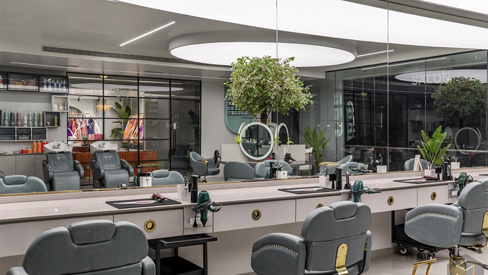
                </a>
              

              

                

                  <ul>
                    <li>
                      <a href="#"
                        ><i class="fa-solid fa-calendar-days"></i> 29 Oct,
                        2026</a
                      >
                    </li>
                  </ul>
                

                <h4>
                  <a
                    href="blogs/how-to-prepare-your-hair-before-a-professional-salon-appointment.html"
                    >How to Prepare Your Hair Before a Professional Salon
                    Appointment</a
                  >
                </h4>
                

                  <a
                    class="btn btn-primary theme-btn"
                    href="blogs/how-to-prepare-your-hair-before-a-professional-salon-appointment.html"
                    role="button"
                    >read more</a
                  >
                

              

            

          

          <!-- 26 Oct -->
          

            

              

                
              

              

                

                  <ul>
                    <li>
                      <a href="#"
                        ><i class="fa-solid fa-calendar-days"></i> 26 Oct,
                        2026</a
                      >
                    </li>
                  </ul>
                

                <h4>
                  <a
                    href="blogs/how-expert-stylists-at-a-hair-salon-in-baroda-create-personalized-looks.html"
                    >How Expert Stylists at a Hair Salon in Baroda Create
                    Personalized Looks</a
                  >
                </h4>
                

                  <a
                    class="btn btn-primary theme-btn"
                    href="blogs/how-expert-stylists-at-a-hair-salon-in-baroda-create-personalized-looks.html"
                    role="button"
                    >read more</a
                  >
                

              

            

          

          <!-- 23 Oct -->
          

            

              

                
              

              

                

                  <ul>
                    <li>
                      <a href="#"
                        ><i class="fa-solid fa-calendar-days"></i> 23 Oct,
                        2026</a
                      >
                    </li>
                  </ul>
                

                <h4>
                  <a
                    href="blogs/why-regular-salon-visits-are-essential-for-healthy-hair-and-beautiful-skin.html"
                    >Why Regular Salon Visits Are Essential for Healthy Hair and
                    Beautiful Skin</a
                  >
                </h4>
                

                  <a
                    class="btn btn-primary theme-btn"
                    href="blogs/why-regular-salon-visits-are-essential-for-healthy-hair-and-beautiful-skin.html"
                    role="button"
                    >read more</a
                  >
                

              

            

          

          <!-- 20 Oct -->
          

            

              

                
              

              

                

                  <ul>
                    <li>
                      <a href="#"
                        ><i class="fa-solid fa-calendar-days"></i> 20 Oct,
                        2026</a
                      >
                    </li>
                  </ul>
                

                <h4>
                  <a
                    href="blogs/the-future-of-hair-beauty-modern-salon-trends-changing-the-industry.html"
                    >The Future of Hair & Beauty: Modern Salon Trends Changing
                    the Industry</a
                  >
                </h4>
                

                  <a
                    class="btn btn-primary theme-btn"
                    href="blogs/the-future-of-hair-beauty-modern-salon-trends-changing-the-industry.html"
                    role="button"
                    >read more</a
                  >
                

              

            

          

          <!-- 17 Oct -->
          

            

              

                
              

              

                

                  <ul>
                    <li>
                      <a href="#"
                        ><i class="fa-solid fa-calendar-days"></i> 17 Oct,
                        2026</a
                      >
                    </li>
                  </ul>
                

                <h4>
                  <a
                    href="blogs/from-consultation-to-transformation-your-salon-journey-at-frenyz-vadodara.html"
                    >From Consultation to Transformation: Your Salon Journey at
                    Frenyz Vadodara</a
                  >
                </h4>
                

                  <a
                    class="btn btn-primary theme-btn"
                    href="blogs/from-consultation-to-transformation-your-salon-journey-at-frenyz-vadodara.html"
                    role="button"
                    >read more</a
                  >
                

              

            

          

          <!-- 14 Oct -->
          

            

              

                <a
                  href="blogs/why-personalized-salon-services-deliver-better-results-than-generic-care.html"
                >
                  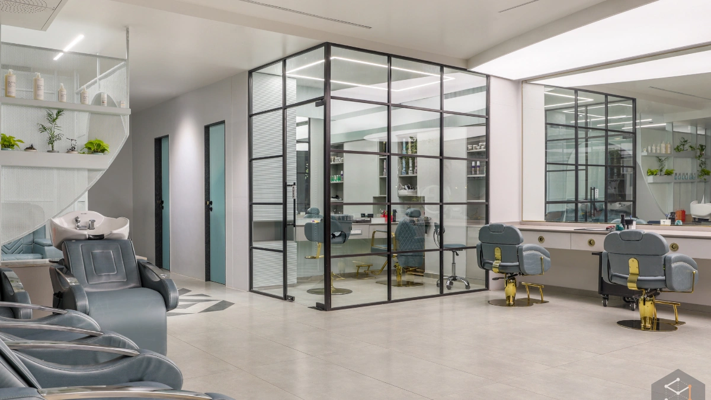
                </a>
              

              

                

                  <ul>
                    <li>
                      <a href="#"
                        ><i class="fa-solid fa-calendar-days"></i> 14 Oct,
                        2026</a
                      >
                    </li>
                  </ul>
                

                <h4>
                  <a
                    href="blogs/why-personalized-salon-services-deliver-better-results-than-generic-care.html"
                    >Why Personalized Salon Services Deliver Better Results Than
                    Generic Care</a
                  >
                </h4>
                

                  <a
                    class="btn btn-primary theme-btn"
                    href="blogs/why-personalized-salon-services-deliver-better-results-than-generic-care.html"
                    role="button"
                    >read more</a
                  >
                

              

            

          

          <!-- 11 Oct -->
          

            

              

                <a
                  href="blogs/the-role-of-nutrition-in-achieving-strong-and-beautiful-hair.html"
                >
                  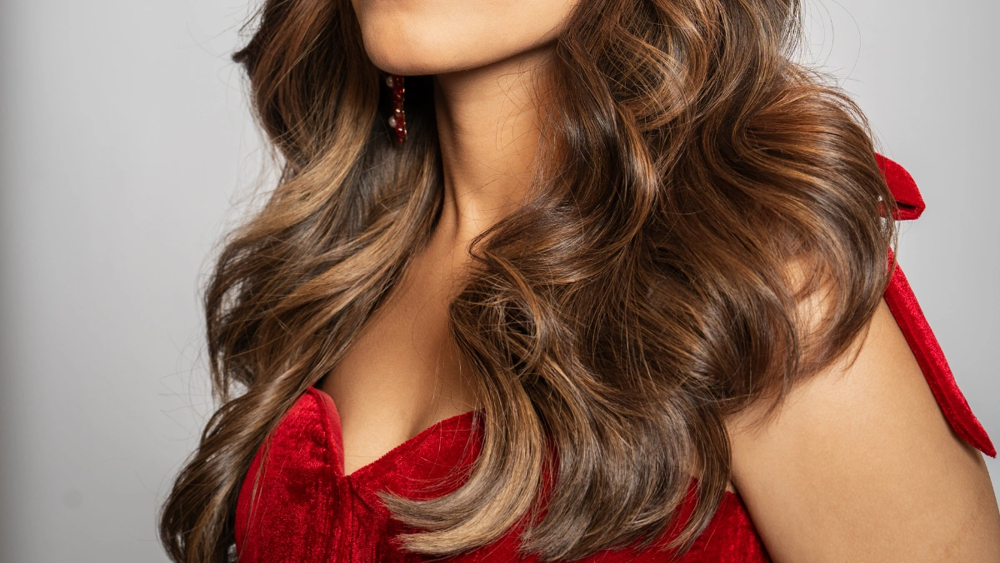
                </a>
              

              

                

                  <ul>
                    <li>
                      <a href="#"
                        ><i class="fa-solid fa-calendar-days"></i> 11 Oct,
                        2026</a
                      >
                    </li>
                  </ul>
                

                <h4>
                  <a
                    href="blogs/the-role-of-nutrition-in-achieving-strong-and-beautiful-hair.html"
                    >The Role of Nutrition in Achieving Strong and Beautiful
                    Hair</a
                  >
                </h4>
                

                  <a
                    class="btn btn-primary theme-btn"
                    href="blogs/the-role-of-nutrition-in-achieving-strong-and-beautiful-hair.html"
                    role="button"
                    >read more</a
                  >
                

              

            

          

          <!-- 08 Oct -->
          

            

              

                
              

              

                

                  <ul>
                    <li>
                      <a href="#"
                        ><i class="fa-solid fa-calendar-days"></i> 08 Oct,
                        2026</a
                      >
                    </li>
                  </ul>
                

                <h4>
                  <a
                    href="blogs/how-to-build-a-hair-care-routine-that-actually-delivers-results.html"
                    >How to Build a Hair Care Routine That Actually Delivers
                    Results</a
                  >
                </h4>
                

                  <a
                    class="btn btn-primary theme-btn"
                    href="blogs/how-to-build-a-hair-care-routine-that-actually-delivers-results.html"
                    role="button"
                    >read more</a
                  >
                

              

            

          

          <!-- 05 Oct -->
          

            

              

                <a
                  href="blogs/everything-you-should-avoid-after-getting-a-professional-hair-service.html"
                >
                  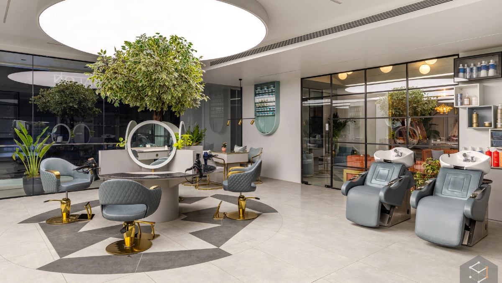
                </a>
              

              

                

                  <ul>
                    <li>
                      <a href="#"
                        ><i class="fa-solid fa-calendar-days"></i> 05 Oct,
                        2026</a
                      >
                    </li>
                  </ul>
                

                <h4>
                  <a
                    href="blogs/everything-you-should-avoid-after-getting-a-professional-hair-service.html"
                    >Everything You Should Avoid After Getting a Professional
                    Hair Service</a
                  >
                </h4>
                

                  <a
                    class="btn btn-primary theme-btn"
                    href="blogs/everything-you-should-avoid-after-getting-a-professional-hair-service.html"
                    role="button"
                    >read more</a
                  >
                

              

            

          

          <!-- 02 Oct -->
          

            

              

                <a
                  href="blogs/how-to-maintain-smooth-manageable-hair-in-every-season.html"
                >
                  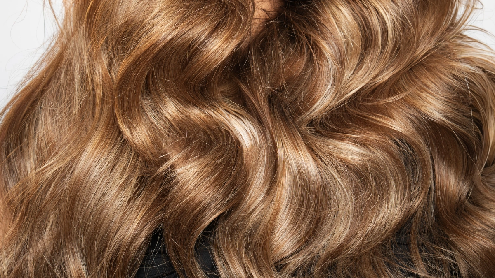
                </a>
              

              

                

                  <ul>
                    <li>
                      <a href="#"
                        ><i class="fa-solid fa-calendar-days"></i> 02 Oct,
                        2026</a
                      >
                    </li>
                  </ul>
                

                <h4>
                  <a
                    href="blogs/how-to-maintain-smooth-manageable-hair-in-every-season.html"
                    >How to Maintain Smooth, Manageable Hair in Every Season</a
                  >
                </h4>
                

                  <a
                    class="btn btn-primary theme-btn"
                    href="blogs/how-to-maintain-smooth-manageable-hair-in-every-season.html"
                    role="button"
                    >read more</a
                  >
                

              

            

          

          <!-- 29 Sep -->
          

            

              

                
              

              

                

                  <ul>
                    <li>
                      <a href="#"
                        ><i class="fa-solid fa-calendar-days"></i> 29 Sep,
                        2026</a
                      >
                    </li>
                  </ul>
                

                <h4>
                  <a
                    href="blogs/what-to-expect-during-your-visit-to-a-professional-beauty-parlour-in-vadodara.html"
                    >What to Expect During Your Visit to a Professional Beauty
                    Parlour in Vadodara</a
                  >
                </h4>
                

                  <a
                    class="btn btn-primary theme-btn"
                    href="blogs/what-to-expect-during-your-visit-to-a-professional-beauty-parlour-in-vadodara.html"
                    role="button"
                    >read more</a
                  >
                

              

            

          

          <!-- 26 Sep -->
          

            

              

                <a
                  href="blogs/how-lifestyle-choices-impact-your-hair-health-more-than-you-realize.html"
                >
                  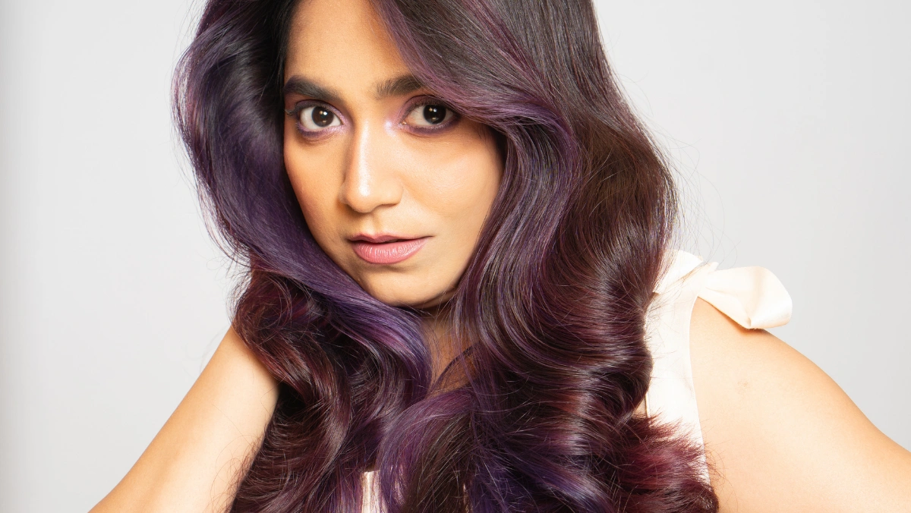
                </a>
              

              

                

                  <ul>
                    <li>
                      <a href="#"
                        ><i class="fa-solid fa-calendar-days"></i> 26 Sep,
                        2026</a
                      >
                    </li>
                  </ul>
                

                <h4>
                  <a
                    href="blogs/how-lifestyle-choices-impact-your-hair-health-more-than-you-realize.html"
                    >How Lifestyle Choices Impact Your Hair Health More Than You
                    Realize</a
                  >
                </h4>
                

                  <a
                    class="btn btn-primary theme-btn"
                    href="blogs/how-lifestyle-choices-impact-your-hair-health-more-than-you-realize.html"
                    role="button"
                    >read more</a
                  >
                

              

            

          

          <!-- 23 Sep -->
          

            

              

                
              

              

                

                  <ul>
                    <li>
                      <a href="#"
                        ><i class="fa-solid fa-calendar-days"></i> 23 Sep,
                        2026</a
                      >
                    </li>
                  </ul>
                

                <h4>
                  <a
                    href="blogs/common-hair-problems-that-professional-salon-experts-can-solve.html"
                    >Common Hair Problems That Professional Salon Experts Can
                    Solve</a
                  >
                </h4>
                

                  <a
                    class="btn btn-primary theme-btn"
                    href="blogs/common-hair-problems-that-professional-salon-experts-can-solve.html"
                    role="button"
                    >read more</a
                  >
                

              

            

          

          <!-- 20 Sep -->
          

            

              

                <a
                  href="blogs/why-quality-hair-products-make-a-bigger-difference-than-you-think.html"
                >
                  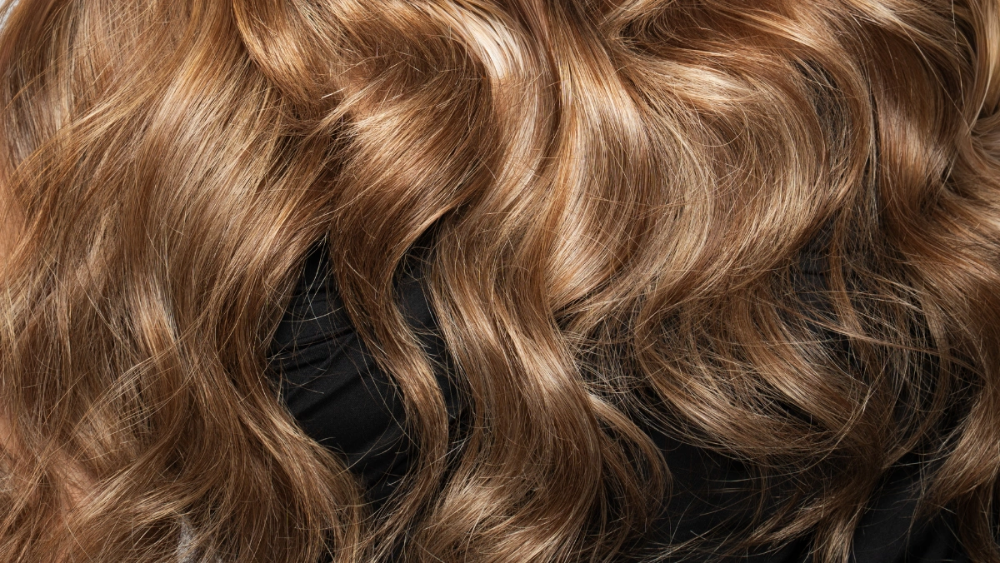
                </a>
              

              

                

                  <ul>
                    <li>
                      <a href="#"
                        ><i class="fa-solid fa-calendar-days"></i> 20 Sep,
                        2026</a
                      >
                    </li>
                  </ul>
                

                <h4>
                  <a
                    href="blogs/why-quality-hair-products-make-a-bigger-difference-than-you-think.html"
                    >Why Quality Hair Products Make a Bigger Difference Than You
                    Think</a
                  >
                </h4>
                

                  <a
                    class="btn btn-primary theme-btn"
                    href="blogs/why-quality-hair-products-make-a-bigger-difference-than-you-think.html"
                    role="button"
                    >read more</a
                  >
                

              

            

          

          <!-- 17 Sep -->
          

            

              

                <a
                  href="blogs/how-a-beauty-parlour-in-vadodara-helps-you-maintain-your-signature-style.html"
                >
                  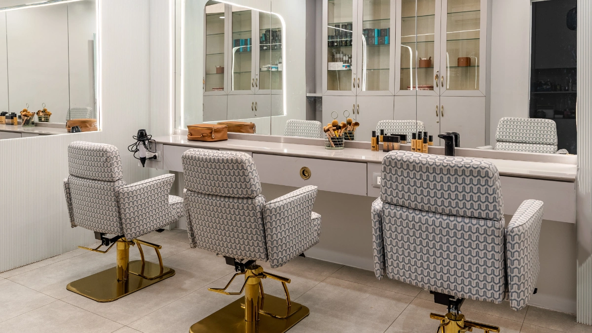
                </a>
              

              

                

                  <ul>
                    <li>
                      <a href="#"
                        ><i class="fa-solid fa-calendar-days"></i> 17 Sep,
                        2026</a
                      >
                    </li>
                  </ul>
                

                <h4>
                  <a
                    href="blogs/how-a-beauty-parlour-in-vadodara-helps-you-maintain-your-signature-style.html"
                    >How a Beauty Parlour in Vadodara Helps You Maintain Your
                    Signature Style</a
                  >
                </h4>
                

                  <a
                    class="btn btn-primary theme-btn"
                    href="blogs/how-a-beauty-parlour-in-vadodara-helps-you-maintain-your-signature-style.html"
                    role="button"
                    >read more</a
                  >
                

              

            

          

          <!-- 14 Sep -->
          

            

              

                <a
                  href="blogs/the-benefits-of-investing-in-professional-hair-care-instead-of-diy.html"
                >
                  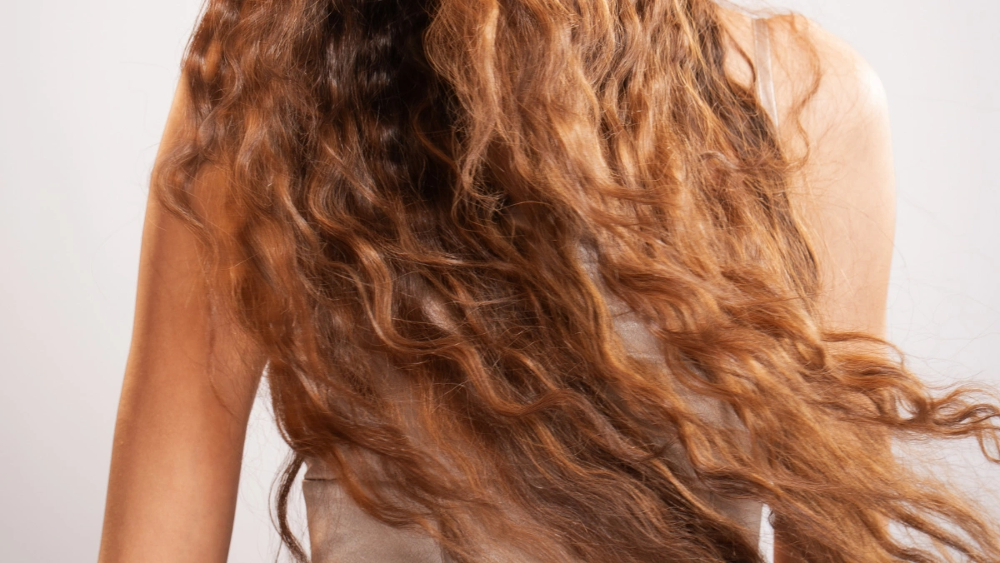
                </a>
              

              

                

                  <ul>
                    <li>
                      <a href="#"
                        ><i class="fa-solid fa-calendar-days"></i> 14 Sep,
                        2026</a
                      >
                    </li>
                  </ul>
                

                <h4>
                  <a
                    href="blogs/the-benefits-of-investing-in-professional-hair-care-instead-of-diy.html"
                    >The Benefits of Investing in Professional Hair Care Instead
                    of DIY</a
                  >
                </h4>
                

                  <a
                    class="btn btn-primary theme-btn"
                    href="blogs/the-benefits-of-investing-in-professional-hair-care-instead-of-diy.html"
                    role="button"
                    >read more</a
                  >
                

              

            

          

          <!-- 11 Sep -->
          

            

              

                <a
                  href="blogs/the-importance-of-hair-consultation-before-any-major-hair-transformation.html"
                >
                  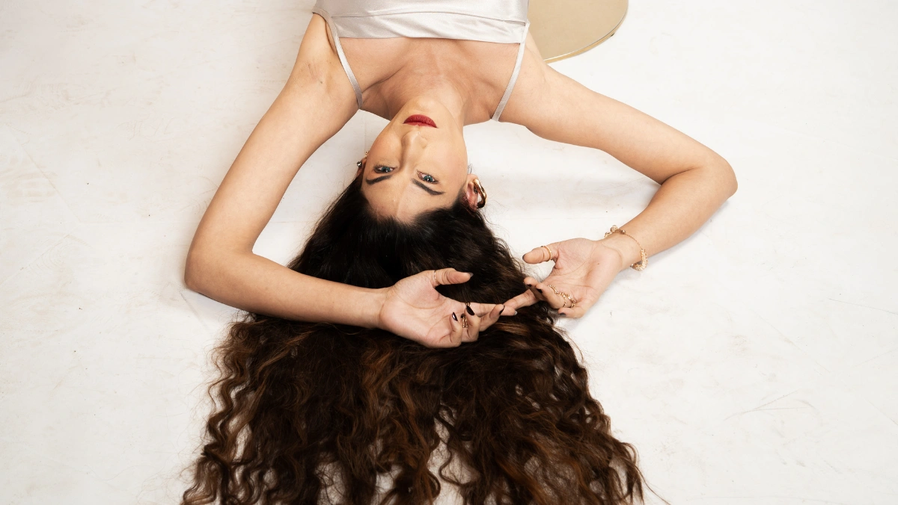
                </a>
              

              

                

                  <ul>
                    <li>
                      <a href="#"
                        ><i class="fa-solid fa-calendar-days"></i> 11 Sep,
                        2026</a
                      >
                    </li>
                  </ul>
                

                <h4>
                  <a
                    href="blogs/the-importance-of-hair-consultation-before-any-major-hair-transformation.html"
                    >The Importance of Hair Consultation Before Any Major Hair
                    Transformation</a
                  >
                </h4>
                

                  <a
                    class="btn btn-primary theme-btn"
                    href="blogs/the-importance-of-hair-consultation-before-any-major-hair-transformation.html"
                    role="button"
                    >read more</a
                  >
                

              

            

          

          <!-- 08 Sep -->
          

            

              

                
              

              

                

                  <ul>
                    <li>
                      <a href="#"
                        ><i class="fa-solid fa-calendar-days"></i> 08 Sep,
                        2026</a
                      >
                    </li>
                  </ul>
                

                <h4>
                  <a
                    href="blogs/signs-its-time-to-change-your-hairstyle-for-a-fresh-new-look.html"
                    >Signs It's Time to Change Your Hairstyle for a Fresh New
                    Look</a
                  >
                </h4>
                

                  <a
                    class="btn btn-primary theme-btn"
                    href="blogs/signs-its-time-to-change-your-hairstyle-for-a-fresh-new-look.html"
                    role="button"
                    >read more</a
                  >
                

              

            

          

          <!-- 05 Sep -->
          

            

              

                
              

              

                

                  <ul>
                    <li>
                      <a href="#"
                        ><i class="fa-solid fa-calendar-days"></i> 05 Sep,
                        2026</a
                      >
                    </li>
                  </ul>
                

                <h4>
                  <a
                    href="blogs/simple-daily-habits-that-keep-your-hair-healthy-between-salon-visits.html"
                    >Simple Daily Habits That Keep Your Hair Healthy Between
                    Salon Visits</a
                  >
                </h4>
                

                  <a
                    class="btn btn-primary theme-btn"
                    href="blogs/simple-daily-habits-that-keep-your-hair-healthy-between-salon-visits.html"
                    role="button"
                    >read more</a
                  >
                

              

            

          

          <!-- 02 Sep -->
          

            

              

                <a
                  href="blogs/why-every-great-hairstyle-starts-with-healthy-hair.html"
                >
                  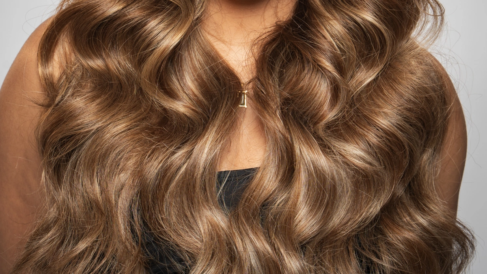
                </a>
              

              

                

                  <ul>
                    <li>
                      <a href="#"
                        ><i class="fa-solid fa-calendar-days"></i> 02 Sep,
                        2026</a
                      >
                    </li>
                  </ul>
                

                <h4>
                  <a
                    href="blogs/why-every-great-hairstyle-starts-with-healthy-hair.html"
                    >Why Every Great Hairstyle Starts with Healthy Hair</a
                  >
                </h4>
                

                  <a
                    class="btn btn-primary theme-btn"
                    href="blogs/why-every-great-hairstyle-starts-with-healthy-hair.html"
                    role="button"
                    >read more</a
                  >
                

              

            

          

          <!-- 29 Aug -->
          

            

              

                
              

              

                

                  <ul>
                    <li>
                      <a href="#"
                        ><i class="fa-solid fa-calendar-days"></i> 29 Aug,
                        2026</a
                      >
                    </li>
                  </ul>
                

                <h4>
                  <a
                    href="blogs/the-complete-guide-to-professional-hair-beauty-consultations-at-a-salon.html"
                    >The Complete Guide to Professional Hair & Beauty
                    Consultations at a Salon</a
                  >
                </h4>
                

                  <a
                    class="btn btn-primary theme-btn"
                    href="blogs/the-complete-guide-to-professional-hair-beauty-consultations-at-a-salon.html"
                    role="button"
                    >read more</a
                  >
                

              

            

          

          <!-- 26 Aug -->
          

            

              

                <a
                  href="blogs/how-weather-changes-affect-your-hair-throughout-the-year.html"
                >
                  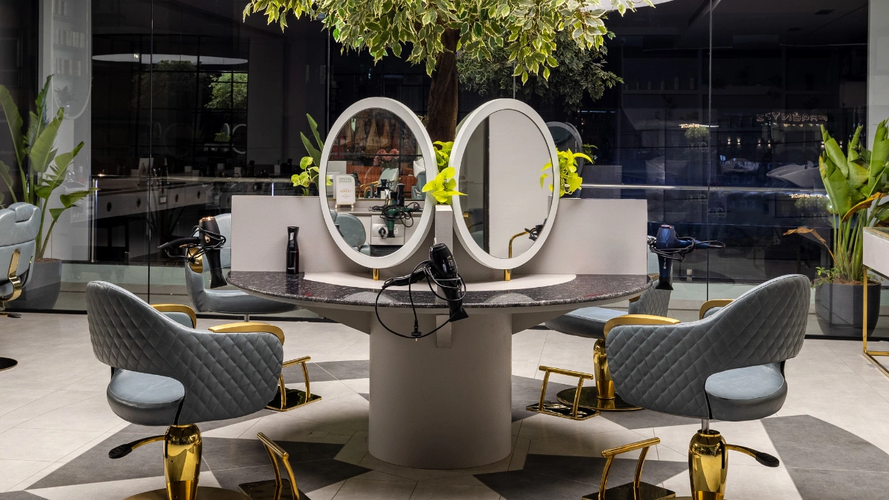
                </a>
              

              

                

                  <ul>
                    <li>
                      <a href="#"
                        ><i class="fa-solid fa-calendar-days"></i> 26 Aug,
                        2026</a
                      >
                    </li>
                  </ul>
                

                <h4>
                  <a
                    href="blogs/how-weather-changes-affect-your-hair-throughout-the-year.html"
                    >How Weather Changes Affect Your Hair Throughout the Year</a
                  >
                </h4>
                

                  <a
                    class="btn btn-primary theme-btn"
                    href="blogs/how-weather-changes-affect-your-hair-throughout-the-year.html"
                    role="button"
                    >read more</a
                  >
                

              

            

          

          <!-- 23 Aug -->
          

            

              

                <a
                  href="blogs/healthy-hair-vs-beautiful-hair-why-you-need-both.html"
                >
                  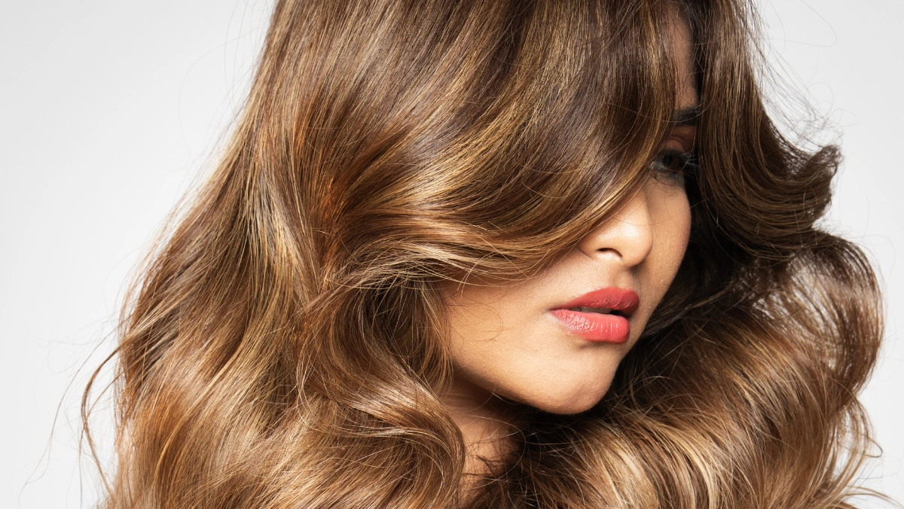
                </a>
              

              

                

                  <ul>
                    <li>
                      <a href="#"
                        ><i class="fa-solid fa-calendar-days"></i> 23 Aug,
                        2026</a
                      >
                    </li>
                  </ul>
                

                <h4>
                  <a
                    href="blogs/healthy-hair-vs-beautiful-hair-why-you-need-both.html"
                    >Healthy Hair vs Beautiful Hair: Why You Need Both</a
                  >
                </h4>
                

                  <a
                    class="btn btn-primary theme-btn"
                    href="blogs/healthy-hair-vs-beautiful-hair-why-you-need-both.html"
                    role="button"
                    >read more</a
                  >
                

              

            

          

          <!-- 20 Aug -->
          

            

              

                <a
                  href="blogs/the-hidden-reasons-your-hair-loses-shine-and-how-to-restore-it.html"
                >
                  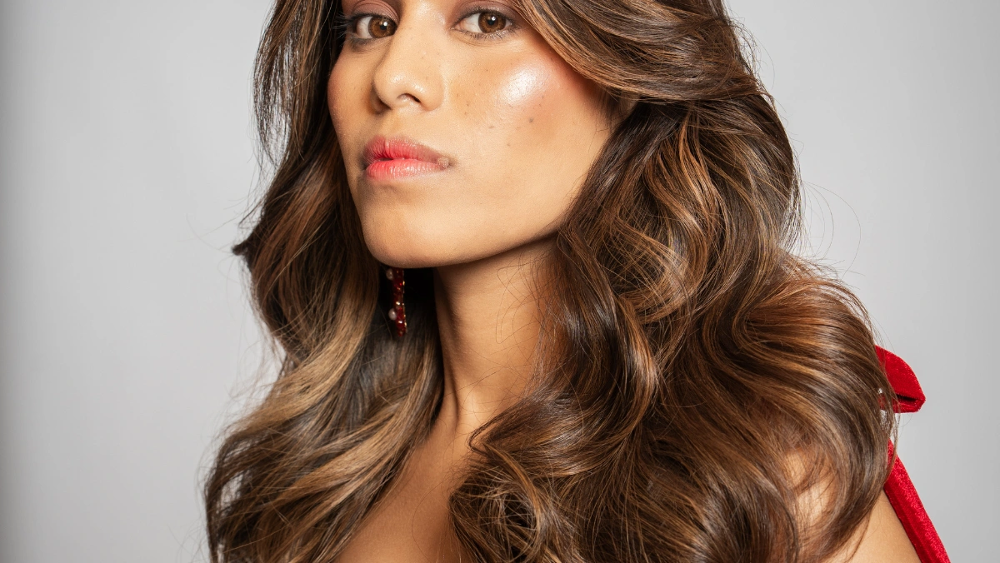
                </a>
              

              

                

                  <ul>
                    <li>
                      <a href="#"
                        ><i class="fa-solid fa-calendar-days"></i> 20 Aug,
                        2026</a
                      >
                    </li>
                  </ul>
                

                <h4>
                  <a
                    href="blogs/the-hidden-reasons-your-hair-loses-shine-and-how-to-restore-it.html"
                    >The Hidden Reasons Your Hair Loses Shine and How to Restore
                    It</a
                  >
                </h4>
                

                  <a
                    class="btn btn-primary theme-btn"
                    href="blogs/the-hidden-reasons-your-hair-loses-shine-and-how-to-restore-it.html"
                    role="button"
                    >read more</a
                  >
                

              

            

          

          <!-- 17 Aug -->
          

            

              

                
              

              

                

                  <ul>
                    <li>
                      <a href="#"
                        ><i class="fa-solid fa-calendar-days"></i> 17 Aug,
                        2026</a
                      >
                    </li>
                  </ul>
                

                <h4>
                  <a
                    href="blogs/how-to-choose-a-salon-in-vadodara-that-matches-your-hair-care-needs.html"
                    >How to Choose a Salon in Vadodara That Matches Your Hair
                    Care Needs</a
                  >
                </h4>
                

                  <a
                    class="btn btn-primary theme-btn"
                    href="blogs/how-to-choose-a-salon-in-vadodara-that-matches-your-hair-care-needs.html"
                    role="button"
                    >read more</a
                  >
                

              

            

          

          <!-- 14 Aug -->
          

            

              

                <a
                  href="blogs/how-to-choose-hair-services-based-on-your-hair-goals.html"
                >
                  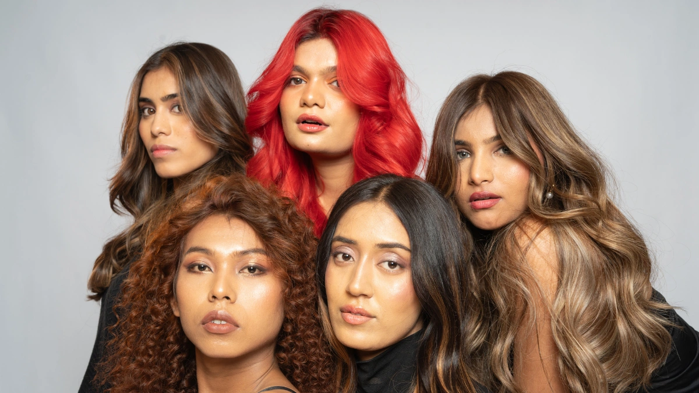
                </a>
              

              

                

                  <ul>
                    <li>
                      <a href="#"
                        ><i class="fa-solid fa-calendar-days"></i> 14 Aug,
                        2026</a
                      >
                    </li>
                  </ul>
                

                <h4>
                  <a
                    href="blogs/how-to-choose-hair-services-based-on-your-hair-goals.html"
                    >How to Choose Hair Services Based on Your Hair Goals</a
                  >
                </h4>
                

                  <a
                    class="btn btn-primary theme-btn"
                    href="blogs/how-to-choose-hair-services-based-on-your-hair-goals.html"
                    role="button"
                    >read more</a
                  >
                

              

            

          

          <!-- 11 Aug -->
          

            

              

                <a
                  href="blogs/easy-ways-to-protect-your-hair-from-everyday-pollution.html"
                >
                  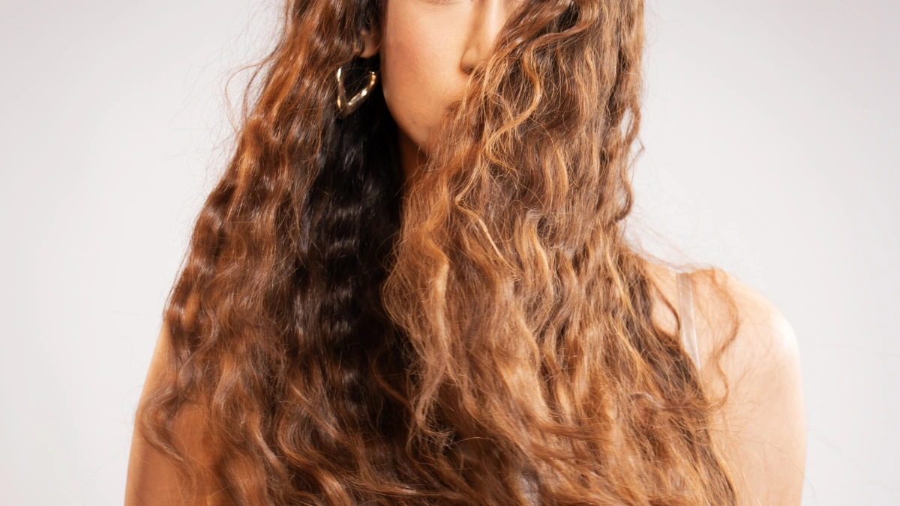
                </a>
              

              

                

                  <ul>
                    <li>
                      <a href="#"
                        ><i class="fa-solid fa-calendar-days"></i> 11 Aug,
                        2026</a
                      >
                    </li>
                  </ul>
                

                <h4>
                  <a
                    href="blogs/easy-ways-to-protect-your-hair-from-everyday-pollution.html"
                    >Easy Ways to Protect Your Hair from Everyday Pollution</a
                  >
                </h4>
                

                  <a
                    class="btn btn-primary theme-btn"
                    href="blogs/easy-ways-to-protect-your-hair-from-everyday-pollution.html"
                    role="button"
                    >read more</a
                  >
                

              

            

          

          <!-- 08 Aug -->
          

            

              

                
              

              

                

                  <ul>
                    <li>
                      <a href="#"
                        ><i class="fa-solid fa-calendar-days"></i> 08 Aug,
                        2026</a
                      >
                    </li>
                  </ul>
                

                <h4>
                  <a
                    href="blogs/what-your-hairstyle-says-about-your-personality.html"
                    >What Your Hairstyle Says About Your Personality</a
                  >
                </h4>
                

                  <a
                    class="btn btn-primary theme-btn"
                    href="blogs/what-your-hairstyle-says-about-your-personality.html"
                    role="button"
                    >read more</a
                  >
                

              

            

          

          <!-- 05 Aug -->
          

            

              

                <a
                  href="blogs/how-professional-hair-analysis-helps-you-get-better-salon-results.html"
                >
                  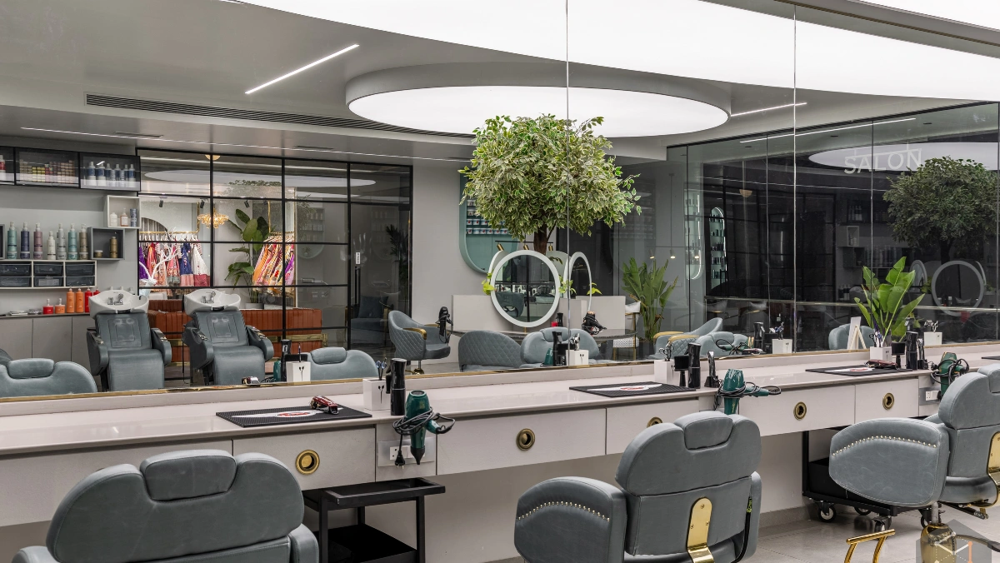
                </a>
              

              

                

                  <ul>
                    <li>
                      <a href="#"
                        ><i class="fa-solid fa-calendar-days"></i> 05 Aug,
                        2026</a
                      >
                    </li>
                  </ul>
                

                <h4>
                  <a
                    href="blogs/how-professional-hair-analysis-helps-you-get-better-salon-results.html"
                    >How Professional Hair Analysis Helps You Get Better Salon
                    Results</a
                  >
                </h4>
                

                  <a
                    class="btn btn-primary theme-btn"
                    href="blogs/how-professional-hair-analysis-helps-you-get-better-salon-results.html"
                    role="button"
                    >read more</a
                  >
                

              

            

          

          <!-- 02 Aug -->
          

            

              

                
              

              

                

                  <ul>
                    <li>
                      <a href="#"
                        ><i class="fa-solid fa-calendar-days"></i> 02 Aug,
                        2026</a
                      >
                    </li>
                  </ul>
                

                <h4>
                  <a
                    href="blogs/salon-hair-treatments-explained-which-one-is-right-for-your-hair.html"
                    >Salon Hair Treatments Explained: Which One Is Right for
                    Your Hair?</a
                  >
                </h4>
                

                  <a
                    class="btn btn-primary theme-btn"
                    href="blogs/salon-hair-treatments-explained-which-one-is-right-for-your-hair.html"
                    role="button"
                    >read more</a
                  >
                

              

            

          

