Blog 81 - Essential Grooming Tips Every Man Should Follow for Sharp Looks
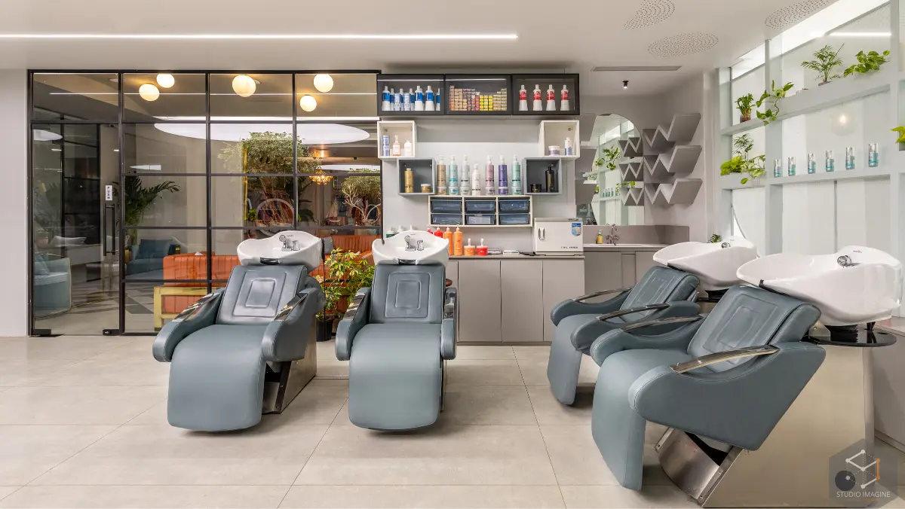

Introduction
Looking sharp is not just about wearing good clothes—it’s about overall grooming. Many men overlook basic grooming habits, which can affect their appearance, confidence, and first impression. In today’s competitive and social world, proper grooming is a necessity, not a luxury.
The good news is that achieving a clean, polished look doesn’t require complicated routines. With a few essential grooming habits, any man can maintain a sharp and confident appearance every day.
What Is Men’s Grooming?
Men’s grooming refers to maintaining personal hygiene and appearance through regular care of hair, skin, beard, and overall presentation. It focuses on cleanliness, neatness, and style.
Basic grooming includes:
Haircuts and hairstyling
Beard trimming or shaving
Skincare and hygiene
Dressing and overall presentation
Consistent grooming helps create a strong and positive impression.
Causes / Reasons
Poor grooming habits often happen due to:
Lack of awareness or routine
Busy lifestyle
Ignoring small details
Belief that grooming is not important
These habits can negatively impact your overall look.
Symptoms / Signs
You may need better grooming if you notice:
Unkempt hair or beard
Dull or tired-looking skin
Poor personal hygiene
Lack of confidence in your appearance
These signs indicate the need for improvement.
Why It Happens / Why It Matters
Neglecting grooming leads to a messy and unpolished appearance. It matters because your look plays a major role in how others perceive you.
Proper grooming:
Enhances confidence
Improves first impressions
Reflects discipline and self-care
Small changes can make a big difference.
Solutions / Treatment / Methods
Follow these essential grooming tips:
Maintain regular haircuts
Keep your hairstyle neat and well-shaped
Trim or shave your beard
Maintain a clean and defined beard style
Follow a skincare routine
Cleanse, moisturize, and protect your skin
Maintain personal hygiene
Daily bathing and proper hygiene are essential
Dress well
Wear clean, well-fitted clothes
Consistency is key to sharp looks.
Who Should Consider This?
These tips are ideal for:
Working professionals
Students
Individuals attending events or meetings
Anyone wanting to improve their appearance
Grooming is important for every man.
Results / Benefits / Outcome
By following proper grooming habits, you will achieve:
A clean and polished appearance
Improved confidence
Better personal and professional impressions
A more attractive overall personality
The impact is immediate and noticeable.
Tips / Prevention / Best Practices
To maintain your grooming routine:
Set a weekly grooming schedule
Use quality grooming products
Keep your tools clean
Pay attention to small details
Stay consistent
Good habits lead to long-term results.
Conclusion
Grooming is a powerful tool that can transform your appearance and confidence. By following simple and consistent habits, you can maintain a sharp and stylish look every day.
Start your grooming routine today and present the best version of yourself to the world.

Blog 82 - How to Prepare Your Skin Before a Big Event or Party Makeup

Introduction
Getting ready for a big event or party is exciting, but many people focus only on makeup and ignore the most important step—skin preparation. Even the best makeup products won’t look flawless if your skin isn’t properly prepped.
Healthy, well-prepared skin acts as the perfect base for makeup, helping it look smooth, long-lasting, and radiant. With the right pre-makeup skincare routine, you can achieve that flawless finish effortlessly.
What Is Pre-Makeup Skin Preparation?
Pre-makeup skin preparation is the process of getting your skin ready before applying makeup. It ensures that your skin is clean, hydrated, and smooth for better makeup application.
This routine includes:
Cleansing to remove dirt and oil
Exfoliating for smooth texture
Hydrating the skin
Priming the skin for makeup
Proper preparation enhances both the look and longevity of makeup.
Causes / Reasons
Makeup often looks uneven or patchy due to:
Dry or dehydrated skin
Excess oil and clogged pores
Lack of proper skincare routine
Skipping essential preparation steps
These factors prevent makeup from blending well.
Symptoms / Signs
You may need better skin prep if:
Makeup looks cakey or uneven
Foundation doesn’t blend properly
Skin appears dull under makeup
Makeup fades quickly
These signs indicate poor preparation.
Why It Happens / Why It Matters
When skin is not properly prepared, makeup cannot sit evenly on the surface. It highlights imperfections instead of covering them.
It matters because:
Prepped skin improves makeup finish
It helps makeup last longer
It enhances natural glow
Good preparation makes a visible difference.
Solutions / Treatment / Methods
Follow these steps before makeup:
Cleanse your face
Use a gentle face wash to remove dirt and oil
Exfoliate lightly
Remove dead skin cells for a smooth base
Apply toner
Balance your skin and tighten pores
Moisturize well
Keep your skin hydrated and soft
Use sunscreen (daytime events)
Protect your skin from UV damage
Apply primer
Create a smooth surface for makeup
These steps ensure flawless application.
Who Should Consider This?
This routine is ideal for:
Brides and event attendees
People attending parties or functions
Individuals with uneven or dry skin
Anyone wanting long-lasting makeup
It works for all skin types.
Results / Benefits / Outcome
With proper skin preparation, you will notice:
Smooth and even makeup application
Long-lasting makeup finish
Natural glow and radiance
Reduced patchiness and creasing
The results are instantly visible.
Tips / Prevention / Best Practices
To achieve the best results:
Start skincare at least a day before the event
Stay hydrated
Avoid trying new products last minute
Get enough sleep before the event
Follow a consistent skincare routine
Preparation is the key to perfection.
Conclusion
Flawless makeup starts with healthy, well-prepared skin. By following a simple pre-makeup routine, you can enhance your overall look and ensure your makeup stays fresh throughout the event.
Take care of your skin first—because great makeup always begins with a great base.

Blog 83 - Hair Fall Causes & Salon Treatments That Actually Work

Introduction
Hair fall is one of the most common concerns faced by both men and women today. Seeing strands of hair on your pillow, comb, or shower drain can be stressful and frustrating. While some hair fall is normal, excessive shedding is a sign that something is wrong.
Many people try home remedies or random products without understanding the root cause. The key to controlling hair fall is identifying the reason behind it and choosing the right professional treatment that actually works.
What Is Hair Fall?
Hair fall refers to the loss of hair from the scalp beyond the normal daily shedding. While losing 50–100 strands a day is considered normal, anything more may indicate a problem.
Hair fall can be temporary or long-term depending on the cause. Proper diagnosis is important for effective treatment.
Causes / Reasons
Hair fall can occur due to multiple reasons:
Stress and unhealthy lifestyle
Poor nutrition and lack of vitamins
Hormonal imbalance
Excessive use of heat styling tools
Chemical treatments like coloring or smoothening
Pollution and environmental damage
Understanding the cause helps in choosing the right solution.
Symptoms / Signs
You may be experiencing excessive hair fall if you notice:
Hair falling in large amounts while combing or washing
Thinning hair or reduced volume
Visible scalp in certain areas
Weak and brittle hair strands
These signs should not be ignored.
Why It Happens / Why It Matters
Hair fall happens when hair roots become weak or the growth cycle is disrupted. Without proper care, it can lead to thinning or long-term hair loss.
It matters because:
Hair affects your overall appearance
Excessive hair fall reduces confidence
Early treatment prevents severe damage
Taking action at the right time is important.
Solutions / Treatment / Methods
Effective salon treatments for hair fall include:
Hair Spa for Strengthening
Nourishes hair roots and improves scalp health
Scalp Treatments
Targets root causes like dryness or dandruff
Keratin-Based Repair Treatments
Strengthens damaged hair and reduces breakage
Deep Conditioning Therapies
Restores moisture and improves texture
Professional Consultation
Helps identify the exact cause and solution
These treatments are more effective when done regularly.
Who Should Consider This?
These treatments are ideal for:
Individuals experiencing excessive hair fall
People with weak or damaged hair
Those undergoing stress or lifestyle changes
Anyone looking to improve hair strength
Early action gives better results.
Results / Benefits / Outcome
With proper treatment, you can expect:
Reduced hair fall
Stronger and healthier hair
Improved scalp condition
Increased hair volume over time
Results improve with consistency and care.
Tips / Prevention / Best Practices
To control hair fall:
Maintain a healthy diet
Avoid excessive heat styling
Use suitable hair care products
Keep your scalp clean
Manage stress levels
Prevention is key to long-term hair health.
Conclusion
Hair fall can be controlled effectively when you understand its cause and choose the right treatments. Professional salon solutions offer targeted care that delivers real results.
Take the first step toward healthier hair by choosing the right treatment and following a consistent care routine.

Blog 84 - Monsoon Hair Care Tips to Prevent Frizz and Hair Damage
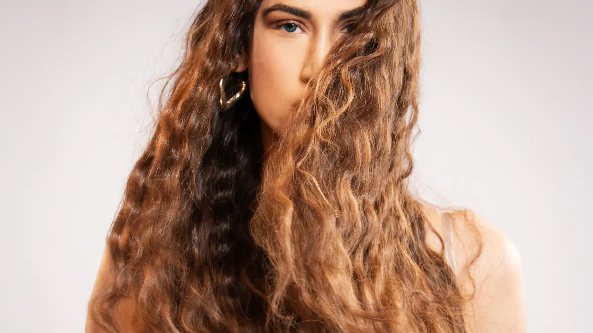

Introduction
The monsoon season brings relief from heat, but it also creates new challenges for your hair. Increased humidity in the air can make your hair frizzy, unmanageable, and prone to damage. Many people struggle with dullness, scalp issues, and sudden hair fall during this time.
Without proper care, monsoon can weaken your hair and affect its overall health. The good news is that with the right routine and simple precautions, you can keep your hair smooth, healthy, and frizz-free even during the rainy season.
What Is Monsoon Hair Care?
Monsoon hair care refers to specific practices designed to protect your hair from humidity, moisture, and environmental damage during the rainy season.
It focuses on:
Controlling frizz and dryness
Maintaining scalp hygiene
Protecting hair from humidity
Keeping hair strong and manageable
A proper routine helps maintain hair health despite seasonal changes.
Causes / Reasons
Hair problems increase during monsoon due to:
High humidity levels
Excess moisture in the air
Dirty rainwater exposure
Increased scalp infections
These factors make hair weak and difficult to manage.
Symptoms / Signs
You may face monsoon hair issues if you notice:
Frizzy and rough hair
Increased hair fall
Sticky or oily scalp
Dull and lifeless appearance
These are common signs of seasonal damage.
Why It Happens / Why It Matters
Humidity causes the hair shaft to absorb excess moisture, leading to frizz and loss of shape. At the same time, a damp scalp becomes a breeding ground for bacteria and dandruff.
It matters because:
Poor hair care can lead to long-term damage
Scalp issues can worsen hair fall
Unmanaged hair affects your overall look
Proper care helps prevent these problems.
Solutions / Treatment / Methods
Follow these monsoon hair care tips:
Keep your scalp clean
Wash your hair regularly to remove dirt and sweat
Use anti-frizz products
Apply serums or conditioners to control frizz
Avoid getting hair wet in rain
Rainwater can damage hair and scalp
Dry your hair properly
Never tie wet hair as it weakens roots
Oil your hair regularly
Provides nourishment and protection
Use mild shampoo
Avoid harsh chemicals that dry out hair
Consistency is key during this season.
Who Should Consider This?
These tips are ideal for:
Individuals with frizzy or dry hair
People experiencing hair fall during monsoon
Anyone exposed to humidity and rain
Those wanting to maintain healthy hair
It applies to all hair types.
Results / Benefits / Outcome
With proper care, you will notice:
Reduced frizz and smoother hair
Stronger and healthier strands
Better scalp hygiene
Improved hair texture and shine
Your hair becomes easier to manage.
Tips / Prevention / Best Practices
To protect your hair during monsoon:
Cover your hair when stepping out
Use a wide-tooth comb
Avoid excessive styling
Maintain a balanced diet
Get regular trims
Preventive care ensures better results.
Conclusion
Monsoon can be harsh on your hair, but with the right care routine, you can easily prevent damage and frizz. Simple habits and consistent care can keep your hair healthy and manageable throughout the season.
Take control of your hair this monsoon and enjoy smooth, beautiful results every day.

Blog 85 - Summer Skincare Tips to Keep Your Skin Fresh and Oil-Free
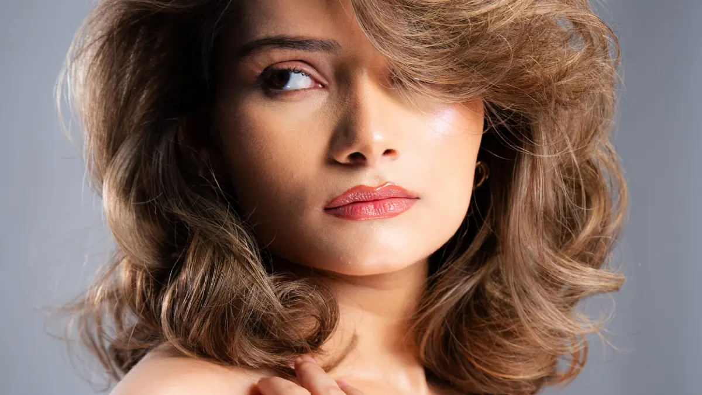

Introduction
Summer can be harsh on your skin, especially with rising temperatures, humidity, and constant exposure to the sun. Many people struggle with oily skin, breakouts, tanning, and dullness during this season. Without proper care, these issues can worsen and affect your overall appearance.
The key to healthy summer skin is a simple yet effective routine that keeps your skin clean, hydrated, and protected. With the right skincare habits, you can maintain a fresh, oil-free, and glowing look even in extreme heat.
What Is Summer Skincare?
Summer skincare refers to a routine specifically designed to protect your skin from heat, sun damage, and excess oil production during hot weather.
It focuses on:
Controlling oil and sweat
Protecting skin from UV rays
Keeping skin hydrated
Preventing breakouts and tanning
A proper routine helps maintain skin balance throughout the season.
Causes / Reasons
Skin problems in summer occur due to:
Excessive sweating and oil production
Prolonged sun exposure
Dehydration
Dust and pollution
These factors clog pores and damage skin health.
Symptoms / Signs
You may need a better summer skincare routine if:
Your skin feels oily and sticky
Frequent breakouts or acne appear
Skin looks dull or tanned
Pores appear larger than usual
These signs indicate seasonal skin stress.
Why It Happens / Why It Matters
Heat increases oil production, while sun exposure damages the skin barrier. Without proper care, this leads to clogged pores, pigmentation, and premature aging.
It matters because:
Healthy skin improves your overall appearance
Proper care prevents long-term damage
Balanced skin feels comfortable and fresh
Taking care of your skin is essential during summer.
Solutions / Treatment / Methods
Follow these summer skincare tips:
Cleanse your face regularly
Use a gentle face wash to remove oil and dirt
Use a lightweight moisturizer
Hydration is important even for oily skin
Apply sunscreen daily
Protect your skin from harmful UV rays
Use oil-free products
Prevent clogged pores and breakouts
Stay hydrated
Drink enough water to keep skin fresh
Exfoliate weekly
Remove dead skin cells and prevent dullness
Consistency ensures better results.
Who Should Consider This?
These tips are ideal for:
People with oily or acne-prone skin
Individuals exposed to sun and heat daily
Anyone experiencing summer skin issues
Those wanting fresh and glowing skin
It works for all skin types.
Results / Benefits / Outcome
With proper summer skincare, you will notice:
Oil-free and fresh skin
Reduced breakouts and acne
Even skin tone and reduced tanning
Healthy and glowing appearance
The results are visible and long-lasting.
Tips / Prevention / Best Practices
To maintain healthy skin in summer:
Avoid heavy makeup
Wash your face after sweating
Wear protective clothing
Use sunglasses and hats
Follow a consistent skincare routine
Small habits make a big difference.
Conclusion
Summer skincare doesn’t have to be complicated. With the right routine and simple habits, you can keep your skin fresh, oil-free, and healthy throughout the season.
Take care of your skin daily and enjoy a confident, glowing look even in the hottest days.

Blog 86 - Best Pre-Bridal Skincare Timeline for Flawless Wedding Glow
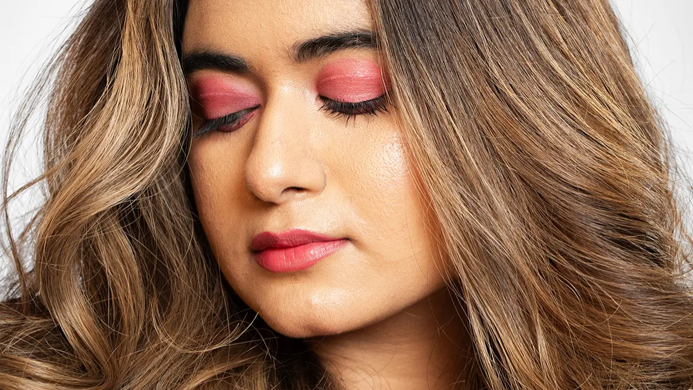

Introduction
Every bride dreams of glowing, flawless skin on her wedding day. However, achieving that radiant look doesn’t happen overnight. Many brides make the mistake of starting skincare too late, which leads to stress, breakouts, or uneven results just before the big day.
The secret to perfect bridal skin is planning ahead. A well-structured pre-bridal skincare timeline helps you prepare your skin gradually, ensuring it looks healthy, smooth, and glowing when it matters the most.
What Is a Pre-Bridal Skincare Timeline?
A pre-bridal skincare timeline is a step-by-step plan that outlines when and how to start skincare treatments before your wedding. It ensures your skin gets enough time to heal, improve, and glow naturally.
It includes:
Regular facials and clean-ups
Skin treatments for specific concerns
Daily skincare routines
Lifestyle adjustments
Following a timeline helps avoid last-minute issues.
Causes / Reasons
Skin problems before weddings often occur due to:
Late skincare planning
Trying new products at the last minute
Stress and lack of sleep
Poor diet and hydration
These factors can affect your skin’s natural glow.
Symptoms / Signs
You may need a proper skincare plan if:
Your skin looks dull or uneven
You experience frequent breakouts
Skin feels dry or dehydrated
You’re unsure about what routine to follow
These signs indicate the need for structured care.
Why It Happens / Why It Matters
Skin needs time to respond to treatments. Quick fixes rarely deliver long-lasting results and may even cause irritation.
It matters because:
Gradual care improves skin health
Proper planning prevents last-minute stress
Healthy skin enhances makeup results
A timeline ensures everything is done at the right time.
Solutions / Treatment / Methods
Follow this pre-bridal skincare timeline:
3–6 Months Before
Start regular facials and identify skin concerns
2–3 Months Before
Begin targeted treatments for acne, pigmentation, or dryness
1 Month Before
Focus on hydration, nourishment, and maintenance
1 Week Before
Go for a gentle facial or clean-up only
1–2 Days Before
Avoid new products and stick to your routine
Consistency is key for best results.
Who Should Consider This?
This timeline is ideal for:
Brides preparing for their wedding
Bridesmaids and close family members
Anyone attending major events
Individuals wanting flawless skin
It works for all skin types.
Results / Benefits / Outcome
By following this timeline, you will achieve:
Clear, smooth, and glowing skin
Even skin tone and improved texture
Better makeup finish
Confidence on your special day
The results are natural and long-lasting.
Tips / Prevention / Best Practices
To get the best results:
Stay hydrated and eat healthy
Avoid experimenting with new products
Follow a consistent skincare routine
Get enough sleep
Consult professionals regularly
Good habits enhance your glow.
Conclusion
A flawless bridal glow is not about last-minute treatments—it’s about planning and consistency. With the right pre-bridal skincare timeline, you can achieve healthy, radiant skin without stress.
Start early, stay consistent, and walk into your wedding day with confidence and natural beauty.

Blog 87 - How to Choose the Right Facial for Your Skin Type at Salon

Introduction
Facials are one of the most popular salon treatments for achieving clean, glowing, and healthy skin. However, many people choose facials based on trends or recommendations without understanding their own skin type. This often leads to irritation, breakouts, or unsatisfactory results.
Choosing the right facial is essential to get the maximum benefits. When selected correctly, a facial can deeply nourish your skin, improve texture, and enhance your natural glow. The key is to match the treatment with your specific skin needs.
What Is a Skin Type-Based Facial?
A skin type-based facial is a customized treatment designed according to your skin’s condition and requirements. Instead of a one-size-fits-all approach, it focuses on what your skin truly needs.
Common skin types include:
Oily skin
Dry skin
Combination skin
Sensitive skin
Each type requires a different kind of facial for the best results.
Causes / Reasons
Choosing the wrong facial often happens due to:
Lack of knowledge about skin type
Following trends blindly
Skipping professional consultation
Using unsuitable products
These mistakes can harm your skin instead of improving it.
Symptoms / Signs
You may be choosing the wrong facial if:
Skin becomes irritated after treatments
Breakouts increase
Skin feels too dry or too oily
No visible improvement after facials
These signs indicate a mismatch between your facial and skin type.
Why It Happens / Why It Matters
Every skin type has unique needs. Using the wrong facial can disturb your skin balance and lead to further issues.
It matters because:
The right facial improves skin health
It prevents unnecessary damage
It enhances glow and texture
Proper selection ensures effective results.
Solutions / Treatment / Methods
Here’s how to choose the right facial:
For oily skin
Choose deep cleansing or oil-control facials
For dry skin
Go for hydrating and nourishing facials
For combination skin
Opt for balancing facials
For sensitive skin
Select gentle, soothing facials
Always consult a professional before selecting a facial
Avoid experimenting without guidance
Personalization is the key.
Who Should Consider This?
This guide is ideal for:
Anyone planning to get a facial
People with skin concerns
Individuals trying facials for the first time
Regular salon visitors
It helps make better skincare decisions.
Results / Benefits / Outcome
By choosing the right facial, you will experience:
Healthier and clearer skin
Improved texture and hydration
Reduced skin issues
Natural and long-lasting glow
The results are both visible and effective.
Tips / Prevention / Best Practices
To get the best results:
Identify your skin type correctly
Follow a regular facial routine
Avoid harsh or unsuitable treatments
Use recommended products
Take professional advice
Consistency ensures long-term benefits.
Conclusion
Choosing the right facial for your skin type is essential for achieving healthy and glowing skin. Instead of guessing, understanding your skin and seeking professional advice can help you get the best results.
Make informed choices and give your skin the care it truly deserves.

Blog 88 - Beard Grooming Tips: How to Maintain a Clean and Stylish Look

Introduction
A well-groomed beard can completely enhance a man’s appearance, adding style, personality, and confidence. However, maintaining a beard is not just about letting it grow—it requires proper care, shaping, and hygiene. Without the right grooming routine, a beard can quickly look messy and unkempt.
Many men struggle with issues like uneven growth, dryness, or lack of shape. The good news is that with simple grooming habits, you can maintain a clean, sharp, and stylish beard effortlessly.
What Is Beard Grooming?
Beard grooming refers to maintaining the health, shape, and appearance of your beard through regular care. It includes trimming, cleaning, styling, and nourishing your facial hair.
Basic beard grooming involves:
Regular trimming and shaping
Cleaning and conditioning
Moisturizing the beard and skin
Styling for a neat appearance
A proper routine keeps your beard looking sharp and healthy.
Causes / Reasons
Beard problems often occur due to:
Lack of grooming routine
Irregular trimming
Dry skin under the beard
Using unsuitable products
These factors can make your beard look rough and untidy.
Symptoms / Signs
You may need better beard grooming if:
Your beard looks uneven or messy
It feels dry or itchy
You notice split ends or rough texture
The shape doesn’t suit your face
These signs indicate poor beard maintenance.
Why It Happens / Why It Matters
Beard hair requires the same care as the hair on your head. Without proper grooming, it becomes dry, tangled, and difficult to manage.
It matters because:
A well-groomed beard enhances your personality
It improves overall appearance
It boosts confidence and style
Small efforts can create a big impact.
Solutions / Treatment / Methods
Follow these beard grooming tips:
Trim regularly
Maintain shape and remove uneven growth
Wash your beard
Keep it clean and free from dirt
Use beard oil
Moisturizes and adds shine
Comb or brush daily
Keeps your beard neat and styled
Define neckline and cheek lines
Gives a sharp and clean look
Consistency is essential for best results.
Who Should Consider This?
These tips are ideal for:
Men with short or long beards
Individuals facing beard maintenance issues
Professionals wanting a polished look
Anyone wanting a stylish appearance
Beard grooming is important for all beard styles.
Results / Benefits / Outcome
With proper grooming, you will achieve:
A clean and well-defined beard
Softer and healthier facial hair
Improved overall appearance
Increased confidence
The difference is clearly noticeable.
Tips / Prevention / Best Practices
To maintain your beard:
Follow a regular grooming routine
Use quality grooming products
Avoid over-trimming
Keep your skin hydrated
Visit a professional for shaping when needed
Good habits ensure long-lasting results.
Conclusion
A stylish beard is not just about growth—it’s about maintenance and care. With the right grooming routine, you can achieve a clean, sharp, and confident look every day.
Start following these tips and transform your beard into a strong style statement.

Blog 89 - Top Reasons to Choose a Professional Salon Over Local Parlours

Introduction
When it comes to hair and skin care, many people often choose local parlours because they are convenient and affordable. However, this decision can sometimes lead to inconsistent results, poor service, or even damage to your hair and skin.
On the other hand, professional salons offer a higher standard of service, expertise, and care. While they may seem like a bigger investment, the results and experience they provide make a significant difference in the long run.
What Is a Professional Salon?
A professional salon is a well-equipped and managed space where trained experts provide hair and beauty services using advanced techniques and quality products.
It focuses on:
Skilled and certified professionals
High-quality products
Personalized consultations
Clean and hygienic environment
This ensures better results and a safer experience.
Causes / Reasons
People often choose local parlours due to:
Lower pricing
Easy accessibility
Lack of awareness about quality differences
Urgent or last-minute needs
However, these choices may compromise results.
Symptoms / Signs
You may need to switch to a professional salon if:
Results are inconsistent every visit
Hair or skin gets damaged after services
Lack of proper consultation
Hygiene standards are not maintained
These are clear signs of poor service quality.
Why It Happens / Why It Matters
Local parlours may lack proper training, quality products, and updated techniques. This can lead to unsatisfactory or even harmful results.
It matters because:
Your hair and skin need expert care
Poor services can cause long-term damage
Professional services ensure safety and quality
Choosing the right place is important.
Solutions / Treatment / Methods
Here’s why professional salons are a better choice:
Expert stylists
Trained professionals understand techniques and trends
Personalized consultation
Services are tailored to your needs
High-quality products
Safer and more effective results
Advanced techniques
Better finishing and long-lasting outcomes
Hygiene and safety
Clean environment reduces risks
These factors ensure a premium experience.
Who Should Consider This?
Professional salons are ideal for:
Individuals serious about their appearance
People with hair or skin concerns
Brides and event attendees
Anyone looking for consistent results
It’s suitable for everyone seeking quality.
Results / Benefits / Outcome
By choosing a professional salon, you will experience:
Better and consistent results
Healthier hair and skin
Improved confidence
A premium and relaxing experience
The difference is clearly visible.
Tips / Prevention / Best Practices
To choose the right salon:
Check reviews and reputation
Look for experienced professionals
Ensure hygiene standards
Avoid choosing only based on price
Stay consistent with one trusted salon
Smart choices lead to better outcomes.
Conclusion
While local parlours may seem convenient, professional salons offer unmatched quality, expertise, and results. Investing in professional care ensures your hair and skin receive the attention they deserve.
Choose wisely and experience the long-term benefits of professional salon services.

Blog 90 - Hair Styling Tools vs Salon Styling: What Works Better?
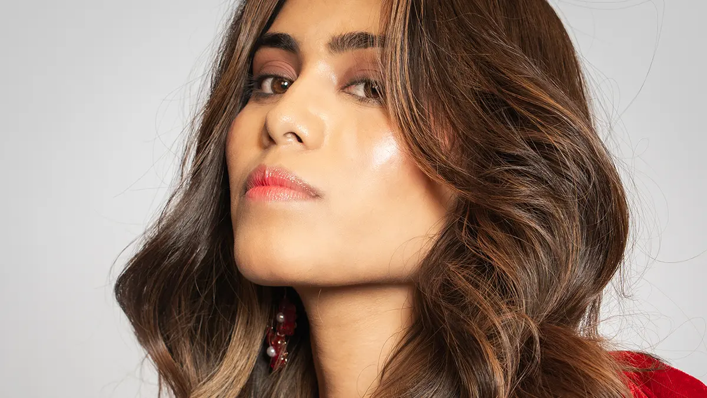

Introduction
Achieving a perfect hairstyle is something many people aim for daily. With easy access to hair styling tools like straighteners, curlers, and dryers, it has become convenient to style hair at home. However, the results often don’t match the finish of professional salon styling.
This raises an important question—should you rely on home styling tools or choose salon styling? Understanding the difference between the two can help you decide what works best for your needs, hair type, and lifestyle.
What Is Hair Styling Tools vs Salon Styling?
Hair styling tools are devices used at home to style your hair, such as straighteners, curling irons, and blow dryers.
Salon styling, on the other hand, involves professional techniques performed by trained stylists using advanced tools and products.
Both methods aim to improve your hairstyle but differ in quality, technique, and results.
Causes / Reasons
People often choose between the two based on:
Convenience and time
Budget considerations
Skill level in styling
Occasion or purpose
These factors influence the final decision.
Symptoms / Signs
You may need salon styling if:
Your hairstyle doesn’t last long
Hair gets damaged from frequent heat use
You struggle to achieve desired styles
Results look uneven or unpolished
These signs indicate limitations of home styling.
Why It Happens / Why It Matters
Home styling tools require proper technique and experience. Without it, results can be inconsistent and may damage hair over time.
It matters because:
Improper styling can weaken hair
Professional styling enhances your overall look
Long-lasting styles save time and effort
Choosing the right method improves both appearance and hair health.
Solutions / Treatment / Methods
Here’s a comparison to help you decide:
Hair Styling Tools (Home Use)
Convenient and time-saving
Cost-effective in the long run
Suitable for daily basic styling
Requires skill and practice
Salon Styling
Professional and polished finish
Long-lasting results
Uses advanced techniques and products
Ideal for special occasions
A combination of both can work best for most people.
Who Should Consider This?
This comparison is useful for:
Individuals styling hair regularly
People attending events or functions
Beginners learning hair styling
Anyone concerned about hair damage
It helps you make a practical choice.
Results / Benefits / Outcome
Depending on your choice, you can achieve:
Home styling: quick and convenient results
Salon styling: flawless and long-lasting finish
Both have their own advantages.
Tips / Prevention / Best Practices
To get the best results:
Use heat protection products
Avoid excessive use of styling tools
Learn proper techniques
Visit salons for important occasions
Maintain a healthy hair care routine
Balance is the key to healthy styling.
Conclusion
Hair styling tools and salon styling both have their place in your routine. While home tools offer convenience, professional salon styling delivers superior results and finish.
Choose based on your needs, but don’t hesitate to rely on experts when you want your hair to look its absolute best.

Blog 91 - Quick Party Ready Looks You Can Get Done in Under One Hour
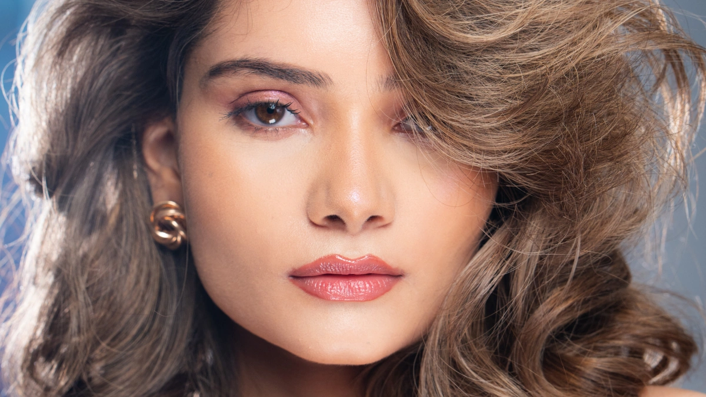

Introduction
Getting ready for a party at the last minute can be stressful, especially when you don’t have enough time for elaborate styling or makeup. Many people struggle to create a polished look quickly, often compromising on either hair or makeup.
The good news is that you don’t need hours to look stunning. With the right approach and simple techniques, you can achieve a complete party-ready look in under one hour—perfect for sudden plans or busy schedules.
What Are Quick Party Ready Looks?
Quick party-ready looks are simple yet stylish hair and makeup combinations that can be done in a short time without compromising on appearance.
These looks focus on:
Minimal steps with maximum impact
Easy-to-create hairstyles
Quick makeup techniques
Balanced and polished finish
They are designed for efficiency and elegance.
Causes / Reasons
People often struggle with quick styling due to:
Lack of time
Overcomplicating the process
Not knowing simple techniques
Trying new styles without practice
These factors make getting ready stressful.
Symptoms / Signs
You may need quick styling solutions if:
You often run out of time before events
Your makeup or hair feels incomplete
You struggle to decide what look to create
You avoid last-minute plans due to preparation time
These signs indicate the need for easy styling options.
Why It Happens / Why It Matters
Many people believe that looking good takes hours, which is not always true. With the right techniques, you can achieve a polished look quickly.
It matters because:
Quick styling saves time and effort
It reduces stress during preparation
It helps you stay confident and ready anytime
Efficiency is key in modern lifestyles.
Solutions / Treatment / Methods
Here are quick party-ready looks you can try:
Soft curls with minimal makeup
Adds volume and a natural glow
Sleek ponytail with bold lipstick
Simple yet stylish
Messy bun with subtle eye makeup
Effortless and trendy
Straight hair with highlighted eyes
Clean and polished look
Half-up hairstyle with light makeup
Balanced and elegant
Choose a look that suits your outfit and occasion.
Who Should Consider This?
These looks are ideal for:
Working professionals
Students
Last-minute party planners
Anyone with a busy schedule
They are suitable for all occasions.
Results / Benefits / Outcome
With quick styling, you will achieve:
A polished look in less time
Reduced stress while getting ready
Confidence for any event
A stylish and effortless appearance
The results are both practical and effective.
Tips / Prevention / Best Practices
To get ready quickly:
Keep your essentials organized
Practice a few go-to looks
Use multi-purpose makeup products
Plan your outfit in advance
Avoid overcomplicating your routine
Preparation makes everything easier.
Conclusion
Looking party-ready doesn’t have to take hours. With simple techniques and the right approach, you can achieve a stunning look in under one hour.
Stay prepared, keep it simple, and step out with confidence—no matter how little time you have.

Blog 92 - Benefits of Deep Conditioning Treatments for Dry Hair
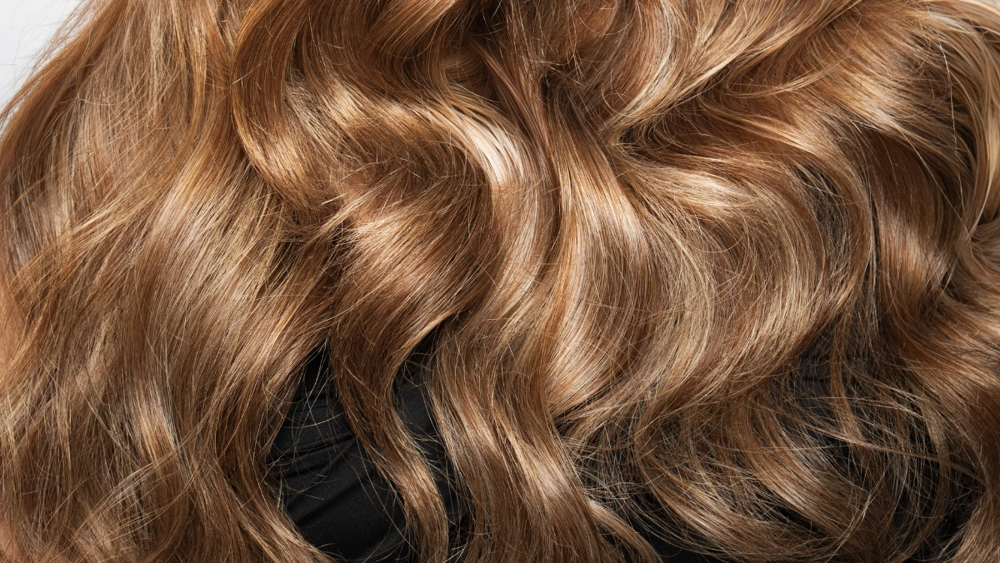

Introduction
Dry and lifeless hair is a common concern caused by pollution, heat styling, and lack of proper care. Many people use regular conditioners but still struggle with frizz, rough texture, and dullness. This happens because surface-level care is often not enough to repair deep damage.
Deep conditioning treatments are designed to go beyond basic care and restore moisture from within. With regular treatments, you can transform dry, brittle hair into smooth, soft, and healthy strands.
What Is Deep Conditioning?
Deep conditioning is an intensive hair treatment that penetrates the hair shaft to provide deep hydration, repair damage, and restore strength. Unlike regular conditioners, it works at a deeper level for long-lasting results.
It typically includes:
Nourishing hair masks
Moisture-rich formulas
Heat or steam for better absorption
Repair and strengthening ingredients
This process helps revive damaged hair effectively.
Causes / Reasons
Dry hair is often caused by:
Excessive use of heat styling tools
Chemical treatments like coloring or smoothening
Environmental factors like sun and pollution
Lack of proper hair care routine
These factors strip away natural moisture from hair.
Symptoms / Signs
You may need deep conditioning if you notice:
Dry and rough texture
Frizz and lack of smoothness
Split ends and breakage
Dull and lifeless appearance
These are signs of moisture deficiency.
Why It Happens / Why It Matters
Hair becomes dry when it loses its natural oils and hydration. Without proper nourishment, the hair structure weakens and becomes prone to damage.
It matters because:
Dry hair is harder to manage
It leads to breakage and hair fall
Healthy hair improves overall appearance
Deep conditioning helps restore balance.
Solutions / Treatment / Methods
Deep conditioning treatments include:
Hydrating hair masks
Restore moisture and softness
Protein treatments
Strengthen weak and damaged hair
Steam therapy
Helps nutrients penetrate deeper
Oil-based treatments
Provide nourishment and shine
Salon hair spa treatments
Offer professional-level care
Regular treatments give the best results.
Who Should Consider This?
Deep conditioning is ideal for:
Individuals with dry or damaged hair
People using heat styling tools frequently
Those with chemically treated hair
Anyone wanting smoother and healthier hair
It suits all hair types needing hydration.
Results / Benefits / Outcome
With deep conditioning, you will notice:
Soft and smooth hair texture
Reduced frizz and dryness
Improved shine and manageability
Stronger and healthier strands
Results improve with consistency.
Tips / Prevention / Best Practices
To maintain healthy hair:
Deep condition once a week or as needed
Use sulfate-free shampoos
Avoid excessive heat styling
Keep your hair hydrated
Follow a consistent care routine
Proper maintenance enhances results.
Conclusion
Deep conditioning is one of the most effective ways to restore dry and damaged hair. It provides the nourishment your hair needs to stay soft, smooth, and healthy.
Make it a part of your routine and enjoy long-lasting, beautiful hair every day.

Blog 93 - How to Get a Long-Lasting Makeup Look for Weddings & Events
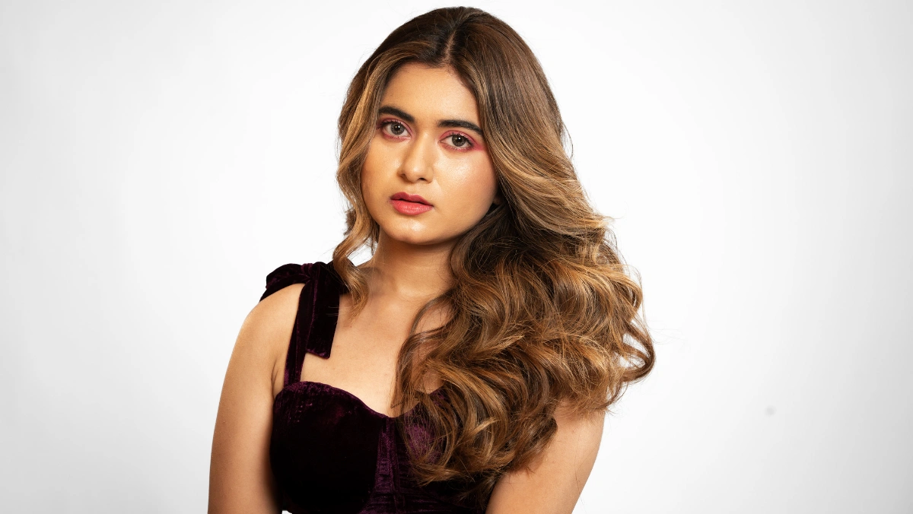

Introduction
Everyone wants their makeup to look flawless and last throughout weddings and special events. However, many people face issues like makeup melting, creasing, or fading after just a few hours. This can be frustrating, especially during long functions where touch-ups are not always possible.
The secret to long-lasting makeup is not just in the products you use, but in how you prepare your skin and apply each layer. With the right techniques, you can keep your makeup fresh, radiant, and intact for hours.
What Is Long-Lasting Makeup?
Long-lasting makeup refers to a technique of applying makeup in a way that it stays intact, fresh, and crease-free for extended periods, even in heat or humidity.
It focuses on:
Proper skin preparation
Layering products correctly
Using long-wear formulas
Setting makeup effectively
This approach ensures durability and a flawless finish.
Causes / Reasons
Makeup doesn’t last long due to:
Oily or unprepared skin
Using incorrect products
Skipping primer or setting steps
Environmental factors like heat and humidity
These issues reduce makeup longevity.
Symptoms / Signs
You may struggle with makeup staying power if:
Foundation melts or becomes patchy
Makeup creases around eyes and lips
Shine appears quickly on the face
Makeup fades within a few hours
These are signs of poor makeup preparation.
Why It Happens / Why It Matters
Makeup breaks down when it mixes with oil, sweat, or is not set properly. Without the right technique, even high-quality products won’t last long.
It matters because:
Long-lasting makeup keeps you confident
It reduces the need for frequent touch-ups
It ensures a polished look throughout the event
Proper application makes a big difference.
Solutions / Treatment / Methods
Follow these steps for long-lasting makeup:
Prep your skin
Cleanse, moisturize, and apply primer
Use long-wear foundation
Choose formulas designed for durability
Apply thin layers
Build coverage gradually instead of heavy application
Set with powder
Lock foundation and concealer in place
Use setting spray
Seal your makeup for longer wear
Waterproof products
Especially for eyes and lips
These techniques ensure better hold.
Who Should Consider This?
This guide is ideal for:
Brides and bridesmaids
Event attendees
Individuals attending long functions
Anyone wanting long-lasting makeup
It suits all skin types.
Results / Benefits / Outcome
With the right technique, you will achieve:
Flawless and long-lasting makeup
Reduced creasing and fading
Fresh and radiant appearance
Confidence throughout the event
The results are both practical and impressive.
Tips / Prevention / Best Practices
To maintain your makeup:
Blot excess oil instead of reapplying makeup
Avoid touching your face frequently
Carry basic touch-up essentials
Stay hydrated
Choose products suitable for your skin type
Small habits help maintain the look.
Conclusion
Long-lasting makeup is all about preparation, technique, and the right products. By following a proper routine, you can ensure your makeup stays flawless from start to finish.
Get ready with confidence and enjoy every moment without worrying about touch-ups.

Blog 94 - Importance of Scalp Care for Strong and Healthy Hair Growth
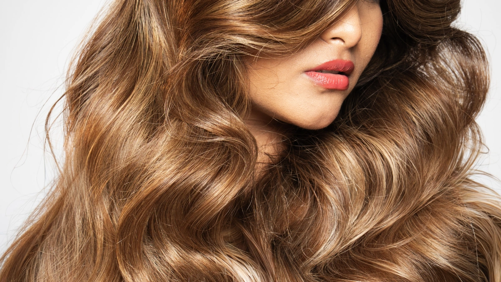

Introduction
When it comes to hair care, most people focus only on the hair strands and ignore the scalp. However, the health of your scalp plays a crucial role in determining the strength, growth, and overall quality of your hair. Neglecting scalp care can lead to issues like hair fall, dandruff, and weak roots.
Just like healthy soil is essential for strong plants, a healthy scalp is the foundation for strong and beautiful hair. Understanding scalp care can help you improve hair growth and prevent common hair problems.
What Is Scalp Care?
Scalp care refers to maintaining the cleanliness, hydration, and overall health of the scalp to support hair growth. It involves proper cleansing, nourishment, and protection.
It includes:
Regular cleaning to remove dirt and oil
Nourishing the scalp with oils or treatments
Maintaining proper moisture balance
Preventing infections and dandruff
A healthy scalp creates the right environment for hair growth.
Causes / Reasons
Poor scalp health can occur due to:
Excess oil or product buildup
Lack of proper cleaning
Dryness and dehydration
Pollution and environmental factors
These issues weaken hair roots over time.
Symptoms / Signs
You may have scalp issues if you notice:
Itching or irritation
Dandruff or flakes
Excessive hair fall
Oily or extremely dry scalp
These are clear signs of an unhealthy scalp.
Why It Happens / Why It Matters
Hair grows from the roots located in the scalp. If the scalp is unhealthy, it affects the hair growth cycle and weakens the roots.
It matters because:
Healthy scalp promotes stronger hair growth
It reduces hair fall and breakage
It improves overall hair quality
Ignoring scalp care can lead to long-term problems.
Solutions / Treatment / Methods
Here are effective scalp care methods:
Cleanse regularly
Use a gentle shampoo to remove buildup
Oil your scalp
Nourishes roots and improves blood circulation
Exfoliate occasionally
Removes dead skin cells
Use scalp treatments
Targets issues like dandruff or dryness
Maintain hygiene
Keep your scalp clean and balanced
Consistency is key for healthy results.
Who Should Consider This?
Scalp care is important for:
Individuals facing hair fall
People with dandruff or itchy scalp
Those with dry or oily scalp issues
Anyone wanting better hair growth
It applies to all hair types.
Results / Benefits / Outcome
With proper scalp care, you will notice:
Stronger and healthier hair growth
Reduced dandruff and irritation
Improved hair texture
Better overall hair health
Results improve over time with regular care.
Tips / Prevention / Best Practices
To maintain a healthy scalp:
Avoid harsh hair products
Keep your scalp clean
Stay hydrated
Eat a balanced diet
Avoid excessive heat styling
Healthy habits support better results.
Conclusion
Scalp care is the foundation of strong and healthy hair. By focusing on your scalp, you can improve hair growth, reduce problems, and achieve better overall hair health.
Start taking care of your scalp today and see the difference in your hair tomorrow.

Blog 95 - Best Haircuts for Different Face Shapes: Complete Guide
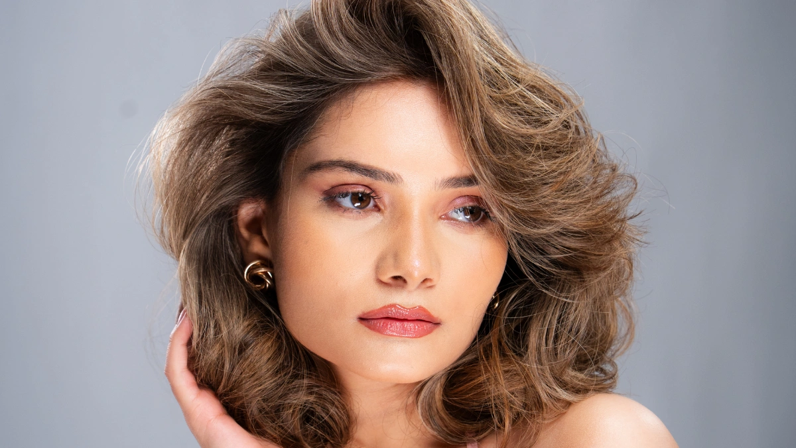

Introduction
Choosing the right haircut can completely transform your appearance, but many people end up with styles that don’t suit them. This usually happens when haircuts are chosen based on trends rather than face shape. The result? A look that feels off or unbalanced.
Understanding your face shape is the key to finding a haircut that enhances your features. When you choose the right style, it highlights your strengths, improves balance, and gives you a more confident and polished look.
What Are Face Shape-Based Haircuts?
Face shape-based haircuts are styles designed to complement the natural structure of your face. Instead of following trends blindly, these haircuts focus on balance and proportion.
Common face shapes include:
Oval
Round
Square
Heart-shaped
Long (rectangular)
Each face shape requires a different haircut approach.
Causes / Reasons
People often choose the wrong haircut due to:
Following trends without personalization
Lack of professional consultation
Not understanding their face shape
Choosing styles based on others
These mistakes lead to unsatisfactory results.
Symptoms / Signs
You may need a better haircut if:
Your hairstyle doesn’t suit your face
Your features look unbalanced
Styling feels difficult
You’re not confident with your look
These signs indicate a mismatch in style.
Why It Happens / Why It Matters
Every face shape has unique proportions. A haircut that works for one person may not work for another.
It matters because:
The right haircut enhances facial features
It creates a balanced and attractive look
It improves confidence and styling ease
Choosing correctly makes a big difference.
Solutions / Treatment / Methods
Here’s a guide to choosing the best haircut:
Oval face shape
Most styles suit this shape, including layers and bobs
Round face shape
Go for long layers or cuts that add height
Square face shape
Choose soft layers or waves to soften sharp angles
Heart-shaped face
Opt for chin-length bobs or side-parted styles
Long face shape
Choose cuts with volume on the sides like layers or bangs
Professional advice helps refine your choice.
Who Should Consider This?
This guide is ideal for:
Anyone planning a haircut
Individuals unhappy with their current style
People trying new looks
Those wanting a personalized appearance
It works for all age groups.
Results / Benefits / Outcome
With the right haircut, you will achieve:
A balanced and flattering look
Enhanced facial features
Easier styling and maintenance
Increased confidence
The impact is immediate and noticeable.
Tips / Prevention / Best Practices
To get the best haircut:
Identify your face shape correctly
Consult a professional stylist
Avoid blindly following trends
Consider your hair type and lifestyle
Maintain regular trims
Smart choices lead to better results.
Conclusion
Choosing the right haircut based on your face shape is the key to looking your best. Instead of guessing, understanding your features helps you make the right decision.
Take the time to choose wisely and enjoy a hairstyle that truly enhances your personality.

Blog 96 - What to Expect During Your First Visit to a Premium Salon

Introduction
Visiting a premium salon for the first time can feel exciting yet a bit intimidating. Many people are unsure about what to expect, how the process works, or whether it will be worth the investment. This uncertainty often holds them back from experiencing professional-level services.
A premium salon visit is not just about getting a service—it’s about a complete experience focused on quality, personalization, and care. Knowing what to expect can help you feel confident and make the most of your visit.
What Is a Premium Salon Experience?
A premium salon offers high-quality hair and beauty services delivered by trained professionals using advanced techniques and products. It focuses on both results and customer experience.
A typical premium salon experience includes:
Personalized consultation
Professional service execution
Use of high-quality products
Comfortable and hygienic environment
Every step is designed to ensure satisfaction and results.
Causes / Reasons
People feel unsure about premium salons due to:
Lack of prior experience
Higher pricing compared to local salons
Fear of trying something new
Uncertainty about service quality
These concerns are common but often unnecessary.
Symptoms / Signs
You may benefit from visiting a premium salon if:
You’re not satisfied with current salon results
Your hair or skin needs expert care
You want a professional and polished look
You’re preparing for a special occasion
These signs indicate it’s time to upgrade your experience.
Why It Happens / Why It Matters
Premium salons focus on precision, expertise, and customization. Unlike basic services, they provide solutions tailored to your needs.
It matters because:
Professional care improves long-term results
Personalized services suit your unique needs
High-quality products reduce damage
The experience is more reliable and effective.
Solutions / Treatment / Methods
Here’s what you can expect during your first visit:
Consultation
Discussion about your hair/skin type, concerns, and goals
Service recommendation
Experts suggest suitable treatments or styles
Professional execution
Skilled stylists perform the service with precision
Product usage
Premium products ensure better results
Styling and finishing
Final touch for a polished look
Aftercare guidance
Tips to maintain results at home
Each step is structured for quality.
Who Should Consider This?
A premium salon is ideal for:
Individuals seeking high-quality services
People with specific hair or skin concerns
Brides and event attendees
Anyone wanting a better grooming experience
It suits all age groups.
Results / Benefits / Outcome
After your visit, you can expect:
Noticeable improvement in hair or skin
A polished and professional look
Better understanding of your care routine
Increased confidence
The experience is both satisfying and valuable.
Tips / Prevention / Best Practices
To make the most of your visit:
Book your appointment in advance
Communicate your preferences clearly
Ask for professional advice
Follow aftercare instructions
Stay consistent with visits
Preparation enhances the experience.
Conclusion
Your first visit to a premium salon is an opportunity to upgrade your grooming routine and experience expert care. With personalized services and professional guidance, you can achieve better and long-lasting results.
Step in with confidence and enjoy a salon experience that truly makes a difference.

Blog 97 - Common Skincare Myths You Should Stop Believing Today

Introduction
Skincare advice is everywhere—social media, friends, and countless online sources. While some tips are helpful, many are simply myths that can harm your skin instead of improving it. Following the wrong information often leads to breakouts, irritation, or wasted effort.
Understanding the truth behind common skincare myths is essential for building an effective routine. When you separate facts from fiction, you can take better care of your skin and achieve real, long-lasting results.
What Are Skincare Myths?
Skincare myths are widely believed ideas or practices that are not scientifically accurate. They often spread through trends, word of mouth, or outdated information.
Some common myths include:
Oily skin doesn’t need moisturizer
Natural products are always better
Washing your face more prevents acne
Expensive products guarantee better results
Believing these myths can lead to poor skincare habits.
Causes / Reasons
Skincare myths exist due to:
Misinformation on social media
Lack of professional guidance
Following trends without research
General assumptions about skin
These factors make it difficult to know what’s right.
Symptoms / Signs
You may be following skincare myths if:
Your skin isn’t improving despite efforts
You experience frequent breakouts or irritation
Your routine feels confusing or ineffective
You constantly switch products
These signs indicate misinformation.
Why It Happens / Why It Matters
Every person’s skin is different, and what works for one may not work for another. Myths oversimplify skincare, leading to incorrect practices.
It matters because:
Wrong habits can damage your skin
Proper knowledge improves results
Consistent care leads to healthier skin
Understanding facts helps you make better choices.
Solutions / Treatment / Methods
Let’s debunk some common myths:
Myth: Oily skin doesn’t need moisturizer
Truth: All skin types need hydration
Myth: Natural products are always safe
Truth: Not all natural ingredients suit every skin
Myth: More washing prevents acne
Truth: Overwashing can irritate and worsen acne
Myth: Expensive means better
Truth: Effectiveness depends on ingredients, not price
Myth: You don’t need sunscreen indoors
Truth: UV rays can still affect your skin
Focus on facts, not trends.
Who Should Consider This?
This guide is ideal for:
Anyone building a skincare routine
Individuals facing skin issues
People influenced by online trends
Beginners in skincare
It helps create a better approach.
Results / Benefits / Outcome
By avoiding skincare myths, you will achieve:
Healthier and clearer skin
More effective skincare routine
Reduced irritation and breakouts
Better long-term results
The improvement becomes noticeable over time.
Tips / Prevention / Best Practices
To avoid skincare mistakes:
Follow professional advice
Understand your skin type
Use tested and suitable products
Avoid blindly following trends
Keep your routine simple and consistent
Knowledge is key to good skincare.
Conclusion
Skincare myths can do more harm than good if followed blindly. By understanding the truth and making informed decisions, you can build a routine that actually works for your skin.
Stop believing myths and start focusing on what truly benefits your skin.

Blog 98 - Top Hair Coloring Trends That Are Dominating This Year
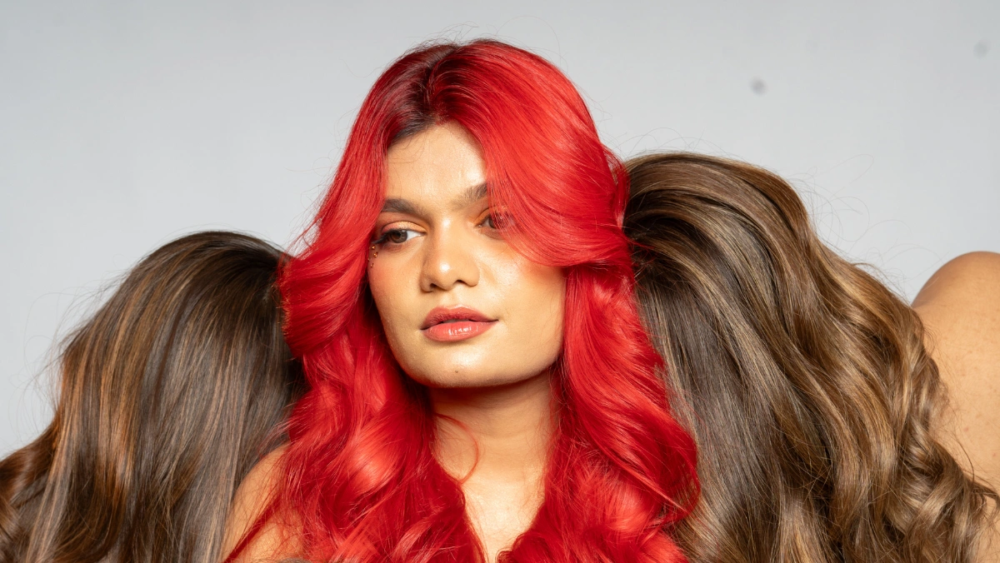

Introduction
Hair coloring has become one of the most popular ways to transform your look and express your personal style. However, with so many trends emerging every year, it can be confusing to decide which one suits you best. Choosing the wrong trend can lead to high maintenance or results that don’t match your personality.
This year, hair color trends are all about subtle elegance, natural blends, and low-maintenance styles. Understanding these trends can help you choose a color that enhances your appearance while staying stylish and practical.
What Are Hair Coloring Trends?
Hair coloring trends refer to popular styles and techniques that are widely chosen based on current fashion and beauty preferences.
These trends focus on:
Natural-looking color blends
Low-maintenance shades
Techniques that add depth and dimension
Personalized color choices
Modern trends aim for both style and hair health.
Causes / Reasons
Hair color trends evolve due to:
Influence of social media and celebrities
Changing fashion styles
Preference for easy maintenance
Awareness about hair health
These factors shape current color choices.
Symptoms / Signs
You may need a hair color update if:
Your current color feels outdated
Your hair lacks dimension or shine
You want a fresh and modern look
You’re bored with your natural color
These signs indicate it’s time for a change.
Why It Happens / Why It Matters
Hair color trends change as fashion evolves. Updating your color can enhance your look and keep your style current.
It matters because:
The right color enhances facial features
It adds depth and dimension to hair
It boosts confidence and personal style
Choosing wisely ensures better results.
Solutions / Treatment / Methods
Here are the top hair coloring trends this year:
Balayage
Natural, sun-kissed highlights with soft blending
Face-framing highlights
Brightens your look and enhances features
Chocolate brown tones
Rich, natural, and low-maintenance
Ash and cool tones
Modern and subtle appearance
Soft ombre
Gradual color transition for a stylish look
Consult a professional to select the best trend for you.
Who Should Consider This?
These trends are ideal for:
Individuals looking for a style upgrade
First-time hair color users
Professionals wanting a subtle change
Anyone following current fashion trends
There’s a trend for every preference.
Results / Benefits / Outcome
With the right hair color, you will achieve:
A fresh and modern appearance
Enhanced facial features
Natural and stylish finish
Increased confidence
The transformation is noticeable and impactful.
Tips / Prevention / Best Practices
To maintain your hair color:
Use color-safe products
Avoid excessive washing
Protect hair from heat and sun
Follow proper aftercare routine
Schedule regular touch-ups
Maintenance keeps your color looking fresh.
Conclusion
Hair coloring trends this year focus on simplicity, elegance, and personalization. By choosing the right trend, you can enhance your natural beauty while keeping your look modern and stylish.
Stay updated, choose wisely, and enjoy a transformation that truly suits you.

Blog 99 - Why Regular Trimming Is Important for Faster Hair Growth
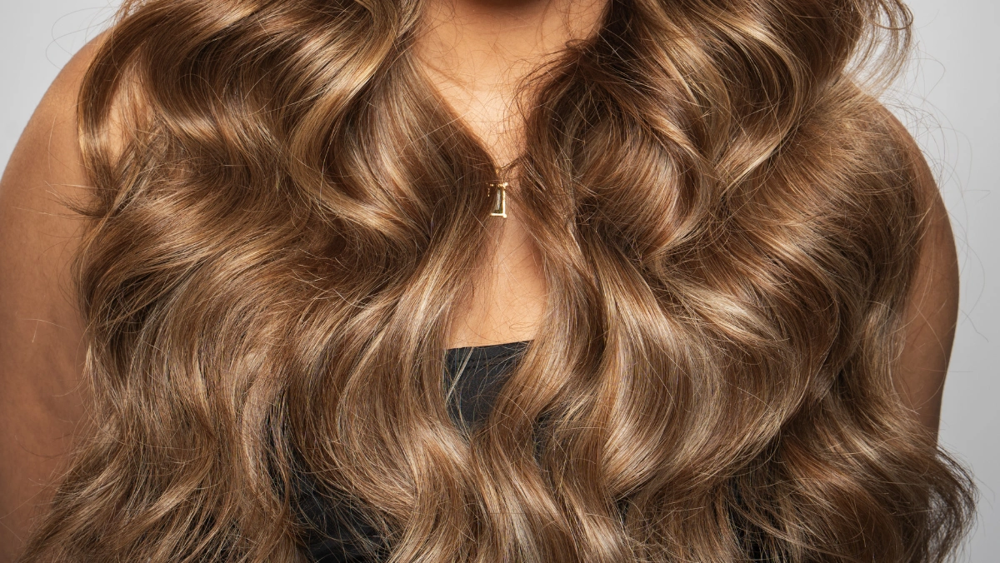

Introduction
Many people believe that avoiding haircuts will help their hair grow faster. In reality, skipping regular trims can lead to split ends, breakage, and slower overall growth. This misconception often prevents people from maintaining a proper hair care routine.
Regular trimming is a simple yet essential step in keeping your hair healthy and promoting better growth. Understanding its importance can help you achieve longer, stronger, and more manageable hair.
What Is Hair Trimming?
Hair trimming involves cutting a small portion of your hair, mainly the ends, to remove damaged or split sections. It helps maintain the shape and health of your hair without affecting its overall length significantly.
It focuses on:
Removing split ends
Maintaining hair shape
Preventing further damage
Supporting healthy growth
Trimming is a preventive care method.
Causes / Reasons
Hair damage that requires trimming occurs due to:
Heat styling tools
Chemical treatments
Pollution and environmental stress
Lack of proper hair care
These factors cause split ends and breakage.
Symptoms / Signs
You may need a trim if you notice:
Split ends
Dry and rough hair ends
Increased breakage
Loss of shape in your haircut
These are signs of damaged hair.
Why It Happens / Why It Matters
When split ends are not removed, they travel up the hair shaft, causing more damage and breakage. This makes your hair appear shorter and less healthy over time.
It matters because:
Healthy ends support better growth
Prevents hair breakage
Maintains overall hair health
Regular trims help your hair grow stronger.
Solutions / Treatment / Methods
Here’s how trimming helps:
Removes damaged ends
Prevents further splitting
Maintains hair health
Keeps hair smooth and manageable
Improves appearance
Gives a neat and polished look
Supports growth
Reduces breakage, allowing length retention
Trim every 6–8 weeks for best results.
Who Should Consider This?
Hair trimming is important for:
Individuals with long hair
People experiencing split ends
Those using heat styling tools
Anyone wanting healthier hair
It is essential for all hair types.
Results / Benefits / Outcome
With regular trimming, you will notice:
Healthier and smoother hair
Reduced split ends and breakage
Better hair growth retention
Improved overall appearance
The benefits are long-term.
Tips / Prevention / Best Practices
To maintain healthy hair:
Trim regularly
Use heat protection products
Avoid excessive styling
Keep your hair moisturized
Follow a proper care routine
Consistency is key for growth.
Conclusion
Regular trimming is not the enemy of hair growth—it’s one of its biggest supporters. By removing damaged ends, you allow your hair to grow stronger and healthier over time.
Make trimming a part of your routine and enjoy longer, more beautiful hair.

Blog 100 - Complete Guide to Salon Hygiene: What Clients Should Check

Introduction
When visiting a salon, most people focus on services, pricing, and results, but often overlook one of the most important factors—hygiene. Poor hygiene in salons can lead to infections, skin issues, and overall unsafe experiences.
A clean and well-maintained salon not only ensures safety but also reflects professionalism and quality. Knowing what to check can help you choose the right salon and protect your health while enjoying your services.
What Is Salon Hygiene?
Salon hygiene refers to the cleanliness, sanitation, and safety practices followed in a salon to ensure a safe environment for clients and staff.
It includes:
Clean tools and equipment
Sanitized workstations
Proper waste disposal
Personal hygiene of staff
Maintaining hygiene is essential for safe beauty treatments.
Causes / Reasons
Poor salon hygiene may occur due to:
Lack of proper training
Ignoring sanitation protocols
Reusing unclean tools
Poor management practices
These issues increase the risk of infections.
Symptoms / Signs
You should be cautious if you notice:
Dirty or unclean tools
Unhygienic workspaces
Towels or equipment being reused without cleaning
Staff not following hygiene practices
These are red flags of poor hygiene.
Why It Happens / Why It Matters
Hygiene is often neglected in low-quality salons due to cost-cutting or lack of awareness. However, this can lead to serious skin or scalp issues.
It matters because:
Clean environments prevent infections
Proper hygiene ensures safe treatments
It reflects professionalism and trust
Your safety should always come first.
Solutions / Treatment / Methods
Here’s what you should check in a salon:
Clean tools and equipment
Ensure tools are sanitized after each use
Disposable items
Items like tissues or blades should not be reused
Clean workstations
Chairs, mirrors, and surfaces should be clean
Staff hygiene
Professionals should maintain personal cleanliness
Proper storage
Products and tools should be stored safely
These checks ensure a safe experience.
Who Should Consider This?
This guide is important for:
Regular salon visitors
Brides and event clients
Individuals with sensitive skin
Anyone concerned about hygiene
It applies to everyone.
Results / Benefits / Outcome
By choosing a hygienic salon, you will experience:
Safe and comfortable services
Reduced risk of infections
Better overall experience
Peace of mind
Hygiene directly impacts quality.
Tips / Prevention / Best Practices
To ensure safety:
Observe cleanliness before booking
Ask about hygiene practices
Avoid salons with poor standards
Choose trusted and professional salons
Stay aware of your surroundings
Being aware helps you stay safe.
Conclusion
Salon hygiene is not something you should ignore. It plays a crucial role in ensuring safe and effective beauty treatments.
Always choose a salon that prioritizes cleanliness and professionalism, so you can enjoy your experience without any concerns.
